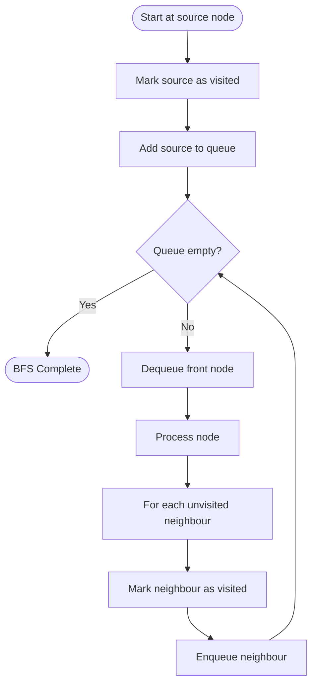

# 🌊 Breadth-First Search (BFS)

!!! abstract "What You'll Learn"
    - ✅ What BFS is and how it explores graphs level by level
    - ✅ BFS on graphs (adjacency list) and trees in Python
    - ✅ Finding shortest paths with BFS
    - ✅ Time and Space complexity analysis
    - ✅ When to use BFS vs DFS

Breadth-First Search explores a graph **level by level** — it visits all neighbours of a node before moving deeper. Think of it like ripples spreading outward from a stone dropped in water. This property makes BFS the go-to algorithm for finding **shortest paths** in unweighted graphs.

!!! tip "New to graph algorithms?"
    Make sure you're comfortable with graphs (nodes, edges, adjacency lists) and Python's `collections.deque` before diving in. BFS is the gentler starting point before DFS.

!!! info "Already know the basics?"
    Jump to [Shortest Path BFS](#3️⃣-shortest-path-with-bfs) or [BFS on a Matrix](#4️⃣-bfs-on-a-matrix-grid) to see the most common interview applications.

!!! warning "Keep in mind"
    Always track **visited nodes** — without it, BFS loops forever on graphs with cycles. For trees (no cycles), the visited set can be omitted.

---

## How It Works



---

## 1️⃣ BFS on a Graph

```python
from collections import deque

def bfs(graph: dict, start: str) -> list:
    """
    Breadth-First Search on an adjacency list graph.
    Returns nodes in the order they were visited.

    Args:
        graph: dict mapping each node to its list of neighbours
        start: the node to begin BFS from
    """
    visited = set()       # Track visited nodes to avoid cycles
    queue   = deque()     # BFS uses a queue (FIFO)
    order   = []          # Record visit order

    visited.add(start)
    queue.append(start)

    while queue:
        node = queue.popleft()   # Dequeue from front (FIFO)
        order.append(node)

        for neighbour in graph[node]:
            if neighbour not in visited:
                visited.add(neighbour)
                queue.append(neighbour)

    return order


# Example graph (undirected)
graph = {
    'A': ['B', 'C'],
    'B': ['A', 'D', 'E'],
    'C': ['A', 'F'],
    'D': ['B'],
    'E': ['B', 'F'],
    'F': ['C', 'E'],
}

print(bfs(graph, 'A'))
```

**Output:**
```
['A', 'B', 'C', 'D', 'E', 'F']
```

!!! tip "Why `deque` and not a `list`?"
    `list.pop(0)` is O(n) — it shifts every element left. `deque.popleft()` is O(1). Always use `collections.deque` for BFS queues.

---

## 2️⃣ BFS on a Tree

Trees have no cycles, so no visited set is needed.

```python
from collections import deque

class TreeNode:
    def __init__(self, val: int):
        self.val      = val
        self.left     = None
        self.right    = None

def bfs_tree(root: TreeNode) -> list[list[int]]:
    """
    Level-order traversal of a binary tree.
    Returns a list of levels, each level as a list of values.
    """
    if not root:
        return []

    result = []
    queue  = deque([root])

    while queue:
        level_size = len(queue)   # Number of nodes at this level
        level      = []

        for _ in range(level_size):
            node = queue.popleft()
            level.append(node.val)

            if node.left:
                queue.append(node.left)
            if node.right:
                queue.append(node.right)

        result.append(level)

    return result


# Build example tree:
#        1
#       / \
#      2   3
#     / \   \
#    4   5   6

root      = TreeNode(1)
root.left = TreeNode(2)
root.right= TreeNode(3)
root.left.left  = TreeNode(4)
root.left.right = TreeNode(5)
root.right.right= TreeNode(6)

print(bfs_tree(root))
```

**Output:**
```
[[1], [2, 3], [4, 5, 6]]
```

!!! info "Level-order traversal"
    Capturing `len(queue)` at the start of each while iteration lets you process exactly one level at a time — a very common interview pattern.

---

## 3️⃣ Shortest Path with BFS

BFS guarantees the **shortest path** in an unweighted graph because it explores nodes in order of increasing distance from the source.

```python
from collections import deque

def bfs_shortest_path(graph: dict, start: str, target: str) -> list | None:
    """
    Returns the shortest path from start to target as a list of nodes.
    Returns None if no path exists.
    """
    if start == target:
        return [start]

    visited = {start}
    queue   = deque([[start]])   # Queue of paths, not just nodes

    while queue:
        path = queue.popleft()
        node = path[-1]          # Last node in current path

        for neighbour in graph[node]:
            if neighbour not in visited:
                new_path = path + [neighbour]

                if neighbour == target:
                    return new_path   # Shortest path found ✅

                visited.add(neighbour)
                queue.append(new_path)

    return None   # No path exists


# Example
graph = {
    'A': ['B', 'C'],
    'B': ['A', 'D', 'E'],
    'C': ['A', 'F'],
    'D': ['B'],
    'E': ['B', 'F'],
    'F': ['C', 'E'],
}

print(bfs_shortest_path(graph, 'A', 'F'))
print(bfs_shortest_path(graph, 'D', 'F'))
```

**Output:**
```
['A', 'C', 'F']
['D', 'B', 'E', 'F']
```

!!! warning "Memory trade-off"
    Storing full paths in the queue uses more memory than storing just nodes. For large graphs, store a `parent` dictionary instead and reconstruct the path at the end — see the pattern below.

```python
def bfs_shortest_path_v2(graph: dict, start: str, target: str) -> list | None:
    """Memory-efficient version using a parent map."""
    visited = {start}
    queue   = deque([start])
    parent  = {start: None}

    while queue:
        node = queue.popleft()

        if node == target:
            # Reconstruct path by walking parent map backwards
            path = []
            while node is not None:
                path.append(node)
                node = parent[node]
            return path[::-1]

        for neighbour in graph[node]:
            if neighbour not in visited:
                visited.add(neighbour)
                parent[neighbour] = node
                queue.append(neighbour)

    return None


print(bfs_shortest_path_v2(graph, 'A', 'F'))
```

**Output:**
```
['A', 'C', 'F']
```

---

## 4️⃣ BFS on a Matrix (Grid)

One of the most common interview patterns — treat each cell as a node, with up/down/left/right neighbours.

```python
from collections import deque

def bfs_grid(grid: list[list[int]], start: tuple, target: tuple) -> int:
    """
    BFS on a 2D grid to find shortest path distance.
    0 = open cell, 1 = wall.
    Returns distance (number of steps), or -1 if unreachable.
    """
    rows, cols = len(grid), len(grid[0])
    sr, sc     = start
    tr, tc     = target
    directions = [(0, 1), (0, -1), (1, 0), (-1, 0)]  # Right, Left, Down, Up

    if grid[sr][sc] == 1 or grid[tr][tc] == 1:
        return -1  # Start or target is a wall

    visited = {(sr, sc)}
    queue   = deque([(sr, sc, 0)])  # (row, col, distance)

    while queue:
        r, c, dist = queue.popleft()

        if (r, c) == (tr, tc):
            return dist   # Reached target ✅

        for dr, dc in directions:
            nr, nc = r + dr, c + dc

            if 0 <= nr < rows and 0 <= nc < cols \
               and (nr, nc) not in visited        \
               and grid[nr][nc] == 0:

                visited.add((nr, nc))
                queue.append((nr, nc, dist + 1))

    return -1   # Target unreachable


# Example grid (0 = open, 1 = wall)
grid = [
    [0, 0, 1, 0],
    [0, 0, 0, 1],
    [1, 0, 0, 0],
    [0, 1, 0, 0],
]

print(bfs_grid(grid, (0, 0), (3, 3)))   # Output: 6
print(bfs_grid(grid, (0, 0), (0, 2)))   # Output: -1 (wall)
```

**Output:**
```
6
-1
```

---

## 5️⃣ Step-by-Step Trace

```
graph = { A: [B,C], B: [A,D,E], C: [A,F], D: [B], E: [B,F], F: [C,E] }
start = A

        A
       / \
      B   C
     / \   \
    D   E   F
         \ /
          F  ← E and C both connect to F

Step 1: visited={A}  queue=[A]
        Dequeue A → visit A
        Enqueue B, C    visited={A,B,C}  queue=[B,C]

Step 2: Dequeue B → visit B
        Enqueue D, E    visited={A,B,C,D,E}  queue=[C,D,E]
        (A already visited — skip)

Step 3: Dequeue C → visit C
        Enqueue F       visited={A,B,C,D,E,F}  queue=[D,E,F]
        (A already visited — skip)

Step 4: Dequeue D → visit D
        (B already visited — skip)  queue=[E,F]

Step 5: Dequeue E → visit E
        (B, F already visited — skip)  queue=[F]

Step 6: Dequeue F → visit F
        (C, E already visited — skip)  queue=[]

Queue empty → BFS complete
Order: [A, B, C, D, E, F] ✅

Levels:
  Level 0: A
  Level 1: B, C
  Level 2: D, E, F
```

---

## 6️⃣ Memory Model

=== "Queue State Over Time"

    ```
    graph: A-[B,C], B-[D,E], C-[F]
    start: A

    TIME →

    Queue:    [A]         [B, C]      [C, D, E]   [D, E, F]   []
               │           │           │
             Dequeue A   Dequeue B   Dequeue C
             Enqueue B,C Enqueue D,E Enqueue F

    Visited:  {A}  →  {A,B,C}  →  {A,B,C,D,E}  →  {A,B,C,D,E,F}

    Max queue size = O(w)  where w = max width of graph
    For a balanced tree of n nodes: max width = n/2  → O(n)
    ```

=== "BFS vs DFS Memory"

    ```
    Same graph, n=15 nodes (balanced binary tree, depth 4):

    BFS uses a QUEUE — stores entire frontier (widest level):
    ┌─────────────────────────────────────────┐
    │ Queue at deepest level: 8 nodes         │ ← O(n) space
    │ [node8, node9, node10, node11,          │
    │  node12, node13, node14, node15]        │
    └─────────────────────────────────────────┘

    DFS uses a STACK — stores one path root to leaf:
    ┌─────────────────────────────────────────┐
    │ Stack at deepest point: 4 nodes         │ ← O(log n) space
    │ [node1, node2, node4, node8]            │
    └─────────────────────────────────────────┘

    BFS: O(n) space — wide graphs can be memory-heavy
    DFS: O(h) space — h = height (much smaller for balanced trees)
    ```

---

## 7️⃣ Complexity Analysis

=== "Time Complexity"

    | Operation | Complexity | Explanation |
    |-----------|-----------|-------------|
    | Graph BFS | O(V + E) | Visit every vertex once, traverse every edge once |
    | Tree BFS | O(n) | Visit every node once |
    | Grid BFS | O(rows × cols) | Each cell visited at most once |

=== "Space Complexity"

    | Structure | Complexity | Reason |
    |-----------|-----------|--------|
    | Queue | O(V) worst case | All nodes could be in queue simultaneously |
    | Visited set | O(V) | Stores each visited node |
    | Parent map (path) | O(V) | One entry per node |
    | Total | O(V + E) | Dominated by adjacency list storage |

!!! info "V + E explained"
    V = number of vertices (nodes), E = number of edges. BFS touches each vertex once (V) and checks each edge once from each direction (E). So total work = O(V + E).

---

## 8️⃣ BFS vs DFS

=== "Comparison Table"

    | Feature | BFS | DFS |
    |---------|-----|-----|
    | Data structure | Queue (FIFO) | Stack / Recursion (LIFO) |
    | Traversal order | Level by level | Branch by branch |
    | Shortest path | ✅ Guaranteed (unweighted) | ❌ Not guaranteed |
    | Memory | O(V) — stores wide frontier | O(h) — stores one path |
    | Best for | Shortest path, level-order, nearby nodes | Cycle detection, topological sort, deep search |
    | Implementation | Iterative (queue) | Recursive or iterative (stack) |

=== "When to Use BFS"

    **✅ Use BFS when:**
    - You need the **shortest path** in an unweighted graph or grid
    - You need **level-order** traversal of a tree
    - You want to find nodes **closest** to the source first
    - Checking if a graph is **bipartite**
    - **Web crawling** (explore pages level by level)

    **❌ Use DFS instead when:**
    - Detecting **cycles** in a graph
    - **Topological sorting** (DAGs)
    - Finding **all paths** between two nodes
    - Solving **maze/backtracking** problems
    - Memory is tight and the graph is wide but shallow

---

## ✅ Quick Reference Summary

| Topic | Key Point |
|-------|-----------|
| **Strategy** | Explore level by level using a queue |
| **Data structure** | `collections.deque` — O(1) enqueue and dequeue |
| **Visited tracking** | Always use a `set` for O(1) lookup |
| **Time complexity** | O(V + E) for graphs, O(n) for trees |
| **Space complexity** | O(V) — queue + visited set |
| **Shortest path?** | ✅ Yes — guaranteed for unweighted graphs |
| **Stable?** | N/A — graph traversal, not sorting |
| **Tree variant** | No visited set needed (trees have no cycles) |
| **Grid variant** | Treat each cell as a node, use 4-directional moves |
| **Mark visited when?** | On **enqueue**, not on dequeue — prevents duplicate enqueues |
| **BFS vs DFS** | BFS = shortest path; DFS = deep search, cycle detection |
| **Python queue** | `from collections import deque` — never use `list.pop(0)` |