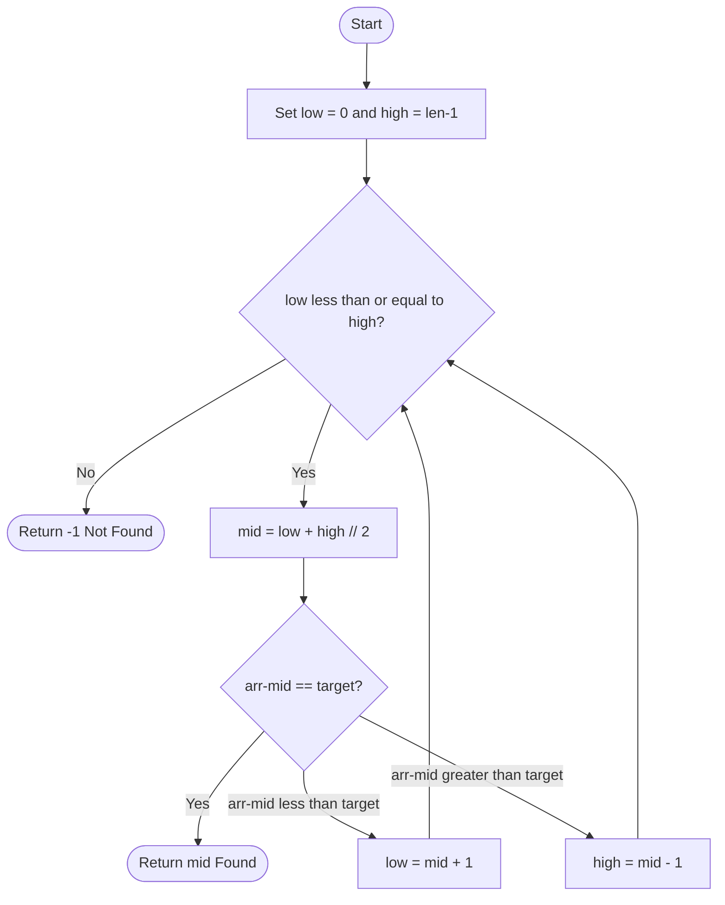

# 🔍 Binary Search

!!! abstract "What You'll Learn"
    - ✅ What Binary Search is and how it works
    - ✅ Iterative vs Recursive implementations in Python
    - ✅ Time and Space complexity analysis
    - ✅ When to use (and NOT use) Binary Search
    - ✅ Common variations and edge cases

Binary Search is one of the most elegant algorithms in computer science — it cuts the search space in **half** with every comparison, turning a linear slog into a logarithmic sprint. The catch? Your data must be **sorted**.

!!! tip "New to searching algorithms?"
    Start with Linear Search first so you understand why Binary Search is such a massive upgrade. Then come back here.

!!! info "Already know the basics?"
    Jump straight to the [Variations](#4️⃣-common-variations) section for `bisect`, rotated arrays, and finding boundaries.

!!! warning "Keep in mind"
    Binary Search only works on **sorted** collections. Applying it to unsorted data produces incorrect results with no error — a silent bug.

---

## How It Works



---

## 1️⃣ Iterative Implementation

The iterative approach uses `O(1)` space — preferred in production.

```python
def binary_search(arr: list, target: int) -> int:
    """
    Returns the index of target in arr, or -1 if not found.
    Assumes arr is sorted in ascending order.
    """
    low, high = 0, len(arr) - 1

    while low <= high:
        mid = low + (high - low) // 2  # Avoids integer overflow

        if arr[mid] == target:
            return mid
        elif arr[mid] < target:
            low = mid + 1
        else:
            high = mid - 1

    return -1


# Example
arr = [2, 5, 8, 12, 16, 23, 38, 45, 72, 91]
print(binary_search(arr, 23))   # Output: 5
print(binary_search(arr, 10))   # Output: -1
```

**Output:**
```
5
-1
```

!!! tip "Why `low + (high - low) // 2`?"
    Writing `(low + high) // 2` can overflow in languages with fixed-size integers (like C/Java). Python handles big integers natively, but using the safe form is a good habit regardless.

---

## 2️⃣ Recursive Implementation

```python
def binary_search_recursive(arr: list, target: int,
                             low: int, high: int) -> int:
    """
    Recursive Binary Search.
    Call with: binary_search_recursive(arr, target, 0, len(arr) - 1)
    """
    if low > high:
        return -1  # Base case: not found

    mid = low + (high - low) // 2

    if arr[mid] == target:
        return mid
    elif arr[mid] < target:
        return binary_search_recursive(arr, target, mid + 1, high)
    else:
        return binary_search_recursive(arr, target, low, mid - 1)


# Example
arr = [2, 5, 8, 12, 16, 23, 38, 45, 72, 91]
print(binary_search_recursive(arr, 38, 0, len(arr) - 1))  # Output: 6
```

**Output:**
```
6
```

!!! warning "Recursion depth"
    Python's default recursion limit is 1000. For arrays with more than ~1000 elements, the recursive approach can hit `RecursionError`. Prefer iterative for large inputs.

---

## 3️⃣ Memory Model

=== "Iterative (O(1) Space)"

    ```
    arr = [2, 5, 8, 12, 16, 23, 38, 45, 72, 91]
    target = 23

    Step 1:  low=0   high=9   mid=4   arr[4]=16  → too small → low=5
             [2, 5, 8, 12, 16, | 23, 38, 45, 72, 91]
                                 ^low             ^high

    Step 2:  low=5   high=9   mid=7   arr[7]=45  → too large → high=6
             [23, 38, | 45, 72, 91]
              ^low ^high

    Step 3:  low=5   high=6   mid=5   arr[5]=23  → FOUND at index 5 ✅

    Stack:   [main frame only — no extra frames]
    ```

=== "Recursive (O(log n) Space)"

    ```
    arr = [2, 5, 8, 12, 16, 23, 38, 45, 72, 91]
    target = 23

    Call Stack (builds up, then unwinds):

    ┌─────────────────────────────────────────┐
    │ bsearch(arr, 23, low=5, high=5)  → mid=5, arr[5]=23 → return 5 ✅
    ├─────────────────────────────────────────┤
    │ bsearch(arr, 23, low=5, high=6)  → mid=5, arr[5]=23 → return 5
    ├─────────────────────────────────────────┤
    │ bsearch(arr, 23, low=5, high=9)  → mid=7, too big  → recurse left
    ├─────────────────────────────────────────┤
    │ bsearch(arr, 23, low=0, high=9)  → mid=4, too small → recurse right
    └─────────────────────────────────────────┘

    Each frame uses O(1) space. log₂(10) ≈ 4 frames max.
    ```

---

## 4️⃣ Common Variations

### Using Python's `bisect` Module

```python
import bisect

arr = [2, 5, 8, 12, 16, 23, 38, 45, 72, 91]

# Find leftmost index where target could be inserted (sorted order)
idx = bisect.bisect_left(arr, 23)
if idx < len(arr) and arr[idx] == 23:
    print(f"Found at index {idx}")   # Output: Found at index 5
else:
    print("Not found")
```

**Output:**
```
Found at index 5
```

!!! info "`bisect_left` vs `bisect_right`"
    - `bisect_left(arr, x)` → index of first element `>= x`
    - `bisect_right(arr, x)` → index of first element `> x`
    Use these for finding insertion points or counting occurrences.

---

### Finding the First / Last Occurrence

```python
def first_occurrence(arr: list, target: int) -> int:
    """Returns index of FIRST occurrence of target, or -1."""
    low, high, result = 0, len(arr) - 1, -1

    while low <= high:
        mid = low + (high - low) // 2
        if arr[mid] == target:
            result = mid
            high = mid - 1   # Keep searching LEFT
        elif arr[mid] < target:
            low = mid + 1
        else:
            high = mid - 1

    return result


def last_occurrence(arr: list, target: int) -> int:
    """Returns index of LAST occurrence of target, or -1."""
    low, high, result = 0, len(arr) - 1, -1

    while low <= high:
        mid = low + (high - low) // 2
        if arr[mid] == target:
            result = mid
            low = mid + 1    # Keep searching RIGHT
        elif arr[mid] < target:
            low = mid + 1
        else:
            high = mid - 1

    return result


arr = [1, 2, 2, 2, 3, 4, 5]
print(first_occurrence(arr, 2))   # Output: 1
print(last_occurrence(arr, 2))    # Output: 3
```

**Output:**
```
1
3
```

---

### Search in Rotated Sorted Array

```python
def search_rotated(arr: list, target: int) -> int:
    """
    Binary search on a rotated sorted array.
    e.g. [4, 5, 6, 7, 0, 1, 2]
    """
    low, high = 0, len(arr) - 1

    while low <= high:
        mid = low + (high - low) // 2

        if arr[mid] == target:
            return mid

        # Left half is sorted
        if arr[low] <= arr[mid]:
            if arr[low] <= target < arr[mid]:
                high = mid - 1
            else:
                low = mid + 1
        # Right half is sorted
        else:
            if arr[mid] < target <= arr[high]:
                low = mid + 1
            else:
                high = mid - 1

    return -1


arr = [4, 5, 6, 7, 0, 1, 2]
print(search_rotated(arr, 0))   # Output: 4
print(search_rotated(arr, 3))   # Output: -1
```

**Output:**
```
4
-1
```

---

## 5️⃣ Complexity Analysis

=== "Time Complexity"

    | Case | Complexity | Explanation |
    |------|-----------|-------------|
    | Best | O(1) | Target is at `mid` on first check |
    | Average | O(log n) | Halve the search space each step |
    | Worst | O(log n) | Target at edge or not present |

=== "Space Complexity"

    | Approach | Space | Reason |
    |----------|-------|--------|
    | Iterative | O(1) | Only `low`, `high`, `mid` variables |
    | Recursive | O(log n) | Call stack grows with each recursive call |

!!! info "Why O(log n)?"
    Starting with n elements: after 1 step → n/2, after 2 steps → n/4, ... after k steps → n/2ᵏ = 1. Solving for k gives k = log₂(n).

---

## ✅ Quick Reference Summary

| Topic | Key Point |
|-------|-----------|
| **Prerequisite** | Array must be **sorted** |
| **Time Complexity** | O(log n) |
| **Space — Iterative** | O(1) |
| **Space — Recursive** | O(log n) |
| **Python built-in** | `bisect.bisect_left()` / `bisect.bisect_right()` |
| **Safe mid formula** | `low + (high - low) // 2` |
| **Not found return** | `-1` (by convention) |
| **First occurrence** | Keep searching left after match |
| **Last occurrence** | Keep searching right after match |
| **Rotated array** | Determine which half is sorted, then decide |