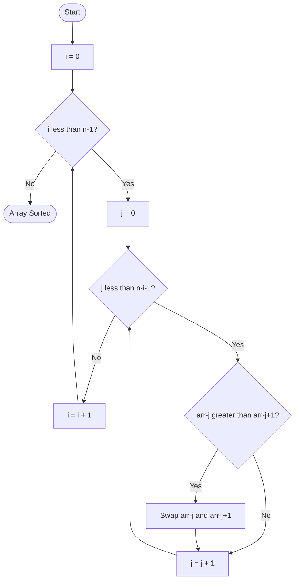

# 🫧 Bubble Sort

!!! abstract "What You'll Learn"
    - ✅ What Bubble Sort is and how it works
    - ✅ Basic and optimized implementations in Python
    - ✅ Time and Space complexity analysis
    - ✅ When to use (and NOT use) Bubble Sort
    - ✅ Visualizing passes and swaps step-by-step

Bubble Sort is the classic "teaching" sorting algorithm — each pass **bubbles** the largest unsorted element to its correct position at the end of the array. It's rarely used in production, but understanding it builds the intuition for more advanced sorts like Insertion Sort and Quick Sort.

!!! tip "New to sorting algorithms?"
    Bubble Sort is the perfect starting point. It's slow, but every step is visible and logical. Nail this before moving to Merge Sort or Quick Sort.

!!! info "Already know the basics?"
    Skip to the [Optimized Version](#2️⃣-optimized-bubble-sort-early-exit) with the early-exit flag, then check the [Complexity section](#5️⃣-complexity-analysis) to understand exactly when it's O(n) vs O(n²).

!!! warning "Keep in mind"
    Bubble Sort has **O(n²)** average and worst-case time complexity. Never use it on large datasets — Python's built-in `sorted()` uses Timsort (O(n log n)) and is always a better choice in practice.

---

## How It Works



---

## 1️⃣ Basic Bubble Sort

```python
def bubble_sort(arr: list) -> list:
    """
    Sorts arr in ascending order using Bubble Sort.
    Modifies the list in-place and also returns it.
    """
    n = len(arr)

    for i in range(n - 1):            # n-1 passes total
        for j in range(n - i - 1):   # Last i elements already sorted
            if arr[j] > arr[j + 1]:
                arr[j], arr[j + 1] = arr[j + 1], arr[j]   # Swap

    return arr


# Example
arr = [64, 34, 25, 12, 22, 11, 90]
print(bubble_sort(arr))
```

**Output:**
```
[11, 12, 22, 25, 34, 64, 90]
```

!!! tip "Pythonic swap"
    `arr[j], arr[j+1] = arr[j+1], arr[j]` uses tuple unpacking — no temp variable needed. This is idiomatic Python.

---

## 2️⃣ Optimized Bubble Sort (Early Exit)

If the array becomes sorted before all passes complete, the basic version still wastes time. Adding a `swapped` flag cuts it short.

```python
def bubble_sort_optimized(arr: list) -> list:
    """
    Optimized Bubble Sort with early exit.
    Best case O(n) when array is already sorted.
    """
    n = len(arr)

    for i in range(n - 1):
        swapped = False

        for j in range(n - i - 1):
            if arr[j] > arr[j + 1]:
                arr[j], arr[j + 1] = arr[j + 1], arr[j]
                swapped = True

        if not swapped:
            break   # No swaps → array is sorted, stop early

    return arr


# Already sorted — exits after 1 pass
arr = [1, 2, 3, 4, 5]
print(bubble_sort_optimized(arr))

# Needs full sort
arr2 = [5, 3, 8, 1, 2]
print(bubble_sort_optimized(arr2))
```

**Output:**
```
[1, 2, 3, 4, 5]
[1, 2, 3, 5, 8]
```

---

## 3️⃣ Step-by-Step Trace

```
arr = [64, 34, 25, 12, 22]

Pass 1 (i=0):  compare all adjacent pairs
  [64, 34, 25, 12, 22]
   64>34 → swap → [34, 64, 25, 12, 22]
   64>25 → swap → [34, 25, 64, 12, 22]
   64>12 → swap → [34, 25, 12, 64, 22]
   64>22 → swap → [34, 25, 12, 22, 64]  ← 64 bubbled to end ✅

Pass 2 (i=1):  last 1 element sorted, compare up to index 3
  [34, 25, 12, 22, 64]
   34>25 → swap → [25, 34, 12, 22, 64]
   34>12 → swap → [25, 12, 34, 22, 64]
   34>22 → swap → [25, 12, 22, 34, 64]  ← 34 in place ✅

Pass 3 (i=2):
  [25, 12, 22, 34, 64]
   25>12 → swap → [12, 25, 22, 34, 64]
   25>22 → swap → [12, 22, 25, 34, 64]  ← 25 in place ✅

Pass 4 (i=3):
  [12, 22, 25, 34, 64]
   12<22 → no swap                       ← 22 in place ✅

Final: [12, 22, 25, 34, 64] ✅
```

---

## 4️⃣ Memory Model

=== "In-Place Sorting (O(1) Space)"

    ```
    arr = [64, 34, 25, 12, 22]
           [0]  [1]  [2]  [3]  [4]

    Swap arr[0] and arr[1]:
    ┌─────────────────────────────┐
    │  temp = arr[0]  →  temp=64  │  ← Python avoids this with tuple swap
    │  arr[0] = arr[1]  →  34     │
    │  arr[1] = temp    →  64     │
    └─────────────────────────────┘

    Python tuple swap (no temp variable):
    arr[0], arr[1] = arr[1], arr[0]
    RHS evaluated first → (34, 64) → unpacked into arr[0], arr[1]

    Memory used: O(1) — only loop indices i, j and swapped flag
    Original array modified in-place, no copy made.
    ```

=== "What 'In-Place' Means"

    ```
    NOT in-place (creates a new list):          In-place (modifies original):
    ┌──────────────┐                            ┌──────────────┐
    │ original_arr │ ──────────────────────────▶│ original_arr │ (sorted ✅)
    └──────────────┘                            └──────────────┘
    ┌──────────────┐
    │  sorted_arr  │  (new allocation in memory)
    └──────────────┘

    Bubble Sort is IN-PLACE → space complexity O(1)
    sorted() / sort() with key copies → O(n) space
    ```

---

## 5️⃣ Complexity Analysis

=== "Time Complexity"

    | Case | Input | Complexity | Explanation |
    |------|-------|-----------|-------------|
    | Best | Already sorted | O(n) | Optimized version exits after 1 pass with no swaps |
    | Average | Random order | O(n²) | ~n²/2 comparisons on average |
    | Worst | Reverse sorted | O(n²) | Maximum swaps every pass |

=== "Space Complexity"

    | Aspect | Complexity | Reason |
    |--------|-----------|--------|
    | Auxiliary space | O(1) | Only a few variables (`i`, `j`, `swapped`) |
    | In-place? | ✅ Yes | Sorts the original array, no copy |
    | Stable? | ✅ Yes | Equal elements never swap — relative order preserved |

!!! info "Why O(n²)?"
    For n elements, Pass 1 does n-1 comparisons, Pass 2 does n-2, ..., Pass n-1 does 1.
    Total = (n-1) + (n-2) + ... + 1 = **n(n-1)/2** → **O(n²)**

---

## 6️⃣ Bubble Sort vs Other Sorts

=== "Comparison Table"

    | Algorithm | Best | Average | Worst | Space | Stable |
    |-----------|------|---------|-------|-------|--------|
    | Bubble Sort | O(n) | O(n²) | O(n²) | O(1) | ✅ |
    | Selection Sort | O(n²) | O(n²) | O(n²) | O(1) | ❌ |
    | Insertion Sort | O(n) | O(n²) | O(n²) | O(1) | ✅ |
    | Merge Sort | O(n log n) | O(n log n) | O(n log n) | O(n) | ✅ |
    | Quick Sort | O(n log n) | O(n log n) | O(n²) | O(log n) | ❌ |
    | Timsort (Python) | O(n) | O(n log n) | O(n log n) | O(n) | ✅ |

=== "When to Use Bubble Sort"

    **✅ Use when:**
    - Learning sorting algorithms for the first time
    - Array is nearly sorted (optimized version shines)
    - Dataset is tiny (< 10 elements)
    - Simplicity and readability are more important than speed

    **❌ Avoid when:**
    - Dataset is large (use `sorted()` or `.sort()`)
    - Performance matters at all
    - You're writing production code

---

## ✅ Quick Reference Summary

| Topic | Key Point |
|-------|-----------|
| **Strategy** | Repeatedly swap adjacent elements if out of order |
| **Passes needed** | At most n - 1 passes for n elements |
| **Time — Best** | O(n) — with early exit on already-sorted input |
| **Time — Average/Worst** | O(n²) |
| **Space** | O(1) — in-place |
| **Stable?** | ✅ Yes — equal elements keep their original order |
| **Optimization** | `swapped` flag for early exit |
| **Python swap** | `a, b = b, a` — no temp variable needed |
| **Use in prod?** | ❌ — use `sorted()` or `.sort()` (Timsort) instead |
| **Good for** | Teaching, nearly-sorted data, tiny arrays |