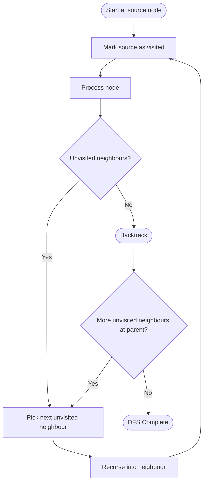

# 🌲 Depth-First Search (DFS)

!!! abstract "What You'll Learn"
    - ✅ What DFS is and how it explores graphs branch by branch
    - ✅ Recursive and iterative DFS on graphs and trees in Python
    - ✅ Cycle detection, topological sort, and path finding with DFS
    - ✅ Time and Space complexity analysis
    - ✅ When to use DFS vs BFS

Depth-First Search dives as **deep as possible** down one branch before backtracking and exploring the next. Think of it like navigating a maze — you follow one corridor all the way to a dead end, then backtrack to the last junction and try another route. This makes DFS the go-to for **cycle detection**, **topological sorting**, and **backtracking** problems.

!!! tip "New to graph algorithms?"
    Make sure you're comfortable with recursion and have read the BFS note first. BFS and DFS solve different problems — understanding both together is more valuable than either alone.

!!! info "Already know the basics?"
    Jump to [Cycle Detection](#3️⃣-cycle-detection) or [Topological Sort](#4️⃣-topological-sort-dfs) to see the most powerful DFS applications.

!!! warning "Keep in mind"
    Always track **visited nodes** on graphs with cycles — without it, DFS loops forever. For trees (no cycles), the visited set can be omitted. Python's default recursion limit is **1000** — for very deep graphs, use the iterative version.

---

## How It Works



---

## 1️⃣ Recursive DFS on a Graph

```python
def dfs_recursive(graph: dict, node: str,
                  visited: set = None, order: list = None) -> list:
    """
    Depth-First Search — recursive implementation.
    Returns nodes in the order they were visited.

    Args:
        graph:   adjacency list — dict mapping node to list of neighbours
        node:    current node being visited
        visited: set of already-visited nodes (created on first call)
        order:   accumulates visit order (created on first call)
    """
    if visited is None:
        visited = set()
    if order is None:
        order = []

    visited.add(node)
    order.append(node)

    for neighbour in graph[node]:
        if neighbour not in visited:
            dfs_recursive(graph, neighbour, visited, order)

    return order


# Example graph (undirected)
graph = {
    'A': ['B', 'C'],
    'B': ['A', 'D', 'E'],
    'C': ['A', 'F'],
    'D': ['B'],
    'E': ['B', 'F'],
    'F': ['C', 'E'],
}

print(dfs_recursive(graph, 'A'))
```

**Output:**
```
['A', 'B', 'D', 'E', 'F', 'C']
```

!!! tip "Mutable default argument warning"
    Never write `def dfs(graph, node, visited=set())` — Python creates the default set **once** and reuses it across all calls. Always default to `None` and initialise inside the function.

---

## 2️⃣ Iterative DFS on a Graph

Replaces the call stack with an explicit stack — avoids Python's recursion limit on deep graphs.

```python
def dfs_iterative(graph: dict, start: str) -> list:
    """
    Depth-First Search — iterative implementation using an explicit stack.
    Returns nodes in the order they were visited.
    """
    visited = set()
    stack   = [start]   # DFS uses a stack (LIFO)
    order   = []

    while stack:
        node = stack.pop()   # Pop from top (LIFO)

        if node in visited:
            continue

        visited.add(node)
        order.append(node)

        # Push neighbours in REVERSE order so leftmost is processed first
        for neighbour in reversed(graph[node]):
            if neighbour not in visited:
                stack.append(neighbour)

    return order


graph = {
    'A': ['B', 'C'],
    'B': ['A', 'D', 'E'],
    'C': ['A', 'F'],
    'D': ['B'],
    'E': ['B', 'F'],
    'F': ['C', 'E'],
}

print(dfs_iterative(graph, 'A'))
```

**Output:**
```
['A', 'B', 'D', 'E', 'F', 'C']
```

!!! info "Why reversed neighbours?"
    A stack is LIFO — the last item pushed is the first popped. Pushing neighbours in reverse order ensures the first neighbour in the list is explored first, matching the recursive version's behaviour.

---

## 3️⃣ DFS on a Tree

Tree DFS has three classic orderings depending on **when** you process the current node.

```python
class TreeNode:
    def __init__(self, val: int):
        self.val   = val
        self.left  = None
        self.right = None


def pre_order(root: TreeNode, result: list = None) -> list:
    """Root → Left → Right"""
    if result is None:
        result = []
    if root:
        result.append(root.val)      # Process BEFORE children
        pre_order(root.left, result)
        pre_order(root.right, result)
    return result


def in_order(root: TreeNode, result: list = None) -> list:
    """Left → Root → Right  (produces sorted output for BSTs)"""
    if result is None:
        result = []
    if root:
        in_order(root.left, result)
        result.append(root.val)      # Process BETWEEN children
        in_order(root.right, result)
    return result


def post_order(root: TreeNode, result: list = None) -> list:
    """Left → Right → Root  (process children before parent)"""
    if result is None:
        result = []
    if root:
        post_order(root.left, result)
        post_order(root.right, result)
        result.append(root.val)      # Process AFTER children
    return result


# Build example tree:
#        1
#       / \
#      2   3
#     / \
#    4   5

root            = TreeNode(1)
root.left       = TreeNode(2)
root.right      = TreeNode(3)
root.left.left  = TreeNode(4)
root.left.right = TreeNode(5)

print("Pre-order: ", pre_order(root))
print("In-order:  ", in_order(root))
print("Post-order:", post_order(root))
```

**Output:**
```
Pre-order:  [1, 2, 4, 5, 3]
In-order:   [4, 2, 5, 1, 3]
Post-order: [4, 5, 2, 3, 1]
```

=== "When to Use Each Order"

    | Order | Pattern | Common Use |
    |-------|---------|-----------|
    | Pre-order | Root → Left → Right | Copy a tree, serialize/deserialize, prefix expressions |
    | In-order | Left → Root → Right | Sorted output from BST, infix expressions |
    | Post-order | Left → Right → Root | Delete a tree, evaluate postfix expressions, directory sizes |

---

## 4️⃣ Cycle Detection

=== "Undirected Graph"

    ```python
    def has_cycle_undirected(graph: dict) -> bool:
        """
        Detects a cycle in an undirected graph using DFS.
        Returns True if a cycle exists.
        """
        visited = set()

        def dfs(node: str, parent: str) -> bool:
            visited.add(node)

            for neighbour in graph[node]:
                if neighbour not in visited:
                    if dfs(neighbour, node):
                        return True
                elif neighbour != parent:
                    return True   # Back edge found → cycle exists

            return False

        for node in graph:
            if node not in visited:
                if dfs(node, None):
                    return True

        return False


    graph_cycle    = {'A': ['B'], 'B': ['A', 'C'], 'C': ['B', 'A']}
    graph_no_cycle = {'A': ['B'], 'B': ['A', 'C'], 'C': ['B']}

    print(has_cycle_undirected(graph_cycle))     # Output: True
    print(has_cycle_undirected(graph_no_cycle))  # Output: False
    ```

    **Output:**
    ```
    True
    False
    ```

=== "Directed Graph"

    ```python
    def has_cycle_directed(graph: dict) -> bool:
        """
        Detects a cycle in a directed graph using DFS with a recursion stack.
        Returns True if a cycle exists.
        """
        visited    = set()
        rec_stack  = set()   # Tracks nodes in current DFS path

        def dfs(node: str) -> bool:
            visited.add(node)
            rec_stack.add(node)

            for neighbour in graph[node]:
                if neighbour not in visited:
                    if dfs(neighbour):
                        return True
                elif neighbour in rec_stack:
                    return True   # Back edge in directed graph → cycle

            rec_stack.remove(node)   # Remove from current path on backtrack
            return False

        for node in graph:
            if node not in visited:
                if dfs(node):
                    return True

        return False


    graph_cycle    = {'A': ['B'], 'B': ['C'], 'C': ['A']}  # A→B→C→A
    graph_no_cycle = {'A': ['B'], 'B': ['C'], 'C': []}

    print(has_cycle_directed(graph_cycle))     # Output: True
    print(has_cycle_directed(graph_no_cycle))  # Output: False
    ```

    **Output:**
    ```
    True
    False
    ```

!!! warning "Undirected vs Directed cycle detection"
    In undirected graphs, track the **parent** node to avoid falsely flagging the edge you came from as a cycle. In directed graphs, use a **recursion stack** — a node is only a cycle if it's reachable again on the **current active path**.

---

## 5️⃣ Topological Sort (DFS)

Topological sort orders nodes of a **Directed Acyclic Graph (DAG)** so every edge points from earlier to later. Classic use case: task scheduling, build systems, course prerequisites.

```python
def topological_sort(graph: dict) -> list:
    """
    Returns a topological ordering of nodes in a DAG.
    Uses DFS post-order: a node is added AFTER all its dependencies.
    Assumes graph is a DAG (no cycles).
    """
    visited = set()
    result  = []

    def dfs(node: str) -> None:
        visited.add(node)

        for neighbour in graph[node]:
            if neighbour not in visited:
                dfs(neighbour)

        result.append(node)   # Add AFTER all descendants are processed

    for node in graph:
        if node not in visited:
            dfs(node)

    return result[::-1]   # Reverse post-order = topological order


# Example: course prerequisites (directed edges = "must take before")
# A → C means A must be taken before C
graph = {
    'A': ['C'],
    'B': ['C', 'D'],
    'C': ['E'],
    'D': ['F'],
    'E': ['F'],
    'F': [],
}

print(topological_sort(graph))
```

**Output:**
```
['B', 'A', 'D', 'C', 'E', 'F']
```

!!! info "Why reverse post-order?"
    In DFS, a node is added to `result` only **after** all its neighbours are fully explored. So the last node added has no outgoing edges — it belongs at the **end**. Reversing gives the correct ordering where dependencies come first.

---

## 6️⃣ Find All Paths (Backtracking)

```python
def find_all_paths(graph: dict, start: str, target: str) -> list[list]:
    """
    Finds ALL paths from start to target using DFS + backtracking.
    Returns a list of paths (each path is a list of nodes).
    """
    all_paths = []

    def dfs(node: str, path: list, visited: set) -> None:
        if node == target:
            all_paths.append(list(path))   # Found a path — save a copy
            return

        for neighbour in graph[node]:
            if neighbour not in visited:
                visited.add(neighbour)
                path.append(neighbour)

                dfs(neighbour, path, visited)   # Recurse deeper

                path.pop()              # Backtrack — undo the choice
                visited.remove(neighbour)

    dfs(start, [start], {start})
    return all_paths


graph = {
    'A': ['B', 'C'],
    'B': ['D', 'E'],
    'C': ['E'],
    'D': ['F'],
    'E': ['F'],
    'F': [],
}

for path in find_all_paths(graph, 'A', 'F'):
    print(path)
```

**Output:**
```
['A', 'B', 'D', 'F']
['A', 'B', 'E', 'F']
['A', 'C', 'E', 'F']
```

!!! tip "The backtracking pattern"
    The key is **undoing your choice after recursion** — `path.pop()` and `visited.remove(neighbour)`. This restores state so the next branch starts fresh. This pattern appears in virtually every backtracking problem.

---

## 7️⃣ Step-by-Step Trace

```
graph = { A:[B,C], B:[A,D,E], C:[A,F], D:[B], E:[B,F], F:[C,E] }
start = A  (recursive DFS)

Call stack builds DOWN, unwinds UP:

dfs(A)  visited={A}  order=[A]
│
├─ dfs(B)  visited={A,B}  order=[A,B]
│  │
│  ├─ dfs(D)  visited={A,B,D}  order=[A,B,D]
│  │   └─ B already visited → backtrack
│  │  ← return from dfs(D)
│  │
│  ├─ dfs(E)  visited={A,B,D,E}  order=[A,B,D,E]
│  │   ├─ B already visited → skip
│  │   └─ dfs(F)  visited={A,B,C,D,E,F}  order=[A,B,D,E,F]
│  │       ├─ dfs(C)  visited+C  order=[A,B,D,E,F,C]
│  │       │   └─ A,F already visited → backtrack
│  │       └─ E already visited → backtrack
│  │      ← return from dfs(F)
│  │     ← return from dfs(E)
│  └─ A already visited → backtrack
│  ← return from dfs(B)
│
└─ C already visited → backtrack
← return from dfs(A)

Final order: [A, B, D, E, F, C] ✅
```

---

## 8️⃣ Memory Model

=== "Recursive Call Stack"

    ```
    Graph depth = 4  (A → B → E → F)

    Active call stack at deepest point:

    ┌──────────────────────┐  ← top of stack
    │  dfs(F)              │
    ├──────────────────────┤
    │  dfs(E)              │
    ├──────────────────────┤
    │  dfs(B)              │
    ├──────────────────────┤
    │  dfs(A)              │
    └──────────────────────┘  ← bottom (initial call)

    Stack depth = O(h)  where h = longest DFS path
    Worst case (linear graph): h = V → O(V) stack space
    Balanced tree: h = log(V) → O(log V) stack space
    ```

=== "Iterative Stack vs Recursive Stack"

    ```
    Recursive DFS:                  Iterative DFS:
    ┌─────────────────────┐         ┌─────────────────────┐
    │ Uses Python's own   │         │ Uses explicit list   │
    │ call stack          │         │ as stack             │
    │                     │         │                      │
    │ Limit: ~1000 frames │         │ Limit: system memory │
    │ (RecursionError)    │         │ (no hard limit)      │
    │                     │         │                      │
    │ Clean, readable     │         │ Verbose, but safe    │
    │ code                │         │ for deep graphs      │
    └─────────────────────┘         └─────────────────────┘

    Rule of thumb:
    - n < 1000 nodes  → recursive is fine
    - n >= 1000 nodes → use iterative or sys.setrecursionlimit()
    ```

---

## 9️⃣ Complexity Analysis

=== "Time Complexity"

    | Operation | Complexity | Explanation |
    |-----------|-----------|-------------|
    | Graph DFS | O(V + E) | Visit every vertex once, traverse every edge once |
    | Tree DFS | O(n) | Visit every node exactly once |
    | Cycle detection | O(V + E) | Standard DFS with extra set tracking |
    | Topological sort | O(V + E) | Standard DFS + reversal |
    | Find all paths | O(V!) worst case | Exponential — all permutations in complete graph |

=== "Space Complexity"

    | Structure | Complexity | Reason |
    |-----------|-----------|--------|
    | Visited set | O(V) | One entry per node |
    | Recursion stack | O(h) | h = max depth of DFS tree |
    | Iterative stack | O(V) worst case | All nodes on stack simultaneously |
    | Total | O(V + E) | Adjacency list + auxiliary structures |

---

## 🔟 DFS vs BFS

=== "Comparison Table"

    | Feature | DFS | BFS |
    |---------|-----|-----|
    | Data structure | Stack / Recursion (LIFO) | Queue (FIFO) |
    | Traversal order | Branch by branch | Level by level |
    | Shortest path | ❌ Not guaranteed | ✅ Guaranteed (unweighted) |
    | Memory | O(h) — stores one path | O(V) — stores entire frontier |
    | Cycle detection | ✅ Natural fit | ✅ Possible but less natural |
    | Topological sort | ✅ Post-order DFS | ✅ Kahn's algorithm (BFS-based) |
    | Backtracking | ✅ Natural fit | ❌ Awkward |
    | Best for | Deep search, cycles, topo sort, paths | Shortest path, level-order, nearest nodes |

=== "When to Use DFS"

    **✅ Use DFS when:**
    - **Cycle detection** in directed or undirected graphs
    - **Topological sorting** of a DAG
    - Finding **all paths** between two nodes
    - **Backtracking** problems (mazes, permutations, combinations)
    - Checking **connectivity** (connected components)
    - Tree traversals: **pre/in/post-order**
    - Memory is limited — DFS uses O(h) vs BFS's O(V)

    **❌ Use BFS instead when:**
    - You need the **shortest path** in an unweighted graph
    - You need **level-order** traversal of a tree
    - The graph is **deep but narrow** (DFS stack grows huge)

---

## ✅ Quick Reference Summary

| Topic | Key Point |
|-------|-----------|
| **Strategy** | Go as deep as possible, backtrack when stuck |
| **Data structure** | Recursion (call stack) or explicit stack (LIFO) |
| **Visited tracking** | Always use a `set` for O(1) lookup on graphs |
| **Time complexity** | O(V + E) for graphs, O(n) for trees |
| **Space complexity** | O(h) recursive, O(V) iterative |
| **Shortest path?** | ❌ No — use BFS for shortest paths |
| **Tree orders** | Pre = Root first, In = Left-Root-Right, Post = Root last |
| **Cycle detection** | Undirected: track parent. Directed: track recursion stack |
| **Topological sort** | Post-order DFS, then reverse the result |
| **Backtracking** | Add → recurse → remove (undo) — restore state after each branch |
| **Recursion limit** | Python default = 1000. Use iterative DFS for deep graphs |
| **Mark visited when?** | On **entry** to the node — before processing neighbours |