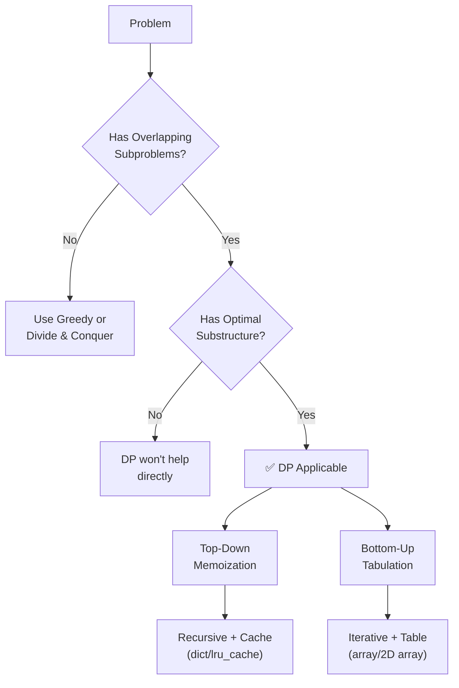

# Dynamic Programming

!!! abstract "What You'll Learn"
    - ✅ What Dynamic Programming (DP) is and when to use it
    - ✅ The two core DP techniques: Memoization and Tabulation
    - ✅ How to identify overlapping subproblems and optimal substructure
    - ✅ Classic DP problems: Fibonacci, 0/1 Knapsack, Longest Common Subsequence, Coin Change
    - ✅ How to derive recurrence relations and build bottom-up tables

Dynamic Programming is a powerful algorithmic technique for solving problems by **breaking them into overlapping subproblems** and storing the results to avoid redundant computation. It sits at the intersection of recursion and optimization — turning exponential brute-force into polynomial elegance.

!!! tip "New to recursion?"
    Before diving into DP, make sure you're comfortable with recursion and the call stack. DP is essentially *optimized recursion* — if recursion feels shaky, revisit it first.

!!! info "Already know recursion?"
    If you can write a recursive solution to a problem, you're 70% of the way to a DP solution. The jump from recursion → memoization → tabulation is the core skill this note teaches.

!!! warning "Keep in mind"
    DP is not a single algorithm — it's a **problem-solving paradigm**. The hard part isn't coding; it's recognizing *when* DP applies and defining the right subproblem.

---



---

## 1️⃣ The Two Pillars of DP

!!! info "Two properties must hold"
    A problem is suitable for DP only if it has **both** of these properties:

    1. **Overlapping Subproblems** — The same subproblems are solved repeatedly (e.g., `fib(3)` is called many times in a naive Fibonacci).
    2. **Optimal Substructure** — The optimal solution to the problem can be built from optimal solutions to its subproblems.

```
Naive Fibonacci Call Tree (exponential — O(2^n)):

                     fib(5)
                   /        \
              fib(4)        fib(3)
             /     \       /     \
         fib(3)  fib(2) fib(2) fib(1)
         /   \
     fib(2) fib(1)

fib(3) is computed 2 times, fib(2) is computed 3 times — WASTE!
```

---

## 2️⃣ Approach 1 — Top-Down (Memoization)

**Idea:** Write the natural recursive solution, then cache results in a dictionary so each subproblem is solved only once.

=== "Without Memoization"

    ```python
    def fib(n):
        if n <= 1:
            return n
        return fib(n - 1) + fib(n - 2)

    print(fib(10))  # Works, but O(2^n) time
    ```
    **Output:** `55`

=== "With Manual Memoization"

    ```python
    def fib(n, memo={}):
        if n in memo:
            return memo[n]       # ✅ Cache hit — skip recomputation
        if n <= 1:
            return n
        memo[n] = fib(n - 1, memo) + fib(n - 2, memo)
        return memo[n]

    print(fib(10))   # O(n) time, O(n) space
    print(fib(50))   # Fast!
    ```
    **Output:**
    ```
    55
    12586269025
    ```

=== "With @lru_cache"

    ```python
    from functools import lru_cache

    @lru_cache(maxsize=None)
    def fib(n):
        if n <= 1:
            return n
        return fib(n - 1) + fib(n - 2)

    print(fib(10))
    print(fib(100))
    ```
    **Output:**
    ```
    55
    354224848179261915075
    ```

!!! tip "When to use `@lru_cache`"
    For competitive programming or quick solutions, `@lru_cache(maxsize=None)` is the fastest way to memoize. For production or interviews where you want explicit control, use a manual `memo` dict.

---

## 3️⃣ Approach 2 — Bottom-Up (Tabulation)

**Idea:** Solve subproblems iteratively from the smallest base cases upward, filling a table. No recursion stack overhead.

=== "1D Table"

    ```python
    def fib(n):
        if n <= 1:
            return n
        dp = [0] * (n + 1)
        dp[0] = 0
        dp[1] = 1
        for i in range(2, n + 1):
            dp[i] = dp[i - 1] + dp[i - 2]
        return dp[n]

    print(fib(10))
    ```
    **Output:** `55`

=== "Space-Optimized"

    ```python
    def fib(n):
        if n <= 1:
            return n
        prev2, prev1 = 0, 1
        for _ in range(2, n + 1):
            curr = prev1 + prev2
            prev2, prev1 = prev1, curr
        return prev1

    print(fib(10))   # O(1) space!
    ```
    **Output:** `55`

```
Tabulation Table for fib(7):

Index:  0   1   2   3   4   5   6   7
dp[]:   0   1   1   2   3   5   8   13
         ↑   ↑
       base cases
```

---

## 4️⃣ Classic DP Problems

### 🪙 Coin Change (Minimum Coins)

**Problem:** Given coins of certain denominations and a target amount, find the minimum number of coins to make the amount.

**Recurrence:**
```
dp[amount] = min(dp[amount - coin] + 1) for each coin ≤ amount
```

```python
def coin_change(coins, amount):
    dp = [float('inf')] * (amount + 1)
    dp[0] = 0                              # Base case: 0 coins for amount 0

    for amt in range(1, amount + 1):
        for coin in coins:
            if coin <= amt:
                dp[amt] = min(dp[amt], dp[amt - coin] + 1)

    return dp[amount] if dp[amount] != float('inf') else -1

print(coin_change([1, 5, 10, 25], 36))
print(coin_change([2], 3))
```
**Output:**
```
3
-1
```

```
dp table for coins=[1,5,10,25], amount=11:

amt:  0  1  2  3  4  5  6  7  8  9  10  11
dp:   0  1  2  3  4  1  2  3  4  5   1   2
                      ↑                ↑
                   use 5            use 10+1
```

---

### 🎒 0/1 Knapsack

**Problem:** Given `n` items each with a weight and value, and a knapsack of capacity `W`, maximize total value without exceeding capacity. Each item can only be used once.

**Recurrence:**
```
dp[i][w] = max(
    dp[i-1][w],                          # Don't take item i
    dp[i-1][w - weight[i]] + value[i]    # Take item i (if it fits)
)
```

```python
def knapsack(weights, values, W):
    n = len(weights)
    # dp[i][w] = max value using first i items with capacity w
    dp = [[0] * (W + 1) for _ in range(n + 1)]

    for i in range(1, n + 1):
        for w in range(W + 1):
            # Option 1: skip item i
            dp[i][w] = dp[i - 1][w]
            # Option 2: take item i (if it fits)
            if weights[i - 1] <= w:
                dp[i][w] = max(dp[i][w],
                               dp[i - 1][w - weights[i - 1]] + values[i - 1])

    return dp[n][W]

weights = [2, 3, 4, 5]
values  = [3, 4, 5, 6]
W = 8
print(knapsack(weights, values, W))
```
**Output:** `10`

!!! info "2D DP Table visualization"
    ```
    Items: (w=2,v=3), (w=3,v=4), (w=4,v=5), (w=5,v=6)  Capacity W=8

         0  1  2  3  4  5  6  7  8
    i=0: 0  0  0  0  0  0  0  0  0
    i=1: 0  0  3  3  3  3  3  3  3
    i=2: 0  0  3  4  4  7  7  7  7
    i=3: 0  0  3  4  5  7  8  9  9
    i=4: 0  0  3  4  5  7  8  9 10  ← answer
    ```

---

### 📝 Longest Common Subsequence (LCS)

**Problem:** Find the length of the longest subsequence common to two strings.

**Recurrence:**
```
If s1[i] == s2[j]:  dp[i][j] = dp[i-1][j-1] + 1
Else:               dp[i][j] = max(dp[i-1][j], dp[i][j-1])
```

```python
def lcs(s1, s2):
    m, n = len(s1), len(s2)
    dp = [[0] * (n + 1) for _ in range(m + 1)]

    for i in range(1, m + 1):
        for j in range(1, n + 1):
            if s1[i - 1] == s2[j - 1]:
                dp[i][j] = dp[i - 1][j - 1] + 1
            else:
                dp[i][j] = max(dp[i - 1][j], dp[i][j - 1])

    return dp[m][n]

print(lcs("ABCBDAB", "BDCAB"))
print(lcs("abcde", "ace"))
```
**Output:**
```
4
3
```

```
LCS Table for "ABCBDAB" vs "BDCAB":

     ""  B  D  C  A  B
  ""  0  0  0  0  0  0
  A   0  0  0  0  1  1
  B   0  1  1  1  1  2
  C   0  1  1  2  2  2
  B   0  1  1  2  2  3
  D   0  1  2  2  2  3
  A   0  1  2  2  3  3
  B   0  1  2  2  3  4  ← LCS length = 4
```

---

### 🪜 Climbing Stairs

**Problem:** You can climb 1 or 2 steps at a time. How many distinct ways to reach step `n`?

```python
def climb_stairs(n):
    if n <= 2:
        return n
    dp = [0] * (n + 1)
    dp[1] = 1
    dp[2] = 2
    for i in range(3, n + 1):
        dp[i] = dp[i - 1] + dp[i - 2]  # Same as Fibonacci!
    return dp[n]

for i in range(1, 8):
    print(f"n={i}: {climb_stairs(i)} ways")
```
**Output:**
```
n=1: 1 ways
n=2: 2 ways
n=3: 3 ways
n=4: 5 ways
n=5: 8 ways
n=6: 13 ways
n=7: 21 ways
```

!!! tip "Pattern Recognition"
    Climbing stairs is identical to Fibonacci. Many DP problems reduce to patterns you've seen before — recognizing the pattern is a key skill.

---

## 5️⃣ How to Solve Any DP Problem

!!! info "5-Step DP Framework"

    **Step 1 — Identify** if the problem has overlapping subproblems + optimal substructure.

    **Step 2 — Define the state** — What does `dp[i]` or `dp[i][j]` represent? Be precise.

    **Step 3 — Write the recurrence** — How does the current state relate to smaller states?

    **Step 4 — Identify base cases** — What are the smallest valid subproblems?

    **Step 5 — Choose top-down or bottom-up** — then implement and optimize space if needed.

```python
# Template: Bottom-Up DP (1D)
def solve(n):
    dp = [0] * (n + 1)
    dp[0] = <base_case>          # Step 4: base case
    for i in range(1, n + 1):
        dp[i] = <recurrence>     # Step 3: recurrence
    return dp[n]

# Template: Top-Down DP (Memoization)
from functools import lru_cache

def solve(n):
    @lru_cache(maxsize=None)
    def dp(i):
        if i == <base>:          # Step 4: base case
            return <base_value>
        return <recurrence>      # Step 3: recurrence
    return dp(n)
```

---

## ✅ Quick Reference Summary

| Concept | Description | Time | Space |
|---|---|---|---|
| **Naive Recursion** | Recomputes subproblems | O(2ⁿ) | O(n) stack |
| **Memoization** | Top-down + cache | O(n) | O(n) |
| **Tabulation** | Bottom-up table | O(n) | O(n) |
| **Space Optimized** | Keep only last k states | O(n) | O(1) |
| **Fibonacci** | 1D DP / rolling vars | O(n) | O(1) |
| **Coin Change** | 1D DP, amount as state | O(n·m) | O(n) |
| **0/1 Knapsack** | 2D DP, items × capacity | O(n·W) | O(n·W) |
| **LCS** | 2D DP, two string indices | O(m·n) | O(m·n) |
| **Climbing Stairs** | Fibonacci variant | O(n) | O(1) |

!!! tip "DP Problem Patterns to Recognize"
    - **"Minimum/Maximum ways/cost"** → almost always DP
    - **"How many ways..."** → counting DP
    - **"Is it possible..."** → boolean DP
    - **"Longest/Shortest subsequence/substring"** → 1D or 2D DP
    - **"Partition/Split array"** → interval DP or subset DP