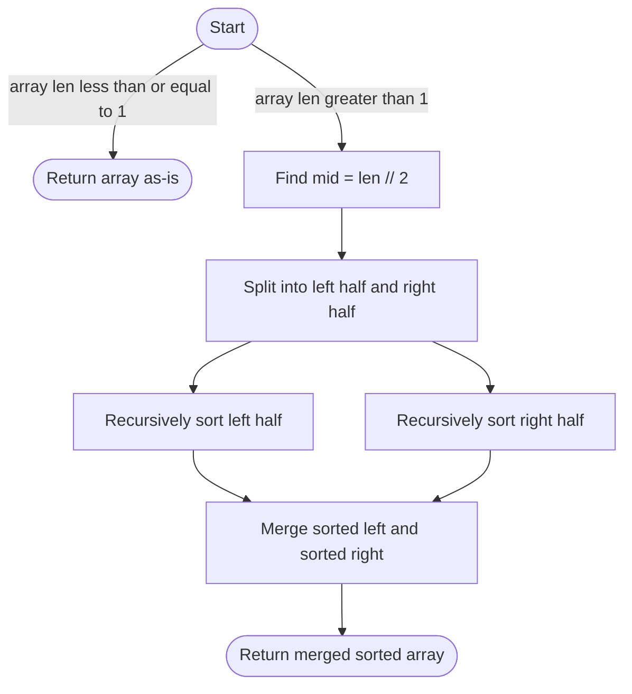

# 🔀 Merge Sort

!!! abstract "What You'll Learn"
    - ✅ What Merge Sort is and how Divide & Conquer works
    - ✅ Recursive implementation in Python
    - ✅ How the merge step actually works
    - ✅ Time and Space complexity analysis
    - ✅ When to use Merge Sort over other algorithms

Merge Sort is a **Divide and Conquer** algorithm — it splits the array in half, recursively sorts each half, then **merges** them back together in sorted order. Unlike Bubble Sort, it's genuinely useful in production for large datasets, and it's the backbone of Python's own Timsort.

!!! tip "New to sorting algorithms?"
    Make sure you're comfortable with recursion before diving in. If not, revisit recursion basics first — Merge Sort's logic clicks much faster once recursion feels natural.

!!! info "Already know the basics?"
    Jump to the [Bottom-Up iterative version](#3️⃣-bottom-up-merge-sort-no-recursion) or the [Complexity section](#5️⃣-complexity-analysis) to understand why Merge Sort guarantees O(n log n) in all cases.

!!! warning "Keep in mind"
    Merge Sort uses **O(n) extra space** for the temporary arrays during merging. If memory is tight, consider In-Place Merge Sort or Heap Sort instead.

---

## How It Works



---

## 1️⃣ Recursive Merge Sort

```python
def merge_sort(arr: list) -> list:
    """
    Sorts and returns a new sorted list using Merge Sort.
    Time:  O(n log n) — all cases
    Space: O(n) — auxiliary arrays during merge
    """
    if len(arr) <= 1:
        return arr  # Base case: already sorted

    mid = len(arr) // 2
    left  = merge_sort(arr[:mid])   # Recursively sort left half
    right = merge_sort(arr[mid:])   # Recursively sort right half

    return merge(left, right)


def merge(left: list, right: list) -> list:
    """
    Merges two sorted lists into one sorted list.
    """
    result = []
    i = j = 0

    while i < len(left) and j < len(right):
        if left[i] <= right[j]:
            result.append(left[i])
            i += 1
        else:
            result.append(right[j])
            j += 1

    # Append any remaining elements
    result.extend(left[i:])
    result.extend(right[j:])

    return result


# Example
arr = [38, 27, 43, 3, 9, 82, 10]
print(merge_sort(arr))
```

**Output:**
```
[3, 9, 10, 27, 38, 43, 82]
```

!!! tip "Why `<=` in the merge step?"
    Using `<=` (not `<`) ensures **stability** — when two elements are equal, the one from the left half comes first, preserving the original relative order.

---

## 2️⃣ In-Place Merge Sort (Memory Optimized)

The standard version creates new lists. This version sorts the original array directly using index slicing to reduce allocations.

```python
def merge_sort_inplace(arr: list, left: int, right: int) -> None:
    """
    In-place Merge Sort using indices.
    Call with: merge_sort_inplace(arr, 0, len(arr) - 1)
    Modifies arr directly, returns nothing.
    """
    if left >= right:
        return  # Base case

    mid = (left + right) // 2
    merge_sort_inplace(arr, left, mid)        # Sort left half
    merge_sort_inplace(arr, mid + 1, right)   # Sort right half
    merge_inplace(arr, left, mid, right)      # Merge both halves


def merge_inplace(arr: list, left: int, mid: int, right: int) -> None:
    left_half  = arr[left : mid + 1]
    right_half = arr[mid + 1 : right + 1]

    i = j = 0
    k = left  # Start filling from left index

    while i < len(left_half) and j < len(right_half):
        if left_half[i] <= right_half[j]:
            arr[k] = left_half[i]
            i += 1
        else:
            arr[k] = right_half[j]
            j += 1
        k += 1

    while i < len(left_half):
        arr[k] = left_half[i]
        i += 1
        k += 1

    while j < len(right_half):
        arr[k] = right_half[j]
        j += 1
        k += 1


# Example
arr = [38, 27, 43, 3, 9, 82, 10]
merge_sort_inplace(arr, 0, len(arr) - 1)
print(arr)
```

**Output:**
```
[3, 9, 10, 27, 38, 43, 82]
```

---

## 3️⃣ Bottom-Up Merge Sort (No Recursion)

Instead of splitting top-down, this version builds up sorted runs iteratively — no call stack needed.

```python
def merge_sort_bottom_up(arr: list) -> list:
    """
    Iterative (Bottom-Up) Merge Sort.
    Avoids recursion stack overhead entirely.
    Time: O(n log n) | Space: O(n)
    """
    n = len(arr)
    width = 1  # Start by merging pairs of 1 element

    while width < n:
        for i in range(0, n, 2 * width):
            left  = i
            mid   = min(i + width - 1, n - 1)
            right = min(i + 2 * width - 1, n - 1)

            if mid < right:  # Only merge if there's a right half
                merge_inplace(arr, left, mid, right)

        width *= 2  # Double the merge window each pass

    return arr


# Example
arr = [38, 27, 43, 3, 9, 82, 10]
print(merge_sort_bottom_up(arr))
```

**Output:**
```
[3, 9, 10, 27, 38, 43, 82]
```

!!! info "Bottom-Up vs Top-Down"
    Bottom-Up avoids Python's recursion limit and call stack overhead. It's preferred for very large arrays where recursion depth could be an issue.

---

## 4️⃣ Step-by-Step Trace

```
arr = [38, 27, 43, 3]

── DIVIDE ──────────────────────────────────────────────────
Level 0:          [38, 27, 43, 3]
                  /              \
Level 1:     [38, 27]         [43, 3]
             /      \         /     \
Level 2:   [38]    [27]     [43]    [3]
            ↑ base case ↑    ↑ base case ↑

── MERGE ───────────────────────────────────────────────────
Level 2 → 1:
  merge([38], [27]):
    38 > 27  → take 27  → [27]
    remaining → take 38 → [27, 38] ✅

  merge([43], [3]):
    43 > 3   → take 3   → [3]
    remaining → take 43 → [3, 43] ✅

Level 1 → 0:
  merge([27, 38], [3, 43]):
    27 > 3   → take 3   → [3]
    27 < 43  → take 27  → [3, 27]
    38 < 43  → take 38  → [3, 27, 38]
    remaining → take 43 → [3, 27, 38, 43] ✅

Final: [3, 27, 38, 43] ✅
```

---

## 5️⃣ Memory Model

=== "Recursive Call Stack"

    ```
    merge_sort([38, 27, 43, 3])
    │
    ├── merge_sort([38, 27])
    │   ├── merge_sort([38])  → returns [38]
    │   ├── merge_sort([27])  → returns [27]
    │   └── merge([38],[27])  → returns [27, 38]
    │
    ├── merge_sort([43, 3])
    │   ├── merge_sort([43])  → returns [43]
    │   ├── merge_sort([3])   → returns [3]
    │   └── merge([43],[3])   → returns [3, 43]
    │
    └── merge([27,38],[3,43]) → returns [3, 27, 38, 43]

    Max stack depth = log₂(n)
    For n=8 → 3 levels deep
    For n=1M → only ~20 levels deep
    ```

=== "Space Usage"

    ```
    arr = [38, 27, 43, 3, 9, 82, 10]  (n = 7)

    During merge step, temporary arrays are created:

    Level 2 merges: [38]+[27] → temp of size 2
                    [43]+[3]  → temp of size 2
                    [9]+[82]  → temp of size 2

    Level 1 merges: [27,38]+[3,43] → temp of size 4
                    [9,82]+[10]    → temp of size 3

    Level 0 merge:  [3,27,38,43]+[9,10,82] → temp of size 7

    Peak memory at any point = O(n) = 7 extra slots
    Call stack depth = O(log n) frames
    Total space = O(n)
    ```

---

## 6️⃣ Merge Sort vs Other Sorts

=== "Comparison Table"

    | Algorithm | Best | Average | Worst | Space | Stable |
    |-----------|------|---------|-------|-------|--------|
    | Merge Sort | O(n log n) | O(n log n) | O(n log n) | O(n) | ✅ |
    | Bubble Sort | O(n) | O(n²) | O(n²) | O(1) | ✅ |
    | Insertion Sort | O(n) | O(n²) | O(n²) | O(1) | ✅ |
    | Quick Sort | O(n log n) | O(n log n) | O(n²) | O(log n) | ❌ |
    | Heap Sort | O(n log n) | O(n log n) | O(n log n) | O(1) | ❌ |
    | Timsort (Python) | O(n) | O(n log n) | O(n log n) | O(n) | ✅ |

=== "When to Use Merge Sort"

    **✅ Use when:**
    - You need **guaranteed O(n log n)** regardless of input order
    - **Stability** matters (equal elements must keep relative order)
    - Sorting **linked lists** (merge is O(1) space for linked lists)
    - Working with **external sorting** (data too large for RAM)
    - You need a **predictable, consistent** sort time

    **❌ Avoid when:**
    - Memory is tight — Merge Sort always uses O(n) extra space
    - Dataset is small — Insertion Sort is faster in practice for n < 20
    - You want in-place sorting — use Heap Sort instead

---

## ✅ Quick Reference Summary

| Topic | Key Point |
|-------|-----------|
| **Strategy** | Divide array in half, sort each half, merge results |
| **Paradigm** | Divide and Conquer |
| **Time — All cases** | O(n log n) |
| **Space** | O(n) — auxiliary arrays during merge |
| **Stable?** | ✅ Yes — use `<=` in merge to preserve order |
| **Recursive depth** | O(log n) call stack frames |
| **Base case** | Array of length 0 or 1 — already sorted |
| **Bottom-Up variant** | Iterative, avoids recursion stack entirely |
| **Best use case** | Large datasets, linked lists, external sorting |
| **Python built-in** | `sorted()` uses Timsort — a hybrid of Merge + Insertion Sort |