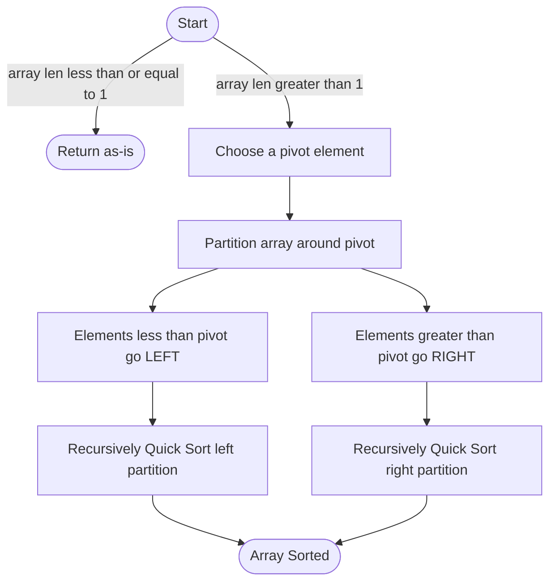

# ⚡ Quick Sort

!!! abstract "What You'll Learn"
    - ✅ What Quick Sort is and how partitioning works
    - ✅ Lomuto and Hoare partition schemes in Python
    - ✅ Pivot selection strategies and why they matter
    - ✅ Time and Space complexity analysis
    - ✅ When Quick Sort beats Merge Sort (and when it doesn't)

Quick Sort is one of the fastest sorting algorithms in practice — despite having an O(n²) worst case, its average O(n log n) performance with tiny constants makes it faster than Merge Sort on most real-world data. It's **in-place**, **cache-friendly**, and the inspiration behind Python's own Timsort.

!!! tip "New to sorting algorithms?"
    Make sure you understand recursion and have seen Merge Sort first. Quick Sort's partitioning step is the trickiest part — take it slow on the trace below before jumping to code.

!!! info "Already know the basics?"
    Jump to [Pivot Strategies](#3️⃣-pivot-selection-strategies) or [Randomized Quick Sort](#4️⃣-randomized-quick-sort) to see how to avoid the O(n²) worst case in practice.

!!! warning "Keep in mind"
    Quick Sort is **not stable** — equal elements may swap relative order. If stability matters, use Merge Sort. Also, naive pivot selection (always picking first/last) degrades to O(n²) on already-sorted input.

---

## How It Works



---

## 1️⃣ Lomuto Partition Scheme

The simpler of the two schemes — always picks the **last element** as pivot.

```python
def quick_sort_lomuto(arr: list, low: int, high: int) -> None:
    """
    Quick Sort using Lomuto partition scheme.
    Sorts arr in-place between indices low and high.
    Call with: quick_sort_lomuto(arr, 0, len(arr) - 1)
    """
    if low < high:
        pivot_idx = partition_lomuto(arr, low, high)
        quick_sort_lomuto(arr, low, pivot_idx - 1)   # Sort left of pivot
        quick_sort_lomuto(arr, pivot_idx + 1, high)  # Sort right of pivot


def partition_lomuto(arr: list, low: int, high: int) -> int:
    """
    Places pivot (arr[high]) in its correct sorted position.
    Returns the final index of the pivot.
    """
    pivot = arr[high]
    i = low - 1  # Index of smaller element

    for j in range(low, high):
        if arr[j] <= pivot:
            i += 1
            arr[i], arr[j] = arr[j], arr[i]  # Swap smaller element left

    arr[i + 1], arr[high] = arr[high], arr[i + 1]  # Place pivot
    return i + 1


# Example
arr = [10, 7, 8, 9, 1, 5]
quick_sort_lomuto(arr, 0, len(arr) - 1)
print(arr)
```

**Output:**
```
[1, 5, 7, 8, 9, 10]
```

!!! info "What does partition do?"
    After `partition_lomuto` runs, the pivot is at its **final sorted position**. Every element to its left is smaller, every element to its right is larger. Then Quick Sort recurses on both sides.

---

## 2️⃣ Hoare Partition Scheme

The original scheme by Tony Hoare — uses **two pointers** moving toward each other. Fewer swaps than Lomuto on average.

```python
def quick_sort_hoare(arr: list, low: int, high: int) -> None:
    """
    Quick Sort using Hoare partition scheme.
    Call with: quick_sort_hoare(arr, 0, len(arr) - 1)
    """
    if low < high:
        pivot_idx = partition_hoare(arr, low, high)
        quick_sort_hoare(arr, low, pivot_idx)        # Note: includes pivot_idx
        quick_sort_hoare(arr, pivot_idx + 1, high)


def partition_hoare(arr: list, low: int, high: int) -> int:
    """
    Uses first element as pivot. Returns partition index.
    Note: pivot is NOT necessarily at the returned index after this.
    """
    pivot = arr[low]
    i = low - 1
    j = high + 1

    while True:
        i += 1
        while arr[i] < pivot:
            i += 1

        j -= 1
        while arr[j] > pivot:
            j -= 1

        if i >= j:
            return j  # Partition point

        arr[i], arr[j] = arr[j], arr[i]  # Swap out-of-place elements


# Example
arr = [10, 7, 8, 9, 1, 5]
quick_sort_hoare(arr, 0, len(arr) - 1)
print(arr)
```

**Output:**
```
[1, 5, 7, 8, 9, 10]
```

!!! warning "Hoare vs Lomuto — Key Difference"
    In Hoare's scheme, the returned index is the **partition point**, not the pivot's final position. The recursive calls must include `pivot_idx` on the left side (`low` to `pivot_idx`), not `pivot_idx - 1`.

---

## 3️⃣ Pivot Selection Strategies

The pivot choice determines whether you get O(n log n) or O(n²).

=== "Last Element (Lomuto Default)"

    ```python
    def pick_last(arr, low, high):
        return high  # Always pick arr[high] as pivot
    ```

    **Problem:** Degrades to O(n²) on already-sorted or reverse-sorted arrays.

    ```
    arr = [1, 2, 3, 4, 5]  ← already sorted
    Pivot = 5 (last) → left partition has all 4 elements, right has 0
    Pivot = 4 (last) → left has 3, right has 0
    ...
    Depth = n → O(n²) ❌
    ```

=== "Median of Three"

    ```python
    def median_of_three(arr: list, low: int, high: int) -> int:
        """
        Returns index of median of arr[low], arr[mid], arr[high].
        Reduces chance of worst-case behavior.
        """
        mid = (low + high) // 2
        candidates = [(arr[low], low), (arr[mid], mid), (arr[high], high)]
        candidates.sort(key=lambda x: x[0])
        return candidates[1][1]  # Return index of median value

    # Use in partition: swap chosen pivot to end, then run Lomuto
    def partition_median(arr, low, high):
        pivot_idx = median_of_three(arr, low, high)
        arr[pivot_idx], arr[high] = arr[high], arr[pivot_idx]
        return partition_lomuto(arr, low, high)
    ```

    **Better for:** Nearly-sorted data, reverse-sorted data.

=== "Random Pivot"

    ```python
    import random

    def partition_random(arr: list, low: int, high: int) -> int:
        """Randomized pivot — swap a random element to end, then partition."""
        rand_idx = random.randint(low, high)
        arr[rand_idx], arr[high] = arr[high], arr[rand_idx]
        return partition_lomuto(arr, low, high)
    ```

    **Best for:** General use. Makes worst-case extremely unlikely regardless of input order.

---

## 4️⃣ Randomized Quick Sort

The production-ready version — random pivot makes O(n²) astronomically unlikely.

```python
import random

def quick_sort_random(arr: list, low: int, high: int) -> None:
    """
    Randomized Quick Sort — best general-purpose version.
    Expected O(n log n) for any input.
    Call with: quick_sort_random(arr, 0, len(arr) - 1)
    """
    if low < high:
        pivot_idx = partition_random(arr, low, high)
        quick_sort_random(arr, low, pivot_idx - 1)
        quick_sort_random(arr, pivot_idx + 1, high)


def partition_random(arr: list, low: int, high: int) -> int:
    rand_idx = random.randint(low, high)
    arr[rand_idx], arr[high] = arr[high], arr[rand_idx]

    pivot = arr[high]
    i = low - 1

    for j in range(low, high):
        if arr[j] <= pivot:
            i += 1
            arr[i], arr[j] = arr[j], arr[i]

    arr[i + 1], arr[high] = arr[high], arr[i + 1]
    return i + 1


# Example
arr = [64, 34, 25, 12, 22, 11, 90]
quick_sort_random(arr, 0, len(arr) - 1)
print(arr)
```

**Output:**
```
[11, 12, 22, 25, 34, 64, 90]
```

---

## 5️⃣ Step-by-Step Trace

```
arr = [10, 7, 8, 9, 1, 5]   pivot = arr[5] = 5   (Lomuto)

Partition step:
  i = -1,  pivot = 5

  j=0: arr[0]=10 > 5  → no swap       i=-1
  j=1: arr[1]=7  > 5  → no swap       i=-1
  j=2: arr[2]=8  > 5  → no swap       i=-1
  j=3: arr[3]=9  > 5  → no swap       i=-1
  j=4: arr[4]=1  <= 5 → i=0, swap(arr[0], arr[4])
       arr = [1, 7, 8, 9, 10, 5]      i=0

  Place pivot: swap(arr[1], arr[5])
       arr = [1, 5, 8, 9, 10, 7]
  pivot_idx = 1  ← 5 is now in final position ✅

Recurse left:  quick_sort([1])        → already sorted ✅
Recurse right: quick_sort([8, 9, 10, 7])

  pivot = 7,  partition:
    j=0: 8 > 7  → no swap
    j=1: 9 > 7  → no swap
    j=2: 10 > 7 → no swap
    Place pivot: swap(arr[0], arr[3])
    arr = [7, 9, 10, 8]  → pivot_idx = 0

  Recurse left:  quick_sort([])       → empty ✅
  Recurse right: quick_sort([9, 10, 8])
    ... continues until fully sorted

Final: [1, 5, 7, 8, 9, 10] ✅
```

---

## 6️⃣ Memory Model

=== "In-Place Sorting"

    ```
    arr = [10, 7, 8, 9, 1, 5]
           [0] [1] [2] [3] [4] [5]

    Quick Sort operates DIRECTLY on the original array.
    No auxiliary array created — only index variables i, j, pivot.

    Memory layout during partition:
    ┌──────────────────────────────────────────┐
    │ arr: [10,  7,  8,  9,  1,  5]           │
    │       ↑                       ↑          │
    │      low                    high         │
    │                   pivot = arr[high] = 5  │
    │  i = -1  (last index with elem <= pivot) │
    │  j scans from low → high-1              │
    └──────────────────────────────────────────┘

    Space used: O(1) per call (just i, j, pivot variables)
    ```

=== "Call Stack Depth"

    ```
    Best / Average case (balanced partitions):

    quick_sort(arr, 0, 5)
    ├── quick_sort(arr, 0, 2)   ← left half
    │   ├── quick_sort(arr, 0, 0)
    │   └── quick_sort(arr, 2, 2)
    └── quick_sort(arr, 4, 5)   ← right half
        ├── quick_sort(arr, 4, 3)  → low > high, return
        └── quick_sort(arr, 5, 5)

    Max depth = O(log n) → O(log n) stack space ✅

    Worst case (unbalanced — sorted input, bad pivot):

    quick_sort(arr, 0, 5)
    └── quick_sort(arr, 0, 4)
        └── quick_sort(arr, 0, 3)
            └── quick_sort(arr, 0, 2)
                └── quick_sort(arr, 0, 1)

    Depth = n → O(n) stack space ❌ (can cause RecursionError)
    Fix: use randomized pivot or median-of-three
    ```

---

## 7️⃣ Complexity Analysis

=== "Time Complexity"

    | Case | Occurs When | Complexity | Explanation |
    |------|------------|-----------|-------------|
    | Best | Pivot always splits evenly | O(n log n) | log n levels, O(n) work per level |
    | Average | Random input | O(n log n) | Expected balanced partitions |
    | Worst | Sorted / reverse-sorted input with bad pivot | O(n²) | n levels, O(n) work per level |

=== "Space Complexity"

    | Aspect | Complexity | Reason |
    |--------|-----------|--------|
    | Auxiliary (data) | O(1) | Sorts in-place, no extra array |
    | Call stack — best/avg | O(log n) | Balanced recursion tree |
    | Call stack — worst | O(n) | Unbalanced recursion, n deep |
    | Stable? | ❌ No | Equal elements may be reordered during swaps |

!!! info "Why is Quick Sort faster than Merge Sort in practice?"
    Both are O(n log n) average, but Quick Sort has better **cache locality** — it accesses memory sequentially during partitioning. Merge Sort jumps between two separate arrays. For in-memory sorting, this cache advantage often makes Quick Sort 2–3x faster in benchmarks.

---

## 8️⃣ Quick Sort vs Other Sorts

=== "Comparison Table"

    | Algorithm | Best | Average | Worst | Space | Stable | In-Place |
    |-----------|------|---------|-------|-------|--------|----------|
    | Quick Sort | O(n log n) | O(n log n) | O(n²) | O(log n) | ❌ | ✅ |
    | Merge Sort | O(n log n) | O(n log n) | O(n log n) | O(n) | ✅ | ❌ |
    | Heap Sort | O(n log n) | O(n log n) | O(n log n) | O(1) | ❌ | ✅ |
    | Bubble Sort | O(n) | O(n²) | O(n²) | O(1) | ✅ | ✅ |
    | Timsort (Python) | O(n) | O(n log n) | O(n log n) | O(n) | ✅ | ❌ |

=== "When to Use Quick Sort"

    **✅ Use when:**
    - You need fast **in-place** sorting with O(1) auxiliary space
    - Memory is limited and you can't afford O(n) extra space
    - Data is **random / unsorted** (avoid on nearly-sorted data with bad pivot)
    - Cache performance matters — Quick Sort is cache-friendly

    **❌ Avoid when:**
    - **Stability** is required — use Merge Sort instead
    - Input is **nearly sorted** and you're using a naive pivot strategy
    - Worst-case O(n²) is unacceptable — use Heap Sort or Merge Sort
    - You're in Python and don't need custom logic — just use `sorted()`

---

## ✅ Quick Reference Summary

| Topic | Key Point |
|-------|-----------|
| **Strategy** | Pick pivot, partition around it, recurse on both sides |
| **Paradigm** | Divide and Conquer |
| **Time — Best/Avg** | O(n log n) |
| **Time — Worst** | O(n²) — sorted input with bad pivot |
| **Space (auxiliary)** | O(1) — in-place |
| **Space (call stack)** | O(log n) avg, O(n) worst |
| **Stable?** | ❌ No |
| **In-place?** | ✅ Yes |
| **Lomuto scheme** | Simpler, picks last element as pivot |
| **Hoare scheme** | Fewer swaps, picks first element as pivot |
| **Best pivot strategy** | Random pivot or Median-of-Three |
| **Worst case trigger** | Already-sorted input with first/last pivot |
| **Fix for worst case** | Randomized pivot — makes O(n²) astronomically unlikely |
| **Python built-in** | `sorted()` uses Timsort — use it in production |