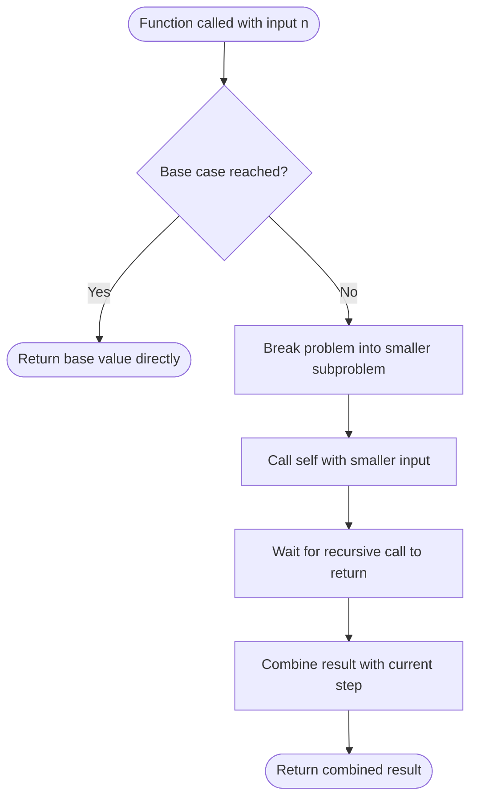

# 🔁 Recursion

!!! abstract "What You'll Learn"
    - ✅ What recursion is and how the call stack works
    - ✅ How to identify base cases and recursive cases
    - ✅ Classic recursive problems in Python
    - ✅ Memoization and when recursion becomes inefficient
    - ✅ When to use recursion vs iteration

Recursion is when a function **calls itself** to solve a smaller version of the same problem. Every recursive solution has two parts — a **base case** that stops the recursion, and a **recursive case** that breaks the problem down. Get these two right and recursion becomes one of the most elegant tools in your toolkit.

!!! tip "New to recursion?"
    The hardest part is trusting that the recursive call will work. Assume it does — focus on what the function should do for the **current** input, not every input at once. This mental model is called the **recursive leap of faith**.

!!! info "Already know the basics?"
    Jump to [Memoization](#5️⃣-memoization--top-down-dp) to see how to fix exponential recursion, or [Tail Recursion](#6️⃣-tail-recursion--iteration-conversion) to understand Python's recursion limits.

!!! warning "Keep in mind"
    Python's default recursion limit is **1000 frames**. Deep recursion raises `RecursionError`. Always identify your base case first — a missing or wrong base case causes infinite recursion and crashes the program.

---

## How It Works



---

## 1️⃣ Anatomy of a Recursive Function

Every recursive function has exactly two parts:

```python
def recursive_function(n):
    # ── BASE CASE ──────────────────────────────────────
    # The simplest input where the answer is known directly.
    # Without this, recursion runs forever → RecursionError.
    if n == 0:
        return 0

    # ── RECURSIVE CASE ─────────────────────────────────
    # Break the problem into a smaller version of itself.
    # Must make progress toward the base case every call.
    return n + recursive_function(n - 1)


print(recursive_function(5))   # 5 + 4 + 3 + 2 + 1 + 0 = 15
```

**Output:**
```
15
```

!!! warning "Two rules for correct recursion"
    1. **Base case must exist** — every recursive path must eventually hit it.
    2. **Progress must be made** — each call must move closer to the base case. `recursive_function(n)` calling `recursive_function(n)` never terminates.

---

## 2️⃣ Classic Examples

### Factorial

```python
def factorial(n: int) -> int:
    """
    n! = n × (n-1) × (n-2) × ... × 1
    Base case: 0! = 1
    """
    if n == 0:          # Base case
        return 1
    return n * factorial(n - 1)   # Recursive case


print(factorial(5))   # 5 × 4 × 3 × 2 × 1
print(factorial(0))   # Base case
```

**Output:**
```
120
1
```

---

### Fibonacci

```python
def fibonacci(n: int) -> int:
    """
    fib(n) = fib(n-1) + fib(n-2)
    Base cases: fib(0) = 0, fib(1) = 1
    """
    if n <= 1:                          # Base cases
        return n
    return fibonacci(n - 1) + fibonacci(n - 2)   # Two recursive calls


print(fibonacci(7))    # Output: 13
print(fibonacci(10))   # Output: 55
```

**Output:**
```
13
55
```

!!! warning "Naive Fibonacci is exponential"
    `fibonacci(n)` makes **two** recursive calls, each of which makes two more. This creates O(2ⁿ) calls — `fibonacci(50)` would take minutes. See [Memoization](#5️⃣-memoization--top-down-dp) to fix this.

---

### Sum of a List

```python
def list_sum(arr: list) -> int:
    """Recursively sum all elements in a list."""
    if not arr:               # Base case: empty list
        return 0
    return arr[0] + list_sum(arr[1:])   # First element + sum of rest


print(list_sum([1, 2, 3, 4, 5]))   # Output: 15
```

**Output:**
```
15
```

---

### Power Function

```python
def power(base: float, exp: int) -> float:
    """
    Computes base^exp recursively.
    Uses fast exponentiation: base^n = (base^(n//2))^2
    """
    if exp == 0:
        return 1                         # base^0 = 1
    if exp % 2 == 0:
        half = power(base, exp // 2)
        return half * half               # Even: square the half-power
    return base * power(base, exp - 1)  # Odd: peel off one base


print(power(2, 10))   # Output: 1024
print(power(3, 4))    # Output: 81
```

**Output:**
```
1024
81
```

---

### Binary Search (Recursive)

```python
def binary_search(arr: list, target: int, low: int, high: int) -> int:
    """Recursive Binary Search — returns index or -1."""
    if low > high:
        return -1                          # Base case: not found

    mid = (low + high) // 2

    if arr[mid] == target:
        return mid                         # Base case: found
    elif arr[mid] < target:
        return binary_search(arr, target, mid + 1, high)
    else:
        return binary_search(arr, target, low, mid - 1)


arr = [1, 3, 5, 7, 9, 11, 13]
print(binary_search(arr, 7, 0, len(arr) - 1))    # Output: 3
print(binary_search(arr, 6, 0, len(arr) - 1))    # Output: -1
```

**Output:**
```
3
-1
```

---

## 3️⃣ Step-by-Step Call Stack Trace

```
factorial(4)
│
├─ return 4 × factorial(3)
│              │
│              ├─ return 3 × factorial(2)
│              │              │
│              │              ├─ return 2 × factorial(1)
│              │              │              │
│              │              │              ├─ return 1 × factorial(0)
│              │              │              │              │
│              │              │              │              └─ return 1  ← BASE CASE
│              │              │              │
│              │              │              └─ return 1 × 1 = 1
│              │              │
│              │              └─ return 2 × 1 = 2
│              │
│              └─ return 3 × 2 = 6
│
└─ return 4 × 6 = 24

Result: 24 ✅

Call stack at deepest point (4 frames):
┌──────────────────┐
│  factorial(0)    │  ← top (base case)
├──────────────────┤
│  factorial(1)    │
├──────────────────┤
│  factorial(2)    │
├──────────────────┤
│  factorial(3)    │
├──────────────────┤
│  factorial(4)    │  ← bottom (first call)
└──────────────────┘
```

---

## 4️⃣ Memory Model

=== "Call Stack Frames"

    ```
    Each recursive call creates a NEW stack frame with its own:
    - Local variables (n, result)
    - Return address (where to go when done)
    - Parameters passed in

    fibonacci(4):

    Frame 5: fib(0) → returns 0 ──────────────────┐
    Frame 4: fib(1) → returns 1 ──────────────┐   │
    Frame 3: fib(2) = fib(1) + fib(0) ────┐   │   │
    Frame 2: fib(3) = fib(2) + fib(1) ─┐  │   │   │
    Frame 1: fib(4) = fib(3) + fib(2)  │  │   │   │
                                        │  │   │   │
    Results flow back UP the stack:     │  │   │   │
    fib(0)=0, fib(1)=1 → fib(2)=1 ─────┘  │   │   │
    fib(1)=1, fib(2)=1 → fib(3)=2 ────────┘   │   │
    fib(2)=1, fib(3)=2 → fib(4)=3 ────────────┘   │
                                                    │
    NOTE: fib(0) and fib(1) are called MULTIPLE    │
    times — this is the inefficiency memoization   │
    solves ────────────────────────────────────────┘
    ```

=== "Recursion Tree for fib(5)"

    ```
                        fib(5)
                       /      \
                  fib(4)       fib(3)
                 /     \      /     \
             fib(3)  fib(2) fib(2) fib(1)
             /   \   /   \  /   \
          fib(2) fib(1) fib(1) fib(0) fib(1) fib(0)
          /   \
       fib(1) fib(0)

    Unique subproblems: fib(0), fib(1), fib(2), fib(3), fib(4) = 5
    Total calls made:  15  ← massive overlap!

    fib(2) computed: 3 times
    fib(3) computed: 2 times

    Memoization stores results → each computed only ONCE → O(n) calls
    ```

---

## 5️⃣ Memoization — Top-Down DP

Memoization caches results of expensive calls so they're never computed twice.

=== "Manual Cache (dict)"

    ```python
    def fibonacci_memo(n: int, cache: dict = None) -> int:
        """Fibonacci with manual memoization — O(n) time, O(n) space."""
        if cache is None:
            cache = {}

        if n <= 1:
            return n
        if n in cache:
            return cache[n]   # Return cached result immediately

        cache[n] = fibonacci_memo(n - 1, cache) + fibonacci_memo(n - 2, cache)
        return cache[n]


    print(fibonacci_memo(10))   # Output: 55
    print(fibonacci_memo(50))   # Output: 12586269025  (instant!)
    ```

    **Output:**
    ```
    55
    12586269025
    ```

=== "Using @lru_cache"

    ```python
    from functools import lru_cache

    @lru_cache(maxsize=None)   # Cache all results, no limit
    def fibonacci_lru(n: int) -> int:
        """Fibonacci with Python's built-in LRU cache decorator."""
        if n <= 1:
            return n
        return fibonacci_lru(n - 1) + fibonacci_lru(n - 2)


    print(fibonacci_lru(10))   # Output: 55
    print(fibonacci_lru(50))   # Output: 12586269025
    print(fibonacci_lru.cache_info())
    ```

    **Output:**
    ```
    55
    12586269025
    CacheInfo(hits=48, misses=51, maxsize=None, currsize=51)
    ```

!!! info "`@lru_cache` vs manual dict"
    `@lru_cache` is cleaner and handles edge cases automatically. Use manual dict when you need to share the cache across calls or inspect it. Both give O(n) time and O(n) space for Fibonacci.

---

## 6️⃣ Tail Recursion & Iteration Conversion

Python does **not** optimise tail calls — every recursive call uses a stack frame regardless. For deep recursion, convert to iteration.

=== "Recursive Factorial"

    ```python
    def factorial_recursive(n: int) -> int:
        if n == 0:
            return 1
        return n * factorial_recursive(n - 1)

    # Depth = n frames — RecursionError for n > ~1000
    ```

=== "Iterative Factorial"

    ```python
    def factorial_iterative(n: int) -> int:
        """Same result, O(1) space, no stack limit."""
        result = 1
        for i in range(2, n + 1):
            result *= i
        return result

    print(factorial_iterative(5))      # Output: 120
    print(factorial_iterative(1000))   # Output: a very big number ✅
    ```

    **Output:**
    ```
    120
    402387260077093773543702433923003985719374864210714632543799910429938512398629020592044208486969404800479988610197196058631666872994808558901323829669944590997424504087073759918823627727188732519779505950995276120874975462497043601418278094646496291056393887437886487337119181045825783647849977012476632889835955735432513185323958463075557409114262417474349347553428646576611667797396668820291207379143853719588249808126867838374559731746136085379534524221586593201928090878297308431392844403281231558611036976801357304216168747609675871348312025478589320767169132448426236131412508780208000261683151027341827977704784635868170164365024153691398281264810213092761244895217527321828267815462547326312557439249464396737891422 (truncated)
    ```

=== "Converting Recursion to Iteration"

    ```python
    # General pattern: replace call stack with explicit stack

    # Recursive DFS
    def dfs_recursive(graph, node, visited=None):
        if visited is None: visited = set()
        visited.add(node)
        for neighbour in graph[node]:
            if neighbour not in visited:
                dfs_recursive(graph, neighbour, visited)
        return visited

    # Iterative DFS — identical result, no recursion limit
    def dfs_iterative(graph, start):
        visited = set()
        stack   = [start]
        while stack:
            node = stack.pop()
            if node not in visited:
                visited.add(node)
                for neighbour in reversed(graph[node]):
                    if neighbour not in visited:
                        stack.append(neighbour)
        return visited
    ```

---

## 7️⃣ Common Recursive Patterns

=== "Divide and Conquer"

    ```python
    # Split problem in half, solve each half, combine
    # Examples: Merge Sort, Binary Search, Quick Sort

    def merge_sort(arr):
        if len(arr) <= 1:
            return arr
        mid   = len(arr) // 2
        left  = merge_sort(arr[:mid])    # Solve left half
        right = merge_sort(arr[mid:])    # Solve right half
        return merge(left, right)        # Combine
    ```

=== "Backtracking"

    ```python
    # Try a choice → recurse → undo the choice
    # Examples: permutations, combinations, maze solving

    def permutations(nums, path=None, result=None):
        if path   is None: path   = []
        if result is None: result = []

        if not nums:
            result.append(list(path))
            return result

        for i in range(len(nums)):
            path.append(nums[i])                      # Choose
            permutations(nums[:i] + nums[i+1:], path, result)  # Recurse
            path.pop()                                # Undo

        return result

    print(permutations([1, 2, 3]))
    ```

    **Output:**
    ```
    [[1, 2, 3], [1, 3, 2], [2, 1, 3], [2, 3, 1], [3, 1, 2], [3, 2, 1]]
    ```

=== "Tree Recursion"

    ```python
    # Each call spawns multiple recursive calls
    # Examples: Fibonacci, tree traversal, combinatorics

    def count_ways(n: int) -> int:
        """Count ways to climb n stairs taking 1 or 2 steps."""
        if n <= 1:
            return 1
        return count_ways(n - 1) + count_ways(n - 2)   # Two branches

    print(count_ways(5))   # Output: 8
    ```

    **Output:**
    ```
    8
    ```

=== "Decrease and Conquer"

    ```python
    # Reduce problem by one step each call
    # Examples: factorial, list sum, linear search

    def reverse_string(s: str) -> str:
        """Recursively reverse a string."""
        if len(s) <= 1:          # Base case
            return s
        return reverse_string(s[1:]) + s[0]   # Rest reversed + first char

    print(reverse_string("hello"))   # Output: olleh
    ```

    **Output:**
    ```
    olleh
    ```

---

## 8️⃣ Complexity Analysis

=== "Time Complexity"

    | Problem | Recurrence | Time | Explanation |
    |---------|-----------|------|-------------|
    | Factorial | T(n) = T(n-1) + O(1) | O(n) | One call per step |
    | List sum | T(n) = T(n-1) + O(1) | O(n) | One call per element |
    | Fibonacci (naive) | T(n) = T(n-1) + T(n-2) | O(2ⁿ) | Two calls, massive overlap |
    | Fibonacci (memo) | T(n) = O(1) per subproblem × n | O(n) | Each subproblem computed once |
    | Binary Search | T(n) = T(n/2) + O(1) | O(log n) | Halves input each call |
    | Merge Sort | T(n) = 2T(n/2) + O(n) | O(n log n) | Master theorem |

=== "Space Complexity"

    | Problem | Stack Depth | Space | Note |
    |---------|------------|-------|------|
    | Factorial | n | O(n) | One frame per call |
    | Fibonacci (naive) | n | O(n) | Max depth of tree |
    | Fibonacci (memo) | n + cache | O(n) | Cache adds O(n) |
    | Binary Search | log n | O(log n) | Halves each time |
    | Merge Sort | log n | O(log n) stack + O(n) merge | Stack is shallow |

!!! info "Master Theorem (quick reference)"
    For recurrences of the form T(n) = aT(n/b) + O(nᵈ):

    - If d > log_b(a) → O(nᵈ)
    - If d = log_b(a) → O(nᵈ log n)
    - If d < log_b(a) → O(n^log_b(a))

    Merge Sort: a=2, b=2, d=1 → d = log₂(2) = 1 → **O(n log n)**

---

## 9️⃣ Recursion vs Iteration

=== "Comparison Table"

    | Feature | Recursion | Iteration |
    |---------|-----------|-----------|
    | Readability | ✅ Often cleaner | Can be verbose |
    | Stack usage | O(depth) call frames | O(1) usually |
    | Depth limit | ~1000 (Python default) | No limit |
    | Performance | Slight overhead per call | Faster in practice |
    | Best for | Trees, graphs, D&C, backtracking | Simple loops, large n |
    | Tail call optimisation | ❌ Python does NOT do this | N/A |

=== "When to Use Recursion"

    **✅ Use recursion when:**
    - The problem is **naturally recursive** — trees, graphs, D&C
    - **Backtracking** is needed — recursion makes undo trivial
    - **Code clarity** matters more than raw performance
    - Input size is **bounded** (won't hit recursion limit)

    **❌ Use iteration instead when:**
    - Input can be **very large** (n > 1000 without memoization)
    - You need **O(1) space** — iteration avoids stack frames
    - Python's recursion limit is a concern
    - Simple sequential processing — a `for` loop is clearer

---

## ✅ Quick Reference Summary

| Topic | Key Point |
|-------|-----------|
| **Two parts** | Base case (stop) + Recursive case (shrink and call self) |
| **Base case** | Must exist on every recursive path — missing = infinite recursion |
| **Progress** | Every call must move closer to the base case |
| **Call stack** | Each call creates a new frame — depth = O(recursion depth) |
| **Python limit** | Default recursion limit = 1000 frames → `RecursionError` |
| **Fibonacci naive** | O(2ⁿ) — exponential due to overlapping subproblems |
| **Memoization** | Cache results → O(n) time, O(n) space |
| **`@lru_cache`** | Pythonic way to memoize — wraps function with no code change |
| **Tail recursion** | Python does NOT optimise it — deep tail recursion still crashes |
| **Convert to loop** | Replace call stack with explicit stack for deep graphs/trees |
| **Backtracking pattern** | Choose → Recurse → Undo |
| **Divide and Conquer** | Split → Solve halves → Combine |
| **Leap of faith** | Trust the recursive call works — focus on current step only |