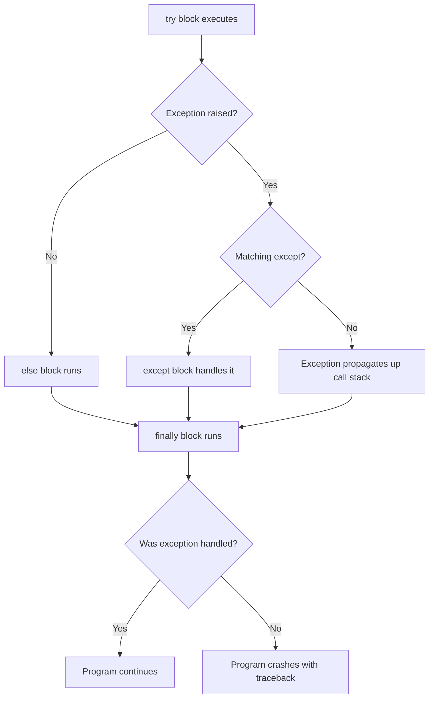

# Error Handling

!!! abstract "What You'll Learn"
    - ✅ What exceptions are and how Python raises them
    - ✅ How to use `try`, `except`, `else`, and `finally`
    - ✅ Catching specific vs multiple vs all exceptions
    - ✅ How to raise exceptions manually with `raise`
    - ✅ Creating custom exception classes
    - ✅ Exception chaining and the `__cause__` / `__context__` attributes
    - ✅ Best practices for writing robust, readable error handling code

When something goes wrong at runtime, Python doesn't just crash silently — it raises an **exception**, an object that describes what went wrong and where. Your job is to decide which exceptions to expect, how to recover from them, and when to let them bubble up.

---

!!! tip "New to Python?"
    Think of exceptions like a fire alarm. When something breaks, Python "pulls the alarm" (raises an exception). A `try/except` block is your fire drill plan — you decide what to do when the alarm goes off instead of letting the building burn down.

!!! info "Already know Python?"
    Focus on [Exception Chaining](#8️⃣-exception-chaining), [Custom Exceptions](#7️⃣-custom-exceptions), and the [Best Practices](#🔟-best-practices) section — these are the areas most developers skip and then regret later.

!!! warning "Keep in mind"
    Catching too broadly (e.g. `except Exception`) can silently swallow bugs. Always catch the **most specific** exception you can handle.

---

## How Exception Handling Works



---

## 1️⃣ Basic `try / except`

Wrap risky code in a `try` block; handle the failure in `except`:

```python
try:
    result = 10 / 0
except ZeroDivisionError:
    print("Cannot divide by zero!")
```

**Output:**
```
Cannot divide by zero!
```

```python
try:
    number = int("not a number")
except ValueError as e:
    print(f"Conversion failed: {e}")
```

**Output:**
```
Conversion failed: invalid literal for int() with base 10: 'not a number'
```

!!! tip "The `as e` alias"
    `except ValueError as e` binds the exception object to `e`. You can inspect `e` for the error message, type, and traceback. Always name it `e` or something descriptive.

---

## 2️⃣ The Full `try / except / else / finally` Block

```python
try:
    file = open("data.txt", "r")
    content = file.read()
except FileNotFoundError:
    print("File not found.")
else:
    # Runs only if NO exception was raised in try
    print(f"Read {len(content)} characters.")
finally:
    # ALWAYS runs — exception or not
    print("Done attempting file read.")
```

**Output (file missing):**
```
File not found.
Done attempting file read.
```

**Output (file exists):**
```
Read 1024 characters.
Done attempting file read.
```

```
Block execution order
─────────────────────────────────────────────────
  try      →  always attempted
  except   →  only if exception raised in try
  else     →  only if NO exception in try
  finally  →  ALWAYS (cleanup code goes here)
─────────────────────────────────────────────────
```

!!! info "When to use `else`"
    Put code that should run only on **success** in `else`, not at the end of `try`. This makes it explicit that the code isn't protected by the `except` clause.

---

## 3️⃣ Catching Multiple Exceptions

=== "Separate except clauses"
    Handle different exceptions differently — the most readable approach:

    ```python
    try:
        value = int(input("Enter a number: "))
        result = 100 / value
    except ValueError:
        print("That's not a valid number.")
    except ZeroDivisionError:
        print("Cannot divide by zero.")
    except Exception as e:
        print(f"Unexpected error: {e}")
    ```

=== "Tuple of exceptions"
    Handle multiple exceptions the same way:

    ```python
    try:
        data = fetch_data()
    except (TimeoutError, ConnectionError) as e:
        print(f"Network issue: {e}")
        retry()
    ```

=== "Catch-all (use sparingly)"
    Catches everything — but you lose specificity:

    ```python
    try:
        risky_operation()
    except Exception as e:
        print(f"Something went wrong: {type(e).__name__}: {e}")
    ```

!!! warning "Order matters"
    Python checks `except` clauses **top to bottom** and uses the first match. Always put **specific** exceptions before **general** ones. Putting `Exception` first would catch everything and skip your specific handlers.

---

## 4️⃣ Common Built-in Exceptions

```
Exception Hierarchy (simplified)
─────────────────────────────────────────────────────────
  BaseException
  └── Exception
      ├── ArithmeticError
      │   ├── ZeroDivisionError
      │   └── OverflowError
      ├── LookupError
      │   ├── IndexError
      │   └── KeyError
      ├── ValueError
      ├── TypeError
      ├── AttributeError
      ├── NameError
      ├── OSError
      │   ├── FileNotFoundError
      │   ├── PermissionError
      │   └── TimeoutError
      ├── RuntimeError
      ├── StopIteration
      └── ImportError
          └── ModuleNotFoundError
─────────────────────────────────────────────────────────
```

| Exception | When it's raised |
|---|---|
| `ValueError` | Right type, wrong value: `int("abc")` |
| `TypeError` | Wrong type entirely: `"a" + 1` |
| `KeyError` | Dict key doesn't exist: `d["missing"]` |
| `IndexError` | List index out of range: `lst[99]` |
| `AttributeError` | Attribute doesn't exist: `None.strip()` |
| `FileNotFoundError` | File path doesn't exist |
| `ZeroDivisionError` | Division or modulo by zero |
| `ImportError` | Module can't be imported |
| `StopIteration` | Iterator has no more items |
| `RuntimeError` | Generic runtime failure |

---

## 5️⃣ Raising Exceptions with `raise`

You can raise exceptions yourself to signal invalid states:

```python
def set_age(age):
    if not isinstance(age, int):
        raise TypeError(f"Age must be an int, got {type(age).__name__}")
    if age < 0 or age > 150:
        raise ValueError(f"Age {age} is out of valid range (0–150)")
    return age

set_age(-5)
```

**Output:**
```
ValueError: Age -5 is out of valid range (0–150)
```

### Re-raising an exception

```python
try:
    risky()
except ValueError as e:
    log_error(e)
    raise  # re-raises the SAME exception without losing the traceback
```

!!! tip "Bare `raise` vs `raise e`"
    Use bare `raise` (no argument) to re-raise the current exception — it preserves the original traceback. `raise e` creates a new traceback starting at that line, making debugging harder.

---

## 6️⃣ `assert` Statements

Assertions are quick sanity checks — they raise `AssertionError` if the condition is `False`:

```python
def calculate_discount(price, discount):
    assert 0 <= discount <= 1, f"Discount must be between 0 and 1, got {discount}"
    return price * (1 - discount)

calculate_discount(100, 1.5)
```

**Output:**
```
AssertionError: Discount must be between 0 and 1, got 1.5
```

!!! warning "Assertions are for development, not validation"
    Python can be run with `-O` (optimise) flag which **disables all assertions**. Never use `assert` for input validation in production code — use `raise ValueError` instead. Use `assert` for internal invariants and debugging.

---

## 7️⃣ Custom Exceptions

Define your own exception classes by inheriting from `Exception` (or a more specific built-in):

```python
# Define custom exceptions
class AppError(Exception):
    """Base class for all application exceptions."""
    pass

class DatabaseError(AppError):
    """Raised when a database operation fails."""
    def __init__(self, message, query=None):
        super().__init__(message)
        self.query = query

class AuthenticationError(AppError):
    """Raised when user authentication fails."""
    pass
```

```python
# Using custom exceptions
def get_user(user_id):
    query = f"SELECT * FROM users WHERE id = {user_id}"
    result = db.execute(query)
    if not result:
        raise DatabaseError("User not found", query=query)
    return result

try:
    user = get_user(999)
except DatabaseError as e:
    print(f"DB Error: {e}")
    print(f"Failed query: {e.query}")
except AppError as e:
    print(f"App Error: {e}")
```

**Output:**
```
DB Error: User not found
Failed query: SELECT * FROM users WHERE id = 999
```

!!! tip "Custom exception hierarchy"
    Always create a base `AppError` class for your project. Callers can catch `AppError` to handle any app-level failure, or catch specific subclasses for fine-grained handling.

```
Custom Exception Hierarchy
──────────────────────────────────
  AppError (your base)
  ├── DatabaseError
  │   ├── ConnectionError
  │   └── QueryError
  ├── AuthenticationError
  └── ValidationError
──────────────────────────────────
Catch specific → broad as needed
```

---

## 8️⃣ Exception Chaining

When you catch an exception and raise a new one, Python can link them with `raise ... from`:

```python
def load_config(path):
    try:
        with open(path) as f:
            return json.load(f)
    except FileNotFoundError as e:
        raise RuntimeError(f"Config file missing: {path}") from e
```

**Output (when file missing):**
```
FileNotFoundError: [Errno 2] No such file or directory: 'config.json'

The above exception was the direct cause of the following exception:

RuntimeError: Config file missing: config.json
```

=== "Explicit chaining (`from`)"
    ```python
    raise NewError("message") from original_error
    # Sets __cause__ — shows "The above exception was the direct cause of..."
    ```

=== "Suppress chaining"
    ```python
    raise NewError("message") from None
    # Hides the original exception from the traceback
    ```

=== "Implicit chaining"
    ```python
    # If you raise inside an except block without `from`,
    # Python automatically sets __context__ — shows
    # "During handling of the above exception, another exception occurred:"
    ```

!!! info "When to use exception chaining"
    Chain exceptions when you're wrapping a low-level error into a higher-level one. It gives callers both the context ("what went wrong at my level") and the root cause ("why it went wrong underneath").

---

## 9️⃣ Context Managers and Exception Safety

Use `with` statements for resources that must be cleaned up even if an exception occurs:

```python
# Without context manager — unsafe
f = open("data.txt")
data = f.read()  # If this raises, f.close() never runs
f.close()

# With context manager — safe
with open("data.txt") as f:
    data = f.read()  # f.close() guaranteed even on exception
```

```python
# Multiple context managers
with open("input.txt") as src, open("output.txt", "w") as dst:
    dst.write(src.read().upper())
```

### Creating your own context manager

```python
from contextlib import contextmanager

@contextmanager
def managed_transaction(db):
    try:
        yield db.connection()
        db.commit()
    except Exception:
        db.rollback()
        raise  # re-raise after cleanup
    finally:
        db.close()

with managed_transaction(db) as conn:
    conn.execute("INSERT INTO ...")
```

!!! tip "`contextlib.suppress`"
    Cleanly ignore specific exceptions without a try/except:
    ```python
    from contextlib import suppress

    with suppress(FileNotFoundError):
        os.remove("temp.txt")  # silently ignored if file doesn't exist
    ```

---

## 🔟 Best Practices

```python
# ✅ Catch specific exceptions
try:
    value = config["timeout"]
except KeyError:
    value = 30  # sensible default

# ❌ Too broad — hides real bugs
try:
    value = config["timeout"]
except Exception:
    value = 30
```

```python
# ✅ Use finally for cleanup
conn = None
try:
    conn = db.connect()
    conn.execute(query)
except DatabaseError as e:
    log.error(e)
finally:
    if conn:
        conn.close()

# ✅ Better — use a context manager instead
with db.connect() as conn:
    conn.execute(query)
```

```python
# ✅ Include useful context in exception messages
raise ValueError(
    f"Expected positive integer for 'retries', got {retries!r}"
)

# ❌ Vague — unhelpful for debugging
raise ValueError("Invalid value")
```

```python
# ✅ Don't silence exceptions without logging
try:
    send_notification(user)
except NotificationError as e:
    logger.warning("Notification failed for user %s: %s", user.id, e)
    # intentionally not re-raising — notifications are non-critical

# ❌ Silent swallow — bugs disappear
try:
    send_notification(user)
except Exception:
    pass
```

!!! warning "Never catch `BaseException` or `KeyboardInterrupt` silently"
    `KeyboardInterrupt` (Ctrl+C) and `SystemExit` inherit from `BaseException`, not `Exception`. Catching `BaseException` will trap those too, making your program unresponsive to user interruption.

---

## ✅ Quick Reference Summary

| Keyword / Pattern | Purpose |
|---|---|
| `try: ... except E:` | Catch exception `E` |
| `except (E1, E2) as e:` | Catch multiple exceptions the same way |
| `else:` | Runs only if `try` succeeded |
| `finally:` | Always runs — use for cleanup |
| `raise ValueError("msg")` | Raise a specific exception |
| `raise` (bare) | Re-raise current exception, preserving traceback |
| `raise NewErr() from e` | Chain exceptions explicitly |
| `raise NewErr() from None` | Suppress original exception in traceback |
| `assert cond, "msg"` | Dev-time sanity check (disabled with `-O`) |
| `class MyError(Exception)` | Define a custom exception |
| `with suppress(E):` | Silently ignore a specific exception |
| `@contextmanager` | Create a context manager with `yield` |