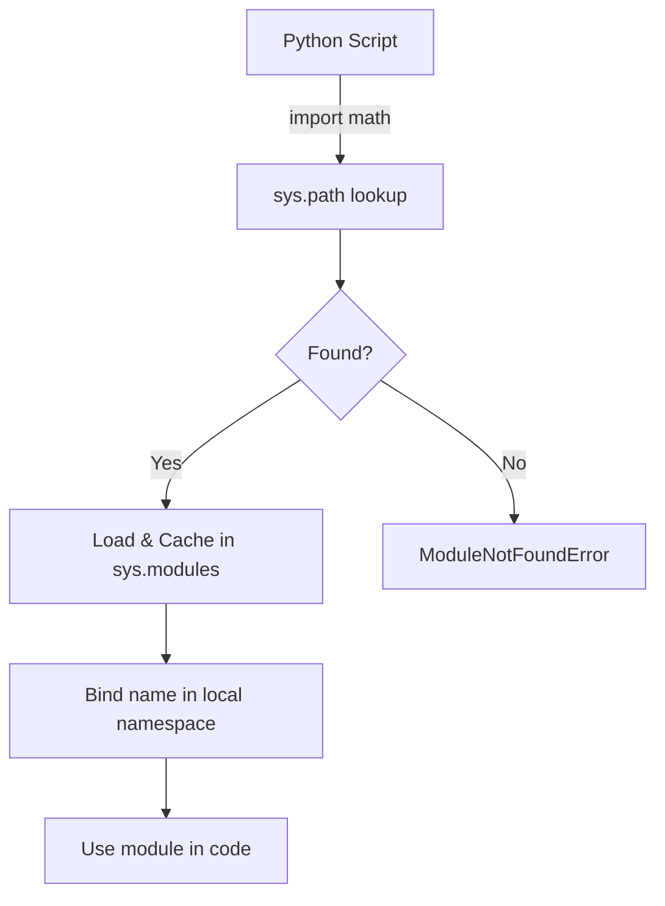

# Modules and Imports

!!! abstract "What You'll Learn"
    - ✅ What Python modules and packages are
    - ✅ How to use `import`, `from ... import`, and `as` aliases
    - ✅ The difference between standard library, third-party, and local modules
    - ✅ How Python resolves module paths (`sys.path`)
    - ✅ How `__init__.py` turns a folder into a package
    - ✅ Best practices for organizing imports

Python's module system lets you split code across files, reuse logic, and tap into thousands of built-in and community libraries — all with a single `import` statement.

---

!!! tip "New to Python?"
    Think of a **module** like a toolbox. Instead of carrying every tool everywhere, you grab only what you need for the job. `import math` pulls in the math toolbox; `from math import sqrt` pulls out just the screwdriver.

!!! info "Already know Python?"
    Focus on the [Package Structure](#5️⃣-packages-and-__init__py) and [sys.path](#6️⃣-how-python-finds-modules-syspath) sections — common interview topics and real-world pain points.

!!! warning "Keep in mind"
    Circular imports (Module A imports B, B imports A) will cause `ImportError`. Structure your packages to avoid this.

---

## How Modules Work



---

## 1️⃣ The `import` Statement

The simplest way to load a module:

```python
import math
import os
import random

print(math.pi)          # 3.141592653589793
print(os.getcwd())      # /home/user/project
print(random.randint(1, 10))  # e.g. 7
```

**Output:**
```
3.141592653589793
/home/user/project
7
```

!!! info "How it works"
    `import math` loads the entire module and binds the name `math` in your local namespace. You access everything through `math.<name>`.

---

## 2️⃣ `from ... import` — Selective Imports

Pull specific names directly into your namespace:

```python
from math import sqrt, pi
from os.path import join, exists

print(sqrt(16))         # 4.0
print(pi)               # 3.141592653589793
print(join("a", "b"))   # a/b
```

**Output:**
```
4.0
3.141592653589793
a/b
```

!!! warning "Avoid `from module import *`"
    Wildcard imports pollute your namespace and make it hard to trace where names come from. Use explicit imports instead.

```python
# ❌ Bad
from math import *

# ✅ Good
from math import sqrt, ceil, floor
```

---

## 3️⃣ Aliases with `as`

Rename a module or name on import:

```python
import numpy as np
import pandas as pd
from datetime import datetime as dt

arr = np.array([1, 2, 3])
df = pd.DataFrame({"a": [1, 2]})
now = dt.now()
```

!!! tip "When to use aliases"
    Use aliases for long module names (`numpy → np`) or to avoid name conflicts. Community conventions (like `np`, `pd`) improve readability for other developers.

---

## 4️⃣ Types of Modules

=== "Standard Library"
    Built into Python — no installation needed.

    ```python
    import os          # OS interaction
    import sys         # System-specific params
    import math        # Math functions
    import json        # JSON parsing
    import re          # Regular expressions
    import datetime    # Dates and times
    import collections # Specialized containers
    import itertools   # Iteration tools
    import functools   # Higher-order functions
    import pathlib     # File system paths
    ```

=== "Third-Party"
    Installed via `pip install <package>`.

    ```python
    import numpy as np       # Numerical computing
    import pandas as pd      # Data analysis
    import requests          # HTTP requests
    import flask             # Web framework
    import sqlalchemy        # Database ORM
    import pytest            # Testing framework
    ```

=== "Local / Your Own"
    `.py` files you create in your project.

    ```
    project/
    ├── main.py
    ├── utils.py      ← your module
    └── models/
        ├── __init__.py
        └── user.py   ← module inside a package
    ```

    ```python
    # In main.py
    import utils
    from models.user import User
    ```

---

## 5️⃣ Packages and `__init__.py`

A **package** is a folder with an `__init__.py` file that groups related modules together.

```
mypackage/
├── __init__.py       ← marks this as a package
├── math_utils.py
├── string_utils.py
└── io/
    ├── __init__.py
    ├── reader.py
    └── writer.py
```

```python
# __init__.py controls what's exposed at the package level
# mypackage/__init__.py
from .math_utils import add, subtract
from .string_utils import capitalize

# Usage from outside:
from mypackage import add
from mypackage.io.reader import read_csv
```

!!! info "`__init__.py` in Python 3"
    Python 3.3+ supports **namespace packages** — folders without `__init__.py` can still be imported. But an explicit `__init__.py` is still recommended for controlling the public API.

### ASCII Package Structure

```
mypackage/
│
├── __init__.py         ← Package root; controls public API
│   └── from .math_utils import add
│
├── math_utils.py       ← Submodule
│   └── def add(a, b): return a + b
│
└── io/                 ← Sub-package
    ├── __init__.py
    └── reader.py
        └── def read_csv(path): ...
```

---

## 6️⃣ How Python Finds Modules: `sys.path`

When you `import something`, Python searches these locations **in order**:

```python
import sys
print(sys.path)
```

```
['',                             # 1. Current directory
 '/usr/lib/python3.11',          # 2. Standard library
 '/usr/lib/python3.11/lib-dynload',
 '/home/user/.local/lib/python3.11/site-packages',  # 3. pip installs
 '/usr/local/lib/python3.11/dist-packages']
```

```
sys.path lookup order
─────────────────────────────────────────────
  [0]  '' (empty string)  →  current directory
  [1]  PYTHONPATH env var (if set)
  [2]  Standard library dirs
  [3]  site-packages (pip installs)
─────────────────────────────────────────────
First match wins. Later entries are ignored.
```

!!! tip "Adding custom paths"
    ```python
    import sys
    sys.path.append("/path/to/my/modules")
    import mymodule  # now found
    ```
    Prefer this over editing `PYTHONPATH` globally in production code.

---

## 7️⃣ The `__name__` Guard

Every module has a `__name__` attribute. When a file is **run directly**, `__name__` is `"__main__"`. When **imported**, it's the module name.

```python
# utils.py

def greet(name):
    return f"Hello, {name}!"

if __name__ == "__main__":
    # This block only runs when utils.py is executed directly
    # NOT when imported by another module
    print(greet("World"))
```

```
Running:   python utils.py  →  Hello, World!
Importing: import utils     →  (nothing printed)
```

!!! tip "Why this matters"
    Use `if __name__ == "__main__":` to add test/demo code to a module without it running on import. This is standard Python practice.

---

## 8️⃣ Relative vs Absolute Imports

=== "Absolute Imports"
    Always preferred. Unambiguous — starts from project root.

    ```python
    # From anywhere in the project:
    from mypackage.math_utils import add
    from mypackage.io.reader import read_csv
    ```

=== "Relative Imports"
    Uses `.` (current package) and `..` (parent package). Only valid **inside a package**.

    ```python
    # Inside mypackage/io/writer.py:
    from . import reader           # same package (io)
    from .. import math_utils      # parent package (mypackage)
    from ..math_utils import add   # specific name from parent
    ```

!!! warning "Relative import rules"
    Relative imports only work inside a package. Running `python mypackage/io/writer.py` directly will raise `ImportError`. Use `python -m mypackage.io.writer` instead.

---

## 9️⃣ Lazy / Conditional Imports

Import only when needed to speed up startup time or handle optional dependencies:

```python
def process_image(path):
    try:
        from PIL import Image  # Only loaded when this function is called
        img = Image.open(path)
        return img
    except ImportError:
        raise ImportError("Pillow is required: pip install Pillow")
```

```python
# Platform-specific imports
import sys

if sys.platform == "win32":
    import winreg
else:
    import pwd
```

---

## 🔟 Reloading a Module

Normally, Python caches modules in `sys.modules` — importing twice doesn't re-execute the file. To force a reload (useful in interactive sessions):

```python
import importlib
import mymodule

# After changing mymodule.py:
importlib.reload(mymodule)
```

!!! warning "Reload gotcha"
    `reload()` re-executes the module code, but existing references to old objects are **not** updated. Use with caution.

---

## ✅ Quick Reference Summary

| Syntax | What it does |
|---|---|
| `import math` | Import entire module, access via `math.sqrt()` |
| `from math import sqrt` | Import specific name, use as `sqrt()` |
| `from math import sqrt, pi` | Import multiple names |
| `import numpy as np` | Import with alias |
| `from . import sibling` | Relative import (same package) |
| `from .. import parent_mod` | Relative import (parent package) |
| `from pkg import *` | ❌ Wildcard — avoid in production |
| `importlib.reload(mod)` | Force re-execution of a module |
| `sys.path.append(path)` | Add custom search path at runtime |
| `if __name__ == "__main__":` | Guard block — runs only when file is executed directly |

!!! tip "Import Best Practices"
    1. **Standard library → Third-party → Local** — group imports in this order (PEP 8)
    2. One import per line for clarity
    3. Use absolute imports unless inside a package
    4. Avoid circular imports — restructure shared code into a separate utility module
    5. Use `__all__` in `__init__.py` to define your package's public API