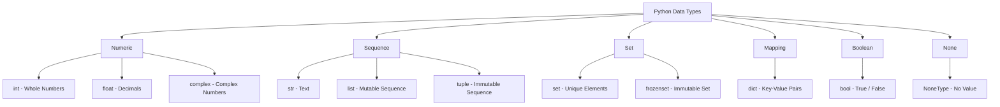

# Variables & Data Types 📚

!!! abstract "What You'll Learn"
    - ✅ What variables are and how to declare them
    - ✅ All Python built-in data types with examples
    - ✅ Memory allocation and how Python stores data
    - ✅ Type conversion (implicit & explicit)
    - ✅ Type checking with `type()` and `isinstance()`
    - ✅ Common mistakes to avoid

---

## 📖 Introduction

In Python, a **variable** is a name that refers to a value stored in memory. Unlike C or Java, Python is **dynamically typed** — you don't need to declare the type of a variable. Python figures it out automatically.

!!! tip "New to Python?"
    Start with **Basics → Complexity Analysis → Data Structures → Algorithms** before jumping into practice problems.

!!! info "Already know Python?"
    Jump straight to **Data Structures** or **Algorithms** depending on what you're revising.

!!! warning "Keep in mind"
    Every topic includes real code examples, memory diagrams, and practical use cases — read them carefully, don't just skim the code.

---

!!! tip "Think of it this way"
    A variable is like a label on a box 📦. The label (variable name) points to whatever is inside the box (value). You can change what's in the box at any time!



---

## 🏷️ Variables

### Declaring Variables

Python uses **dynamic typing** — no need to specify the type.

```python
name = "Alice"       # str
age = 25             # int
height = 5.7         # float
is_student = True    # bool
nothing = None       # NoneType
```

**Output:**
```
name      → Alice
age       → 25
height    → 5.7
is_student → True
nothing   → None
```

### Variable Naming Rules

!!! info "Rules"
    - Must start with a letter or `_` (not a digit)
    - Can contain letters, digits, and underscores
    - Case-sensitive: `age` ≠ `Age` ≠ `AGE`
    - Cannot use Python keywords (`if`, `for`, `class`, etc.)

=== "✅ Valid Names"
    ```python
    name = "Alice"
    _name = "Bob"
    name1 = "Charlie"
    my_name = "Dave"
    NAME = "EVE"
    ```

=== "❌ Invalid Names"
    ```python
    1name = "Alice"     # ❌ Starts with digit
    my-name = "Bob"     # ❌ Hyphen not allowed
    for = 10            # ❌ Reserved keyword
    my name = "Dave"    # ❌ Space not allowed
    ```

### Multiple Assignment

```python
# Assign same value to multiple variables
x = y = z = 0
print(x, y, z)

# Assign multiple values at once
a, b, c = 10, 20, 30
print(a, b, c)

# Swap values (Pythonic way)
a, b = b, a
print(a, b)
```

**Output:**
```
0 0 0
10 20 30
20 10
```

!!! tip "Python Convention"
    Use **snake_case** for variable names: `my_variable`, `student_name`, `total_marks`

---

## 🔢 Numeric Types

### 1️⃣ Integer (`int`)

Stores whole numbers — positive, negative, or zero. **No size limit** in Python!

!!! info "Real-Life Example"
    - Age: `25`
    - Number of students: `50`
    - Bank balance: `-1500`

```python
age = 25
students = 50
negative = -100
big_num = 999_999_999   # Underscore for readability

print(age)
print(students)
print(negative)
print(big_num)
print(type(age))
```

**Output:**
```
25
50
-100
999999999
<class 'int'>
```

**Integer in Different Bases**

=== "Binary (base 2)"
    ```python
    b = 0b1010       # Binary literal
    print(b)         # 10
    print(bin(10))   # '0b1010'
    ```

=== "Octal (base 8)"
    ```python
    o = 0o17         # Octal literal
    print(o)         # 15
    print(oct(15))   # '0o17'
    ```

=== "Hexadecimal (base 16)"
    ```python
    h = 0xFF         # Hex literal
    print(h)         # 255
    print(hex(255))  # '0xff'
    ```

**Memory Visualization**

```
Python int (arbitrary precision — grows as needed)

small int (e.g. 25):
┌─────────────────────────────┐
│  ob_refcnt  │  ob_type      │  ← CPython object header
├─────────────────────────────┤
│  ob_digit[0] = 25           │  ← actual value stored here
└─────────────────────────────┘

Unlike C, Python ints never overflow — they expand automatically!
```

**Practical Example: Simple Calculator**

```python
num1 = int(input("Enter first number: "))
num2 = int(input("Enter second number: "))

print(f"\n📊 Results:")
print(f"Sum:        {num1 + num2}")
print(f"Difference: {num1 - num2}")
print(f"Product:    {num1 * num2}")
print(f"Quotient:   {num1 / num2}")
print(f"Floor Div:  {num1 // num2}")
print(f"Remainder:  {num1 % num2}")
print(f"Power:      {num1 ** num2}")
```

!!! warning "Common Mistake"
    ```python
    result = 10 / 3
    print(result)   # 3.3333... (float, not int!)

    result = 10 // 3
    print(result)   # 3 (floor division → gives int)
    ```
    `/` always returns a `float`. Use `//` for integer division.

---

### 2️⃣ Float (`float`)

Stores decimal numbers. Follows **IEEE 754** double-precision standard (64-bit).

!!! info "Real-Life Example"
    - Temperature: `98.6`
    - Price: `19.99`
    - Pi: `3.141592653589793`

```python
temperature = 98.6
price = 19.99
pi = 3.141592653589793
scientific = 1.5e10     # Scientific notation = 15000000000.0

print(temperature)
print(price)
print(pi)
print(scientific)
print(type(pi))
```

**Output:**
```
98.6
19.99
3.141592653589793
15000000000.0
<class 'float'>
```

**Memory Visualization**

```
float (64-bit IEEE 754 double precision)

┌──────┬──────────────┬──────────────────────────────────────────┐
│ Sign │   Exponent   │                Mantissa                  │
├──────┼──────────────┼──────────────────────────────────────────┤
│ 1bit │    11 bits   │                 52 bits                  │
└──────┴──────────────┴──────────────────────────────────────────┘
   ↑           ↑                         ↑
 +/- sign   Power of 2           Fractional part
```

!!! warning "Floating Point Precision"
    ```python
    a = 0.1 + 0.2
    print(a)           # 0.30000000000000004 😱

    # Fix: use round() or decimal module
    print(round(a, 2)) # 0.3 ✅

    from decimal import Decimal
    print(Decimal('0.1') + Decimal('0.2'))  # 0.3 ✅
    ```

**Special Float Values**

```python
import math

print(float('inf'))   # Infinity
print(float('-inf'))  # Negative Infinity
print(float('nan'))   # Not a Number

print(math.isinf(float('inf')))  # True
print(math.isnan(float('nan')))  # True
```

---

### 3️⃣ Complex (`complex`)

Stores numbers with a real and imaginary part.

```python
c1 = 3 + 4j
c2 = complex(2, -5)

print(c1)           # (3+4j)
print(c2)           # (2-5j)
print(c1.real)      # 3.0
print(c1.imag)      # 4.0
print(abs(c1))      # 5.0  (magnitude: √(3²+4²))
print(c1 + c2)      # (5-1j)
print(type(c1))     # <class 'complex'>
```

**Output:**
```
(3+4j)
(2-5j)
3.0
4.0
5.0
(5-1j)
<class 'complex'>
```

!!! info "When to Use"
    Complex numbers are used in signal processing, electrical engineering, and scientific computing.

---

## 📝 Text Type

### 4️⃣ String (`str`)

Stores text — an immutable sequence of Unicode characters.

!!! info "Real-Life Example"
    - Name: `"Alice"`
    - Message: `"Hello, World!"`
    - Email: `"alice@example.com"`

```python
name = "Alice"
greeting = 'Hello, World!'
multiline = """This is
a multiline
string"""

print(name)
print(greeting)
print(multiline)
print(type(name))
```

**Output:**
```
Alice
Hello, World!
This is
a multiline
string
<class 'str'>
```

**Memory Visualization**

```
str = "Hello"

Index:    0     1     2     3     4
        ┌─────┬─────┬─────┬─────┬─────┐
Char:   │  H  │  e  │  l  │  l  │  o  │
        └─────┴─────┴─────┴─────┴─────┘
Neg idx: -5    -4    -3    -2    -1

Strings are immutable — you cannot change individual characters!
```

**String Operations**

=== "Indexing & Slicing"
    ```python
    s = "Python"

    print(s[0])      # P
    print(s[-1])     # n
    print(s[0:3])    # Pyt
    print(s[::2])    # Pto
    print(s[::-1])   # nohtyP (reversed)
    ```

=== "Common Methods"
    ```python
    s = "  hello world  "

    print(s.strip())         # "hello world"
    print(s.upper())         # "  HELLO WORLD  "
    print(s.lower())         # "  hello world  "
    print(s.replace("hello", "hi"))  # "  hi world  "
    print(s.split())         # ['hello', 'world']
    print(len(s))            # 15
    ```

=== "f-Strings (Formatting)"
    ```python
    name = "Alice"
    age = 25
    gpa = 3.85

    # f-string (recommended ✅)
    print(f"Name: {name}, Age: {age}, GPA: {gpa:.2f}")

    # .format()
    print("Name: {}, Age: {}".format(name, age))

    # % formatting (old style)
    print("Name: %s, Age: %d" % (name, age))
    ```

=== "Checking Content"
    ```python
    s = "Hello123"

    print(s.isalpha())   # False (has digits)
    print(s.isdigit())   # False (has letters)
    print(s.isalnum())   # True
    print(s.startswith("Hello"))  # True
    print(s.endswith("123"))      # True
    print("ell" in s)             # True
    ```

!!! warning "Strings are Immutable"
    ```python
    s = "Hello"
    s[0] = "h"   # ❌ TypeError: 'str' object does not support item assignment

    # ✅ Create a new string instead
    s = "h" + s[1:]
    print(s)     # hello
    ```

---

## 📋 Sequence Types

### 5️⃣ List (`list`)

An ordered, **mutable** collection of items. Can hold mixed types.

```python
fruits = ["apple", "banana", "cherry"]
mixed = [1, "hello", 3.14, True, None]
nested = [[1, 2], [3, 4], [5, 6]]

print(fruits)
print(mixed)
print(fruits[0])     # apple
print(fruits[-1])    # cherry
print(len(fruits))   # 3
print(type(fruits))  # <class 'list'>
```

**Output:**
```
['apple', 'banana', 'cherry']
[1, 'hello', 3.14, True, None]
apple
cherry
3
<class 'list'>
```

**Memory Visualization**

```
fruits = ["apple", "banana", "cherry"]

List object:
┌──────────┬──────────┬──────────┐
│  ref[0]  │  ref[1]  │  ref[2]  │
└────┬─────┴────┬─────┴────┬─────┘
     │          │          │
     ▼          ▼          ▼
 "apple"    "banana"   "cherry"

Lists store references (pointers) to objects, not the objects themselves!
```

**Common List Operations**

```python
fruits = ["apple", "banana", "cherry"]

fruits.append("mango")       # Add to end
fruits.insert(1, "kiwi")     # Insert at index
fruits.remove("banana")      # Remove by value
popped = fruits.pop()        # Remove & return last
fruits.sort()                # Sort in place
fruits.reverse()             # Reverse in place

print(fruits)
print(popped)
```

**Output:**
```
['cherry', 'apple', 'kiwi']
mango
```

---

### 6️⃣ Tuple (`tuple`)

An ordered, **immutable** sequence. Faster than lists.

```python
point = (3, 4)
rgb = (255, 128, 0)
single = (42,)         # Single element — note the comma!
empty = ()

print(point)
print(rgb[0])          # 255
print(type(point))     # <class 'tuple'>

# Tuple unpacking
x, y = point
print(f"x={x}, y={y}")
```

**Output:**
```
(3, 4)
255
<class 'tuple'>
x=3, y=4
```

=== "Tuple vs List"
    | Feature | Tuple | List |
    |---------|-------|------|
    | Mutable | ❌ No | ✅ Yes |
    | Syntax | `(1, 2)` | `[1, 2]` |
    | Speed | Faster | Slower |
    | Use case | Fixed data | Dynamic data |
    | Hashable | ✅ Yes | ❌ No |

!!! tip "When to Use Tuples"
    Use tuples for data that should **never change**: coordinates, RGB values, database records, dictionary keys.

!!! warning "Common Mistake"
    ```python
    single = (42)    # ❌ This is just int 42!
    single = (42,)   # ✅ This is a tuple with one element
    print(type((42)))   # <class 'int'>
    print(type((42,)))  # <class 'tuple'>
    ```

---

## 🔣 Set Types

### 7️⃣ Set (`set`)

An **unordered** collection of **unique** elements.

!!! info "Real-Life Example"
    A set is like a bag where duplicates are automatically removed. Perfect for membership testing and removing duplicates.

```python
fruits = {"apple", "banana", "cherry", "apple"}  # duplicate removed
numbers = {1, 2, 3, 4, 5}
empty_set = set()    # NOT {} — that creates a dict!

print(fruits)        # order not guaranteed
print(len(fruits))   # 3 (not 4)
print("apple" in fruits)   # True
print(type(fruits))  # <class 'set'>
```

**Output:**
```
{'banana', 'cherry', 'apple'}
3
True
<class 'set'>
```

**Set Operations**

=== "Union"
    ```python
    A = {1, 2, 3}
    B = {3, 4, 5}

    print(A | B)         # {1, 2, 3, 4, 5}
    print(A.union(B))    # {1, 2, 3, 4, 5}
    ```

=== "Intersection"
    ```python
    A = {1, 2, 3}
    B = {3, 4, 5}

    print(A & B)              # {3}
    print(A.intersection(B))  # {3}
    ```

=== "Difference"
    ```python
    A = {1, 2, 3}
    B = {3, 4, 5}

    print(A - B)           # {1, 2}
    print(A.difference(B)) # {1, 2}
    ```

=== "Symmetric Difference"
    ```python
    A = {1, 2, 3}
    B = {3, 4, 5}

    print(A ^ B)                        # {1, 2, 4, 5}
    print(A.symmetric_difference(B))    # {1, 2, 4, 5}
    ```

**Practical: Remove Duplicates**

```python
names = ["Alice", "Bob", "Alice", "Charlie", "Bob"]
unique = list(set(names))
print(unique)
```

**Output:**
```
['Charlie', 'Alice', 'Bob']
```

---

## 🗂️ Mapping Type

### 8️⃣ Dictionary (`dict`)

An **unordered** collection of **key-value pairs**. Keys must be unique and hashable.

!!! info "Real-Life Example"
    A dictionary is like a phone book 📖 — you look up a name (key) to get a phone number (value).

```python
student = {
    "name": "Alice",
    "age": 20,
    "gpa": 3.8,
    "courses": ["Math", "CS", "Physics"]
}

print(student["name"])           # Alice
print(student.get("age"))        # 20
print(student.get("grade", "N/A"))  # N/A (default if missing)
print(type(student))             # <class 'dict'>
```

**Output:**
```
Alice
20
N/A
<class 'dict'>
```

**Memory Visualization**

```
student = {"name": "Alice", "age": 20}

Hash Table:
┌──────────┬──────────────┐
│   Key    │    Value     │
├──────────┼──────────────┤
│ "name"   │   "Alice"   │
├──────────┼──────────────┤
│ "age"    │     20      │
└──────────┴──────────────┘

Keys are hashed for O(1) average lookup!
```

**Common Dict Operations**

```python
student = {"name": "Alice", "age": 20}

# Add / Update
student["gpa"] = 3.8
student.update({"age": 21, "city": "NY"})

# Remove
del student["city"]
popped = student.pop("gpa")

# Iterate
for key, value in student.items():
    print(f"{key}: {value}")

# Keys, Values, Items
print(list(student.keys()))    # ['name', 'age']
print(list(student.values()))  # ['Alice', 21]
```

**Output:**
```
name: Alice
age: 21
['name', 'age']
['Alice', 21]
```

!!! warning "KeyError"
    ```python
    d = {"name": "Alice"}
    print(d["age"])          # ❌ KeyError: 'age'
    print(d.get("age"))      # ✅ None (no error)
    print(d.get("age", 0))   # ✅ 0 (default value)
    ```

---

## ✔️ Boolean Type

### 9️⃣ Boolean (`bool`)

Stores `True` or `False`. A subclass of `int` in Python.

```python
is_raining = True
is_sunny = False

print(is_raining)
print(type(is_raining))   # <class 'bool'>

# bool is a subclass of int
print(int(True))    # 1
print(int(False))   # 0
print(True + True)  # 2
```

**Output:**
```
True
<class 'bool'>
1
0
2
```

**Truthy and Falsy Values**

=== "Falsy Values"
    ```python
    # All of these are False in a boolean context
    print(bool(0))        # False
    print(bool(0.0))      # False
    print(bool(""))       # False
    print(bool([]))       # False
    print(bool({}))       # False
    print(bool(None))     # False
    ```

=== "Truthy Values"
    ```python
    # All of these are True in a boolean context
    print(bool(1))         # True
    print(bool(-1))        # True
    print(bool("hello"))   # True
    print(bool([0]))       # True
    print(bool({"a": 1}))  # True
    ```

```python
# Practical use
name = ""
if not name:
    print("Name is empty!")   # This prints

items = [1, 2, 3]
if items:
    print("List has items!")  # This prints
```

---

## 🚫 None Type

### 🔟 NoneType (`None`)

Represents the **absence of a value**. Similar to `null` in other languages.

```python
result = None
name = None

print(result)           # None
print(type(result))     # <class 'NoneType'>

# Always use 'is' to check for None
if result is None:
    print("No result yet!")

if result is not None:
    print("Got a result!")
```

**Output:**
```
None
<class 'NoneType'>
No result yet!
```

!!! warning "Use `is`, not `==`"
    ```python
    x = None
    print(x == None)    # True (works but not recommended)
    print(x is None)    # True ✅ (correct way)
    ```
    `is` checks identity (same object), `==` checks equality.

!!! info "Common Use Case"
    ```python
    def find_user(name):
        # ...search logic...
        return None   # Return None if not found

    user = find_user("Alice")
    if user is None:
        print("User not found")
    ```

---

## 🔄 Type Conversion

### Implicit Conversion (Automatic)

Python automatically converts types when safe to do so.

```python
x = 10      # int
y = 3.14    # float

result = x + y
print(result)         # 13.14
print(type(result))   # <class 'float'>  ← int promoted to float
```

### Explicit Conversion (Casting)

```python
# int()
print(int(3.9))       # 3   (truncates decimal)
print(int("42"))      # 42
print(int(True))      # 1

# float()
print(float(10))      # 10.0
print(float("3.14"))  # 3.14

# str()
print(str(42))        # "42"
print(str(3.14))      # "3.14"
print(str(True))      # "True"

# bool()
print(bool(0))        # False
print(bool("hello"))  # True

# list(), tuple(), set()
print(list("hello"))        # ['h', 'e', 'l', 'l', 'o']
print(tuple([1, 2, 3]))     # (1, 2, 3)
print(set([1, 2, 2, 3]))    # {1, 2, 3}
```

**Output:**
```
3
42
1
10.0
3.14
42
3.14
True
False
True
['h', 'e', 'l', 'l', 'o']
(1, 2, 3)
{1, 2, 3}
```

!!! warning "Data Loss in Casting"
    ```python
    x = int(3.99)
    print(x)   # 3  (not 4! — truncates, doesn't round)

    # Use round() if you want rounding
    print(round(3.99))   # 4
    ```

---

## 🔍 Type Checking

```python
x = 42
name = "Alice"
items = [1, 2, 3]

# type() — returns exact type
print(type(x))           # <class 'int'>
print(type(x) == int)    # True

# isinstance() — checks type including subclasses (preferred ✅)
print(isinstance(x, int))           # True
print(isinstance(x, (int, float)))  # True  (check multiple types)
print(isinstance(True, int))        # True  (bool is subclass of int)
```

!!! tip "Use `isinstance()` over `type()`"
    `isinstance()` is preferred because it works correctly with inheritance. For example, `isinstance(True, int)` returns `True` since `bool` is a subclass of `int`.

---

## ✅ Quick Reference Summary

| Type | Category | Mutable | Example | `type()` |
|------|----------|---------|---------|----------|
| `int` | Numeric | ❌ | `42`, `-10`, `0` | `<class 'int'>` |
| `float` | Numeric | ❌ | `3.14`, `-0.5` | `<class 'float'>` |
| `complex` | Numeric | ❌ | `3+4j` | `<class 'complex'>` |
| `str` | Sequence | ❌ | `"hello"` | `<class 'str'>` |
| `list` | Sequence | ✅ | `[1, 2, 3]` | `<class 'list'>` |
| `tuple` | Sequence | ❌ | `(1, 2, 3)` | `<class 'tuple'>` |
| `set` | Set | ✅ | `{1, 2, 3}` | `<class 'set'>` |
| `dict` | Mapping | ✅ | `{"a": 1}` | `<class 'dict'>` |
| `bool` | Boolean | ❌ | `True`, `False` | `<class 'bool'>` |
| `None` | NoneType | ❌ | `None` | `<class 'NoneType'>` |