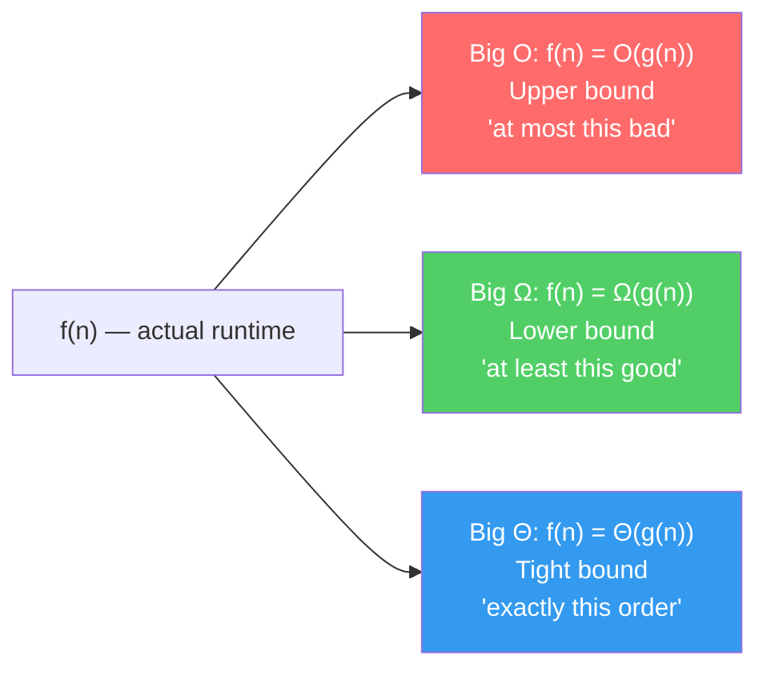

# Big O, Big Θ, Big Ω

!!! abstract "What You'll Learn"
    - ✅ What asymptotic notation is and why we need it
    - ✅ The difference between Big O (upper bound), Big Ω (lower bound), and Big Θ (tight bound)
    - ✅ How to read and write complexity expressions
    - ✅ The most common complexity classes and what they feel like at scale
    - ✅ How to determine which notation to use when analysing an algorithm
    - ✅ Common misconceptions and traps

When we analyse an algorithm, we don't care about exact runtimes — those depend on hardware, language, and input quirks. Instead, we ask: **how does the runtime grow as input size grows?** Asymptotic notation gives us a precise mathematical language to answer that question.

---

!!! tip "New to Complexity Analysis?"
    Start by thinking of Big O as a **speed limit sign** — it tells you the worst it can get, not how fast you're going right now. Once that clicks, Big Θ and Big Ω fall into place naturally.

!!! info "Already know the basics?"
    Focus on the [Formal Definitions](#3️⃣-formal-definitions) and [Choosing the Right Notation](#7️⃣-choosing-the-right-notation) sections — most developers use these terms loosely and mix them up in interviews.

!!! warning "Keep in mind"
    In everyday conversation (and most interviews), people say "Big O" when they really mean Big Θ (tight bound). Knowing the difference matters for technical accuracy — and for impressing interviewers.

---

## The Three Notations at a Glance



---

## 1️⃣ Why Asymptotic Notation?

Consider two sorting algorithms:

```python
# Algorithm A: always does exactly 3n² + 5n + 12 operations
# Algorithm B: always does exactly 100n + 200 operations
```

```
n = 10:     A = 362 ops      B = 1,200 ops   → A wins
n = 100:    A = 30,512 ops   B = 10,200 ops   → B wins
n = 1,000:  A = 3,005,012    B = 100,200      → B wins by 30x
n = 1,000,000: A ≈ 3×10¹²   B ≈ 10⁸          → B wins by 30,000x
```

The **growth rate** of the dominant term is what matters at scale. We drop constants and lower-order terms:

```
3n² + 5n + 12  →  O(n²)    (quadratic growth dominates)
100n + 200     →  O(n)     (linear growth dominates)
```

!!! tip "The golden rule"
    Drop constants. Drop lower-order terms. Keep only the **fastest-growing term**.
    ```
    5n³ + 2n² + 100n + 9  →  O(n³)
    n log n + n            →  O(n log n)
    42                     →  O(1)
    ```

---

## 2️⃣ The Complexity Classes


*Growth rate comparison of common complexity classes — [HackerEarth](https://www.hackerearth.com/practice/notes/big-o-cheatsheet-series-data-structures-and-algorithms-with-thier-complexities-1/)*

| Class | Name | Example |
|---|---|---|
| O(1) | Constant | Array index access, hash map lookup |
| O(log n) | Logarithmic | Binary search, balanced BST ops |
| O(n) | Linear | Linear search, single loop |
| O(n log n) | Linearithmic | Merge sort, heap sort |
| O(n²) | Quadratic | Bubble sort, nested loops |
| O(n³) | Cubic | Naive matrix multiplication |
| O(2ⁿ) | Exponential | Recursive Fibonacci, subset generation |
| O(n!) | Factorial | Permutation generation, brute-force TSP |

---

## 3️⃣ Formal Definitions

### Big O — Upper Bound

> **f(n) = O(g(n))** means there exist positive constants **c** and **n₀** such that:
> `f(n) ≤ c · g(n)` for all `n ≥ n₀`


*f(n) stays below c·g(n) for all n past n₀ — source: [Programiz](https://www.programiz.com/dsa/asymptotic-notations)*

**Example:** `f(n) = 3n + 5`
- Choose `c = 4`, `n₀ = 5`: `3n + 5 ≤ 4n` for all `n ≥ 5` ✅
- Therefore: `f(n) = O(n)`

### Big Ω — Lower Bound

> **f(n) = Ω(g(n))** means there exist positive constants **c** and **n₀** such that:
> `f(n) ≥ c · g(n)` for all `n ≥ n₀`


*f(n) stays above c·g(n) for all n past n₀ — source: [Programiz](https://www.programiz.com/dsa/asymptotic-notations)*

**Example:** Any comparison-based sort is `Ω(n log n)` — you can't do better than that in the worst case.

### Big Θ — Tight Bound

> **f(n) = Θ(g(n))** means **f(n) = O(g(n))** AND **f(n) = Ω(g(n))**
>
> Equivalently: there exist constants **c₁**, **c₂**, **n₀** such that:
> `c₁ · g(n) ≤ f(n) ≤ c₂ · g(n)` for all `n ≥ n₀`


*f(n) is sandwiched between c₁·g(n) and c₂·g(n) for all n past n₀ — source: [Programiz](https://www.programiz.com/dsa/asymptotic-notations)*

**Example:** `f(n) = 3n + 5 = Θ(n)` because it's both O(n) and Ω(n).

---

## 4️⃣ Big O in Code

=== "O(1) — Constant"
    ```python
    def get_first(lst):
        return lst[0]        # one operation, regardless of list size

    def is_even(n):
        return n % 2 == 0    # one operation
    ```

=== "O(log n) — Logarithmic"
    ```python
    def binary_search(arr, target):
        lo, hi = 0, len(arr) - 1
        while lo <= hi:
            mid = (lo + hi) // 2
            if arr[mid] == target:
                return mid
            elif arr[mid] < target:
                lo = mid + 1    # discard left half
            else:
                hi = mid - 1    # discard right half
        return -1
    # Each iteration halves the search space → log₂(n) iterations
    ```

=== "O(n) — Linear"
    ```python
    def find_max(lst):
        max_val = lst[0]
        for item in lst:      # visits each element once
            if item > max_val:
                max_val = item
        return max_val
    ```

=== "O(n log n) — Linearithmic"
    ```python
    def merge_sort(arr):
        if len(arr) <= 1:
            return arr
        mid = len(arr) // 2
        left = merge_sort(arr[:mid])   # log n levels of recursion
        right = merge_sort(arr[mid:])
        return merge(left, right)      # O(n) work at each level
    # log n levels × O(n) merge = O(n log n)
    ```

=== "O(n²) — Quadratic"
    ```python
    def bubble_sort(arr):
        n = len(arr)
        for i in range(n):          # outer loop: n iterations
            for j in range(n - 1):  # inner loop: n iterations
                if arr[j] > arr[j + 1]:
                    arr[j], arr[j + 1] = arr[j + 1], arr[j]
    # n × n = n² comparisons in the worst case
    ```

---

## 5️⃣ Analysing Cases: Best, Average, Worst

An algorithm can behave differently depending on the input. We analyse three cases:

```python
def linear_search(lst, target):
    for i, val in enumerate(lst):
        if val == target:
            return i    # found — stop early
    return -1
```

```
Case Analysis for Linear Search
──────────────────────────────────────────────────────
  Best case    →  target is lst[0]   →  1 comparison   →  Ω(1)
  Average case →  target is in middle → n/2 comparisons → Θ(n)
  Worst case   →  target not in list →  n comparisons   →  O(n)
──────────────────────────────────────────────────────
  Big O  describes the WORST case upper bound
  Big Ω  describes the BEST case lower bound
  Big Θ  describes the TIGHT bound (when best ≈ worst)
──────────────────────────────────────────────────────
```

!!! warning "O and Ω are bounds, not cases"
    This is one of the most common confusions. Big O is **not** the worst case — it's an **upper bound**. You can correctly say `linear_search = O(n²)` (it's true but loose). Big O just says "it won't grow faster than this." The *tight* worst-case bound is Θ(n).

---

## 6️⃣ Simplification Rules

```python
# Rule 1: Drop constants
O(3n)     →  O(n)
O(500)    →  O(1)
O(2n²)   →  O(n²)

# Rule 2: Drop lower-order terms
O(n² + n)       →  O(n²)
O(n log n + n)  →  O(n log n)
O(2ⁿ + n¹⁰⁰)   →  O(2ⁿ)

# Rule 3: Sequential steps → ADD
def two_loops(n):
    for i in range(n):    # O(n)
        pass
    for j in range(n):    # O(n)
        pass
# Total: O(n) + O(n) = O(2n) → O(n)

# Rule 4: Nested steps → MULTIPLY
def nested_loops(n):
    for i in range(n):        # O(n)
        for j in range(n):    # O(n)
            pass
# Total: O(n) × O(n) = O(n²)

# Rule 5: Different inputs → different variables
def two_arrays(a, b):
    for x in a:    # O(a)
        pass
    for y in b:    # O(b)
        pass
# Total: O(a + b)  ← NOT O(n), they're separate inputs!
```

!!! tip "Sequential vs Nested"
    The **+** vs **×** distinction is critical. Sequential loops add; nested loops multiply. This single rule explains why two nested loops over n items is O(n²), not O(2n).

---

## 7️⃣ Choosing the Right Notation

=== "Use Big O when..."
    You want to give a **guarantee** — the algorithm will not be worse than this.

    - Reporting worst-case performance to stakeholders
    - Comparing algorithms where the worst case matters (e.g. real-time systems)
    - Most interview and textbook contexts — it's the default notation

    ```python
    # Insertion sort: O(n²) worst case
    # Even if the input is sorted (O(n) best case), we guarantee O(n²)
    ```

=== "Use Big Ω when..."
    You want to give a **lower bound** — no algorithm can do better than this.

    - Proving theoretical limits: "any comparison sort requires Ω(n log n)"
    - Showing a problem is *inherently* hard
    - Proving your algorithm is optimal

    ```python
    # Searching an unsorted array: Ω(n)
    # You MUST look at every element — no shortcut exists
    ```

=== "Use Big Θ when..."
    You know both the upper and lower bound — the **exact growth order**.

    - When best and worst cases have the same growth rate
    - Precise academic analysis
    - Describing algorithms that behave consistently

    ```python
    # Merge sort: Θ(n log n) — always, regardless of input
    # Binary search: Θ(log n) — always halves the space
    ```

---

## 8️⃣ Common Traps and Misconceptions

```python
# ❌ Trap 1: O(n) doesn't mean "fast"
# O(n) with n = 10⁹ is still a billion operations.
# Constants matter in practice even if we drop them theoretically.

# ❌ Trap 2: Confusing Big O with worst case
# These are independent. Big O is a bound, not a case.
# Quicksort is O(n²) worst case, but also O(n log n) average case.
# Both statements use Big O for different scenarios.

# ❌ Trap 3: Same variable for different inputs
def func(a, b):
    for x in a:      # this is O(|a|), not O(n)
        for y in b:  # this is O(|b|), not O(n)
            pass
# Correct: O(|a| × |b|)  — NOT O(n²) unless |a| == |b|

# ❌ Trap 4: Ignoring space complexity
# Big O applies to space too, not just time.
# Recursive functions use O(depth) call stack space.
def factorial(n):
    if n == 0: return 1
    return n * factorial(n - 1)
# Time: O(n), Space: O(n) — each call lives on the stack
```

!!! info "Space complexity"
    Every call to a recursive function uses stack space. `factorial(n)` creates `n` stack frames before any returns — so it's O(n) space even though it looks simple. Iterative versions are O(1) space.

---

## 9️⃣ Practical Complexity Targets

```
Input Size → Acceptable Complexity
──────────────────────────────────────────────────────
  n ≤ 10        →  O(n!), O(2ⁿ)     fine
  n ≤ 20        →  O(2ⁿ)             fine
  n ≤ 100       →  O(n³)             fine
  n ≤ 1,000     →  O(n²)             fine
  n ≤ 100,000   →  O(n log n)        fine
  n ≤ 10⁶       →  O(n)              fine
  n ≤ 10⁸       →  O(log n), O(1)    fine
──────────────────────────────────────────────────────
Rule of thumb: 10⁸ simple operations ≈ 1 second in Python
```

!!! tip "Interview strategy"
    When asked to optimise, work backwards from the input size. If `n ≤ 10⁵`, you need at most O(n log n). If O(n²) is your current solution, that's your target to beat.

---

## 🔟 Side-by-Side Summary

```
Notation   Symbol   Bound     Says...                      Example
─────────────────────────────────────────────────────────────────────────
Big O      O(g(n))  Upper     "grows no faster than g(n)"  3n+5 = O(n)
Big Omega  Ω(g(n))  Lower     "grows no slower than g(n)"  3n+5 = Ω(1)
Big Theta  Θ(g(n))  Tight     "grows at exactly g(n)"      3n+5 = Θ(n)
─────────────────────────────────────────────────────────────────────────
  If f(n) = Θ(g(n)), then BOTH f(n) = O(g(n)) AND f(n) = Ω(g(n))
  The reverse is NOT always true.
─────────────────────────────────────────────────────────────────────────
```

---

## ✅ Quick Reference Summary

| Notation | Meaning | Analogy | When to use |
|---|---|---|---|
| O(g(n)) | Upper bound — at most this | Speed limit (won't exceed) | Worst-case guarantees, interviews |
| Ω(g(n)) | Lower bound — at least this | Minimum time required | Proving theoretical limits |
| Θ(g(n)) | Tight bound — exactly this | Precise measurement | When algorithm is consistent |
| O(1) | Constant time | Instant | Array access, hash lookup |
| O(log n) | Logarithmic | Halving the problem | Binary search, tree height |
| O(n) | Linear | One pass | Single loop, linear scan |
| O(n log n) | Linearithmic | Sort-then-scan | Merge sort, heap sort |
| O(n²) | Quadratic | Nested loops | Bubble sort, brute force pairs |
| O(2ⁿ) | Exponential | Doubles per step | Recursive backtracking |
| O(n!) | Factorial | All permutations | Brute-force TSP |