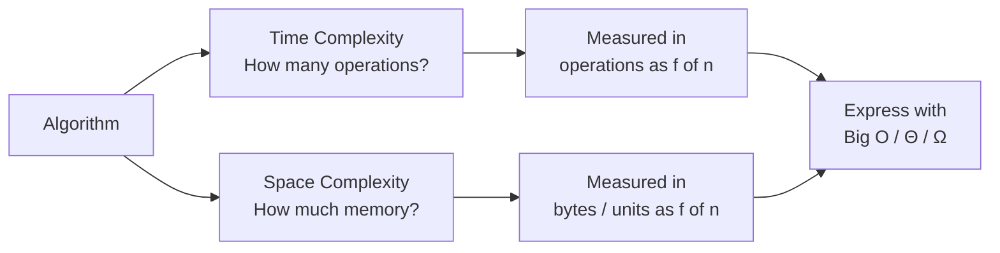

# Time & Space Complexity

!!! abstract "What You'll Learn"
    - ✅ What time complexity and space complexity mean
    - ✅ How to analyse loops, nested loops, and recursive functions
    - ✅ The difference between auxiliary space and total space
    - ✅ Common space complexity patterns (in-place, stack frames, allocations)
    - ✅ How to analyse both dimensions together for real algorithms
    - ✅ Trade-offs between time and space in practical algorithm design

Every algorithm consumes two resources: **time** (how many operations it performs) and **space** (how much memory it uses). Complexity analysis lets you measure both — not in seconds or bytes, but as functions of input size, so comparisons hold across any machine.

---

!!! tip "New to Complexity Analysis?"
    Read the [Big O, Big Θ, Big Ω](./Big%20O%2C%20Big%20%CE%98%2C%20Big%20%CE%A9.md) note first — this note builds directly on those definitions. Think of this note as "how do I actually calculate those values for real code?"

!!! info "Already comfortable with Big O?"
    Jump straight to [Space Complexity](#5️⃣-space-complexity) and [Trade-offs](#9️⃣-time-vs-space-trade-offs) — these are the sections most developers under-study.

!!! warning "Keep in mind"
    Time and space complexity are **independent** dimensions. An algorithm can be fast but memory-hungry, or slow but memory-efficient. Always report both when evaluating an algorithm.

---

## The Two Dimensions of Every Algorithm



---

## 1️⃣ Time Complexity

Time complexity counts the number of **elementary operations** an algorithm performs as a function of input size `n`. We don't count wall-clock time — we count steps.

### Single loop — O(n)

```python
def print_all(lst):
    for item in lst:      # executes n times
        print(item)       # O(1) per iteration
# Total: n × O(1) = O(n)
```

### Loop with inner work — O(n)

```python
def sum_list(lst):
    total = 0             # O(1)
    for item in lst:      # n iterations
        total += item     # O(1) per iteration
    return total          # O(1)
# Total: O(1) + O(n) + O(1) = O(n)
```

### Nested loops — O(n²)

```python
def print_pairs(lst):
    for i in lst:         # n iterations
        for j in lst:     # n iterations each
            print(i, j)   # O(1)
# Total: n × n × O(1) = O(n²)
```

!!! tip "The key rule"
    **Sequential** steps → **add** their complexities. **Nested** steps → **multiply** their complexities.
    ```
    O(n) + O(n)  =  O(n)      ← sequential loops
    O(n) × O(n)  =  O(n²)     ← nested loops
    ```

---

## 2️⃣ Analysing Loops in Detail

=== "Simple loop"
    ```python
    for i in range(n):     # runs exactly n times
        do_work()          # assume O(1)
    # → O(n)
    ```

=== "Loop with step"
    ```python
    i = 1
    while i < n:
        do_work()
        i *= 2             # doubles each time → log₂(n) iterations
    # → O(log n)
    ```

=== "Dependent nested loop"
    ```python
    for i in range(n):
        for j in range(i):   # inner runs 0,1,2,...,n-1 times
            do_work()
    # Total iterations: 0+1+2+...+(n-1) = n(n-1)/2 → O(n²)
    ```

=== "Independent variable loops"
    ```python
    for i in range(n):     # O(n)
        do_work()

    for j in range(m):     # O(m) — different input!
        do_work()
    # Total: O(n + m)  ← NOT O(n), different variables
    ```

---

## 3️⃣ Analysing Recursive Functions

Recursion is trickier — the "loop" is implicit. Use a **recurrence relation** to describe it, then solve it.

### Linear recursion — O(n)

```python
def factorial(n):
    if n == 0:
        return 1
    return n * factorial(n - 1)
```

```
Recurrence:  T(n) = T(n-1) + O(1)
             T(0) = O(1)

Expanding:   T(n) = T(n-1) + 1
                  = T(n-2) + 1 + 1
                  = T(n-3) + 1 + 1 + 1
                  = T(0)  + n
                  = O(n)
```

### Binary recursion — O(log n)

```python
def binary_search(arr, lo, hi, target):
    if lo > hi:
        return -1
    mid = (lo + hi) // 2
    if arr[mid] == target:
        return mid
    elif arr[mid] < target:
        return binary_search(arr, mid + 1, hi, target)
    else:
        return binary_search(arr, lo, mid - 1, target)
```

```
Recurrence:  T(n) = T(n/2) + O(1)

Each call halves the input → log₂(n) levels deep
→ O(log n)
```

### Tree recursion — O(2ⁿ)

```python
def fib(n):
    if n <= 1:
        return n
    return fib(n - 1) + fib(n - 2)
```

```
Recurrence:  T(n) = T(n-1) + T(n-2) + O(1)

Call tree for fib(5):
                    fib(5)
                  /        \
            fib(4)          fib(3)
           /      \        /      \
       fib(3)  fib(2)  fib(2)  fib(1)
       /    \
   fib(2) fib(1)

Each level roughly doubles the calls → O(2ⁿ)
```

!!! warning "Tree recursion is expensive"
    `fib(50)` makes ~2⁵⁰ ≈ 10¹⁵ calls. Always consider memoisation or dynamic programming to reduce tree recursion to O(n).

---

## 4️⃣ The Master Theorem

For divide-and-conquer recurrences of the form `T(n) = aT(n/b) + O(nᶜ)`:

```
T(n) = aT(n/b) + O(nᶜ)

where:
  a = number of subproblems
  b = factor by which input shrinks
  c = exponent of work done at each level

─────────────────────────────────────────────────────────
  Case 1: log_b(a) > c  →  T(n) = O(n^log_b(a))   [subproblems dominate]
  Case 2: log_b(a) = c  →  T(n) = O(nᶜ log n)     [balanced]
  Case 3: log_b(a) < c  →  T(n) = O(nᶜ)           [root work dominates]
─────────────────────────────────────────────────────────
```

**Examples:**

```
Merge sort:    T(n) = 2T(n/2) + O(n)
  a=2, b=2, c=1 → log₂(2) = 1 = c → Case 2 → O(n log n) ✅

Binary search: T(n) = 1T(n/2) + O(1)
  a=1, b=2, c=0 → log₂(1) = 0 = c → Case 2 → O(log n) ✅

Naive matrix multiply: T(n) = 8T(n/2) + O(n²)
  a=8, b=2, c=2 → log₂(8) = 3 > 2  → Case 1 → O(n³) ✅
```

---

## 5️⃣ Space Complexity

Space complexity measures the **total memory** an algorithm uses as a function of input size. It has two components:

```
Total Space = Input Space + Auxiliary Space

  Input Space   → memory for the input data itself (often excluded)
  Auxiliary Space → extra memory the algorithm creates (stack, variables,
                    new data structures) — this is what we usually report
```

!!! info "Auxiliary vs Total"
    Most complexity analysis reports **auxiliary space** — the extra memory beyond the input. When someone says "this algorithm is O(1) space", they mean it uses constant *extra* memory, regardless of how large the input is.

### O(1) — Constant space

```python
def find_max(lst):
    max_val = lst[0]       # one variable — O(1)
    for item in lst:
        if item > max_val:
            max_val = item
    return max_val
# Space: O(1) — only max_val, regardless of input size
```

### O(n) — Linear space

```python
def double_list(lst):
    result = []            # grows with input — O(n)
    for item in lst:
        result.append(item * 2)
    return result
# Space: O(n) — result list has n elements
```

### O(n) — Recursive call stack

```python
def factorial(n):
    if n == 0:
        return 1
    return n * factorial(n - 1)
# Space: O(n) — n stack frames live simultaneously
```

```
Call stack for factorial(4):
┌─────────────────┐
│ factorial(0) = 1│  ← top of stack (base case)
├─────────────────┤
│ factorial(1)    │
├─────────────────┤
│ factorial(2)    │
├─────────────────┤
│ factorial(3)    │
├─────────────────┤
│ factorial(4)    │  ← bottom (first call)
└─────────────────┘
n frames deep → O(n) space
```

### O(log n) — Recursive with halving

```python
def binary_search(arr, lo, hi, target):
    if lo > hi: return -1
    mid = (lo + hi) // 2
    if arr[mid] == target: return mid
    elif arr[mid] < target:
        return binary_search(arr, mid + 1, hi, target)
    else:
        return binary_search(arr, lo, mid - 1, target)
# Space: O(log n) — log₂(n) stack frames deep
```

---

## 6️⃣ Space Patterns by Data Structure Allocation

=== "Creating new arrays/lists"
    ```python
    def merge(left, right):          # merge step of merge sort
        result = []                  # O(n) new space
        i = j = 0
        while i < len(left) and j < len(right):
            if left[i] <= right[j]:
                result.append(left[i]); i += 1
            else:
                result.append(right[j]); j += 1
        result += left[i:] + right[j:]
        return result
    # Auxiliary space: O(n)
    ```

=== "Hash maps / sets"
    ```python
    def two_sum(nums, target):
        seen = {}                    # O(n) space in worst case
        for i, num in enumerate(nums):
            complement = target - num
            if complement in seen:
                return [seen[complement], i]
            seen[num] = i
        return []
    # Time: O(n), Space: O(n)
    ```

=== "In-place (O(1) space)"
    ```python
    def reverse_in_place(lst):
        lo, hi = 0, len(lst) - 1
        while lo < hi:
            lst[lo], lst[hi] = lst[hi], lst[lo]   # swap in-place
            lo += 1; hi -= 1
    # Time: O(n), Space: O(1) — no extra allocation
    ```

=== "2D matrix allocation"
    ```python
    def create_dp_table(m, n):
        dp = [[0] * n for _ in range(m)]  # O(m × n) space
        return dp
    # Space: O(m·n) — common in dynamic programming
    ```

---

## 7️⃣ Analysing Real Algorithms — Both Dimensions

### Bubble Sort

```python
def bubble_sort(arr):
    n = len(arr)
    for i in range(n):
        for j in range(n - i - 1):
            if arr[j] > arr[j + 1]:
                arr[j], arr[j + 1] = arr[j + 1], arr[j]
```

```
Time:  outer loop × inner loop = n × n = O(n²)
Space: sorts in-place, only uses i, j, temp swap → O(1)

Summary: Time O(n²)  |  Space O(1)
```

### Merge Sort

```python
def merge_sort(arr):
    if len(arr) <= 1:
        return arr
    mid = len(arr) // 2
    left = merge_sort(arr[:mid])
    right = merge_sort(arr[mid:])
    return merge(left, right)       # merge creates new list
```

```
Time:  log n levels of recursion × O(n) merge work = O(n log n)
Space: O(n) for merged arrays + O(log n) call stack
       → O(n) dominates → O(n) total auxiliary space

Summary: Time O(n log n)  |  Space O(n)
```

### Binary Search (iterative)

```python
def binary_search(arr, target):
    lo, hi = 0, len(arr) - 1
    while lo <= hi:
        mid = (lo + hi) // 2
        if arr[mid] == target: return mid
        elif arr[mid] < target: lo = mid + 1
        else: hi = mid - 1
    return -1
```

```
Time:  halves search space each step → O(log n)
Space: only lo, hi, mid variables → O(1)

Summary: Time O(log n)  |  Space O(1)
```

### Hash Map Lookup

```python
def has_duplicate(lst):
    seen = set()
    for item in lst:
        if item in seen:
            return True
        seen.add(item)
    return False
```

```
Time:  one pass, O(1) set operations → O(n)
Space: set can hold up to n items → O(n)

Summary: Time O(n)  |  Space O(n)
```

---

## 8️⃣ Common Complexity Combinations

```
Algorithm                  Time          Space     Notes
──────────────────────────────────────────────────────────────────
Array access               O(1)          O(1)
Hash map get/set           O(1) avg      O(n)      n = stored items
Binary search              O(log n)      O(1)      iterative
Binary search (recursive)  O(log n)      O(log n)  call stack
Linear search              O(n)          O(1)
Reverse array in-place     O(n)          O(1)
Copy array                 O(n)          O(n)
Two-sum with hash map      O(n)          O(n)
Bubble sort                O(n²)         O(1)
Selection sort             O(n²)         O(1)
Insertion sort             O(n²)         O(1)
Merge sort                 O(n log n)    O(n)
Heap sort                  O(n log n)    O(1)
Quick sort (avg)           O(n log n)    O(log n)  call stack
Quick sort (worst)         O(n²)         O(n)      unbalanced pivot
DFS / BFS on graph         O(V + E)      O(V)      V=vertices, E=edges
──────────────────────────────────────────────────────────────────
```

---

## 9️⃣ Time vs Space Trade-offs

Many algorithms let you trade one resource for the other. The right choice depends on your constraints.

=== "Memoisation — trade space for time"
    ```python
    # Naive fib: Time O(2ⁿ), Space O(n)
    def fib_naive(n):
        if n <= 1: return n
        return fib_naive(n-1) + fib_naive(n-2)

    # Memoised fib: Time O(n), Space O(n)
    def fib_memo(n, cache={}):
        if n <= 1: return n
        if n in cache: return cache[n]
        cache[n] = fib_memo(n-1, cache) + fib_memo(n-2, cache)
        return cache[n]

    # We spend O(n) space to save O(2ⁿ) → O(n) time — massive win
    ```

=== "Precomputation — trade space for time"
    ```python
    # Without precomputation: each prefix sum query is O(n)
    def range_sum_naive(arr, l, r):
        return sum(arr[l:r+1])    # O(n) per query

    # With prefix sums: O(n) space, O(1) per query
    def build_prefix(arr):
        prefix = [0] * (len(arr) + 1)      # O(n) space
        for i, val in enumerate(arr):
            prefix[i+1] = prefix[i] + val
        return prefix

    def range_sum_fast(prefix, l, r):
        return prefix[r+1] - prefix[l]     # O(1) per query
    ```

=== "In-place — trade time for space"
    ```python
    # In-place reverse: O(n) time, O(1) space
    def reverse_inplace(arr):
        lo, hi = 0, len(arr) - 1
        while lo < hi:
            arr[lo], arr[hi] = arr[hi], arr[lo]
            lo += 1; hi -= 1

    # New-list reverse: O(n) time, O(n) space
    def reverse_copy(arr):
        return arr[::-1]    # creates a new list
    ```

!!! tip "The general rule"
    - **More time → less space**: recompute instead of storing (e.g. iterative Fibonacci with two variables)
    - **More space → less time**: cache/precompute results (e.g. memoisation, lookup tables, prefix sums)

---

## 🔟 Worked Example: Two Ways to Find Duplicates

```python
# Approach 1 — Brute force
def has_duplicate_v1(lst):
    for i in range(len(lst)):
        for j in range(i + 1, len(lst)):
            if lst[i] == lst[j]:
                return True
    return False
# Time: O(n²)  |  Space: O(1)

# Approach 2 — Hash set
def has_duplicate_v2(lst):
    seen = set()
    for item in lst:
        if item in seen:
            return True
        seen.add(item)
    return False
# Time: O(n)  |  Space: O(n)

# Approach 3 — Sort first
def has_duplicate_v3(lst):
    lst.sort()                      # O(n log n), O(log n) space
    for i in range(len(lst) - 1):
        if lst[i] == lst[i + 1]:
            return True
    return False
# Time: O(n log n)  |  Space: O(log n)  [sort's call stack]
```

```
Comparison
──────────────────────────────────────────
  Approach    Time         Space
  v1          O(n²)        O(1)
  v2          O(n)         O(n)       ← best time
  v3          O(n log n)   O(log n)   ← middle ground
──────────────────────────────────────────
  v2 trades O(n) space for a massive time improvement.
  v3 is a compromise — better time than v1, less space than v2.
  Choose based on your constraints.
```

---

## ✅ Quick Reference Summary

| Concept | Definition | Example |
|---|---|---|
| Time complexity | Operations as a function of input size | Nested loops → O(n²) |
| Space complexity | Memory used as a function of input size | New array of size n → O(n) |
| Auxiliary space | Extra memory beyond input | In-place sort → O(1) |
| Sequential steps | Add complexities: O(a) + O(b) | Two loops → O(n) |
| Nested steps | Multiply complexities: O(a) × O(b) | Nested loops → O(n²) |
| Recursive time | Solve recurrence relation | factorial → O(n) |
| Recursive space | Stack depth × frame size | factorial → O(n) stack |
| Master theorem | Solves divide-and-conquer recurrences | Merge sort → O(n log n) |
| Memoisation | Cache results → trade space for time | fib O(2ⁿ) → O(n) |
| In-place | Modify input directly → O(1) extra space | Reverse array → O(1) |