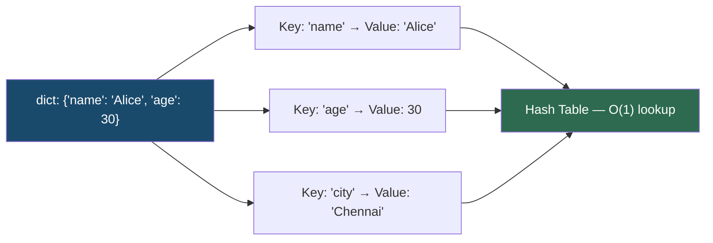

# Dictionaries

!!! abstract "What You'll Learn"
    - ✅ What Python dictionaries are and how hash tables power them
    - ✅ Creating, accessing, updating, and deleting key-value pairs
    - ✅ All essential dictionary methods and iteration patterns
    - ✅ Dictionary comprehensions — the Pythonic way to build dicts
    - ✅ Merging, nesting, and advanced patterns
    - ✅ Specialized dicts — `defaultdict`, `Counter`, `OrderedDict`
    - ✅ Time complexity of all common operations

A Python dictionary is an **unordered, mutable mapping of unique keys to values**, backed by a hash table. It is the most versatile and heavily used data structure in Python — used for caching, counting, grouping, configuration, JSON data, and much more. In Python 3.7+, dicts **preserve insertion order**.

!!! tip "New to Python?"
    Think of a dictionary like a real-world dictionary: you look up a **word (key)** to find its **definition (value)**. Looking up any word takes the same amount of time no matter how large the dictionary — that's the power of O(1) lookup.

!!! info "Coming from another language?"
    Python dicts are equivalent to `HashMap` in Java, `unordered_map` in C++, or objects/maps in JavaScript. Keys must be **hashable** (strings, numbers, tuples) — lists and dicts cannot be keys.

!!! warning "Keep in mind"
    Dictionaries are **mutable** — passing a dict to a function passes a reference, not a copy. Modifying it inside the function will affect the original. Use `.copy()` or `dict(d)` for a shallow copy, or `copy.deepcopy(d)` for a deep copy.

---



---

## 1️⃣ Creating Dictionaries

=== "Basic Creation"

    ```python
    # Empty dict
    empty = {}
    also_empty = dict()

    # Literal syntax
    person = {
        "name": "Alice",
        "age": 30,
        "city": "Chennai"
    }

    # From keyword arguments
    config = dict(host="localhost", port=5432, debug=True)

    # From a list of key-value pairs
    from_pairs = dict([("a", 1), ("b", 2), ("c", 3)])

    # From two lists using zip
    keys   = ["x", "y", "z"]
    values = [10, 20, 30]
    from_zip = dict(zip(keys, values))

    print(person)
    print(config)
    print(from_zip)
    ```
    **Output:**
    ```
    {'name': 'Alice', 'age': 30, 'city': 'Chennai'}
    {'host': 'localhost', 'port': 5432, 'debug': True}
    {'x': 10, 'y': 20, 'z': 30}
    ```

=== "dict.fromkeys()"

    ```python
    # Create a dict with the same default value for all keys
    keys = ["a", "b", "c", "d"]

    zeroed  = dict.fromkeys(keys, 0)
    default = dict.fromkeys(keys, None)

    print(zeroed)
    print(default)
    ```
    **Output:**
    ```
    {'a': 0, 'b': 0, 'c': 0, 'd': 0}
    {'a': None, 'b': None, 'c': None, 'd': None}
    ```

    !!! warning "Don't use mutable defaults with `fromkeys`"
        ```python
        # ❌ All keys share the SAME list object
        bad = dict.fromkeys(["a", "b", "c"], [])
        bad["a"].append(1)
        print(bad)   # {'a': [1], 'b': [1], 'c': [1]} — all changed!

        # ✅ Use a comprehension instead
        good = {k: [] for k in ["a", "b", "c"]}
        good["a"].append(1)
        print(good)  # {'a': [1], 'b': [], 'c': []}
        ```

---

## 2️⃣ Accessing Values

=== "Direct Access vs .get()"

    ```python
    person = {"name": "Alice", "age": 30, "city": "Chennai"}

    # Direct access — KeyError if missing
    print(person["name"])
    # print(person["email"])  # ❌ KeyError: 'email'

    # .get() — returns None (or default) if missing ✅
    print(person.get("age"))
    print(person.get("email"))              # None
    print(person.get("email", "N/A"))       # Custom default
    ```
    **Output:**
    ```
    Alice
    30
    None
    N/A
    ```

=== "Membership Testing"

    ```python
    person = {"name": "Alice", "age": 30}

    print("name" in person)      # O(1) — check key exists
    print("email" in person)
    print("email" not in person)

    # Check values — O(n) scan
    print(30 in person.values())
    ```
    **Output:**
    ```
    True
    False
    True
    True
    ```

!!! tip "Always prefer `.get()` over direct access"
    Unless a missing key is truly a bug, `.get(key, default)` is safer and more Pythonic than wrapping `dict[key]` in a try/except.

---

## 3️⃣ Adding, Updating & Deleting

=== "Adding & Updating"

    ```python
    person = {"name": "Alice", "age": 30}

    # Add new key
    person["city"] = "Chennai"
    print(person)

    # Update existing key
    person["age"] = 31
    print(person)

    # .update() — merge multiple key-values at once
    person.update({"email": "alice@example.com", "age": 32})
    print(person)

    # .setdefault() — set only if key is MISSING
    person.setdefault("country", "India")   # Adds 'country'
    person.setdefault("name", "Bob")        # 'name' already exists — unchanged
    print(person["country"])
    print(person["name"])
    ```
    **Output:**
    ```
    {'name': 'Alice', 'age': 30, 'city': 'Chennai'}
    {'name': 'Alice', 'age': 31, 'city': 'Chennai'}
    {'name': 'Alice', 'age': 32, 'city': 'Chennai', 'email': 'alice@example.com'}
    India
    Alice
    ```

=== "Deleting"

    ```python
    person = {"name": "Alice", "age": 30, "city": "Chennai", "email": "alice@example.com"}

    # del — KeyError if key missing
    del person["email"]
    print(person)

    # .pop() — remove and return value, optional default
    age = person.pop("age")
    print(age, person)

    missing = person.pop("phone", "N/A")   # Safe — no error
    print(missing)

    # .popitem() — remove and return LAST inserted (key, value) pair
    last = person.popitem()
    print(last, person)

    # .clear() — remove everything
    person.clear()
    print(person)
    ```
    **Output:**
    ```
    {'name': 'Alice', 'age': 30, 'city': 'Chennai'}
    30 {'name': 'Alice', 'city': 'Chennai'}
    N/A
    ('city', 'Chennai') {'name': 'Alice'}
    {}
    ```

---

## 4️⃣ Iterating Over Dictionaries

=== "Keys, Values, Items"

    ```python
    scores = {"Alice": 95, "Bob": 87, "Carol": 92}

    # Iterate over keys (default)
    for name in scores:
        print(name)

    # Iterate over values
    for score in scores.values():
        print(score)

    # Iterate over key-value pairs ✅ most common
    for name, score in scores.items():
        print(f"{name}: {score}")
    ```
    **Output:**
    ```
    Alice
    Bob
    Carol
    95
    87
    92
    Alice: 95
    Bob: 87
    Carol: 92
    ```

=== "Views — keys(), values(), items()"

    ```python
    d = {"a": 1, "b": 2, "c": 3}

    keys   = d.keys()    # dict_keys — live view
    values = d.values()
    items  = d.items()

    print(keys)

    d["d"] = 4           # Modify the dict
    print(keys)          # View reflects the change immediately!
    ```
    **Output:**
    ```
    dict_keys(['a', 'b', 'c'])
    dict_keys(['a', 'b', 'c', 'd'])
    ```

    !!! info "Dict views are live"
        `.keys()`, `.values()`, and `.items()` return **view objects** that reflect changes to the dict in real time. Convert to `list()` if you need a static snapshot.

=== "Sorted Iteration"

    ```python
    scores = {"Carol": 92, "Alice": 95, "Bob": 87}

    # Sort by key
    for name in sorted(scores):
        print(f"{name}: {scores[name]}")

    print("---")

    # Sort by value (descending)
    for name, score in sorted(scores.items(), key=lambda x: x[1], reverse=True):
        print(f"{name}: {score}")
    ```
    **Output:**
    ```
    Alice: 95
    Bob: 87
    Carol: 92
    ---
    Alice: 95
    Carol: 92
    Bob: 87
    ```

---

## 5️⃣ Dictionary Comprehensions

**Syntax:** `{key_expr: value_expr for item in iterable if condition}`

=== "Basic Comprehensions"

    ```python
    # Square numbers
    squares = {x: x ** 2 for x in range(1, 6)}
    print(squares)

    # Filter — only even squares
    even_squares = {x: x ** 2 for x in range(1, 11) if x % 2 == 0}
    print(even_squares)

    # Invert a dictionary (swap keys and values)
    original = {"a": 1, "b": 2, "c": 3}
    inverted = {v: k for k, v in original.items()}
    print(inverted)
    ```
    **Output:**
    ```
    {1: 1, 2: 4, 3: 9, 4: 16, 5: 25}
    {2: 4, 4: 16, 6: 36, 8: 64, 10: 100}
    {1: 'a', 2: 'b', 3: 'c'}
    ```

=== "From Two Lists"

    ```python
    students = ["Alice", "Bob", "Carol"]
    grades   = ["A", "B", "A+"]

    report = {s: g for s, g in zip(students, grades)}
    print(report)
    ```
    **Output:** `{'Alice': 'A', 'Bob': 'B', 'Carol': 'A+'}`

=== "Transforming Values"

    ```python
    prices = {"apple": 1.20, "banana": 0.50, "cherry": 3.00}

    # Apply 10% discount
    discounted = {item: round(price * 0.90, 2) for item, price in prices.items()}
    print(discounted)

    # Filter expensive items
    expensive = {item: price for item, price in prices.items() if price > 1.00}
    print(expensive)
    ```
    **Output:**
    ```
    {'apple': 1.08, 'banana': 0.45, 'cherry': 2.7}
    {'apple': 1.2, 'cherry': 3.0}
    ```

---

## 6️⃣ Merging Dictionaries

=== "Python 3.9+  ( | operator )"

    ```python
    defaults = {"theme": "dark", "lang": "en", "debug": False}
    user     = {"lang": "ta", "debug": True}

    # Merge — right side wins on conflicts
    config = defaults | user
    print(config)

    # In-place merge
    defaults |= user
    print(defaults)
    ```
    **Output:**
    ```
    {'theme': 'dark', 'lang': 'ta', 'debug': True}
    {'theme': 'dark', 'lang': 'ta', 'debug': True}
    ```

=== "Python 3.5+  ( ** unpacking )"

    ```python
    defaults = {"theme": "dark", "lang": "en", "debug": False}
    user     = {"lang": "ta", "debug": True}

    config = {**defaults, **user}   # Right side wins
    print(config)

    # Merge more than two dicts
    extra = {"version": "1.0"}
    full  = {**defaults, **user, **extra}
    print(full)
    ```
    **Output:**
    ```
    {'theme': 'dark', 'lang': 'ta', 'debug': True}
    {'theme': 'dark', 'lang': 'ta', 'debug': True, 'version': '1.0'}
    ```

=== ".update() (in-place, all Python versions)"

    ```python
    config = {"theme": "dark", "lang": "en"}
    config.update({"lang": "ta", "debug": True})
    print(config)
    ```
    **Output:** `{'theme': 'dark', 'lang': 'ta', 'debug': True}`

---

## 7️⃣ Nested Dictionaries

```python
# JSON-like nested structure
users = {
    "alice": {
        "age": 30,
        "skills": ["Python", "SQL"],
        "address": {"city": "Chennai", "zip": "600001"}
    },
    "bob": {
        "age": 25,
        "skills": ["JavaScript", "React"],
        "address": {"city": "Mumbai", "zip": "400001"}
    }
}

# Deep access
print(users["alice"]["address"]["city"])
print(users["bob"]["skills"][0])

# Safe deep access with chained .get()
city = users.get("carol", {}).get("address", {}).get("city", "Unknown")
print(city)

# Iterate nested
for username, info in users.items():
    print(f"{username} — {info['address']['city']}")
```
**Output:**
```
Chennai
JavaScript
Unknown
alice — Chennai
bob — Mumbai
```

---

## 8️⃣ Specialized Dictionaries

### 🔢 `collections.defaultdict`

Automatically creates a default value for missing keys — eliminates the need for key-existence checks.

=== "Grouping with defaultdict"

    ```python
    from collections import defaultdict

    words = ["apple", "banana", "avocado", "blueberry", "cherry", "apricot"]

    # Group words by first letter
    grouped = defaultdict(list)
    for word in words:
        grouped[word[0]].append(word)   # No KeyError — list created automatically

    for letter, group in sorted(grouped.items()):
        print(f"{letter}: {group}")
    ```
    **Output:**
    ```
    a: ['apple', 'avocado', 'apricot']
    b: ['banana', 'blueberry']
    c: ['cherry']
    ```

=== "Counting with defaultdict"

    ```python
    from collections import defaultdict

    text = "the quick brown fox jumps over the lazy dog"
    freq = defaultdict(int)

    for word in text.split():
        freq[word] += 1    # int default is 0

    print(dict(sorted(freq.items())))
    ```
    **Output:**
    ```
    {'brown': 1, 'dog': 1, 'fox': 1, 'jumps': 1, 'lazy': 1,
     'over': 1, 'quick': 1, 'the': 2}
    ```

---

### 🔢 `collections.Counter`

A specialized dict for **counting hashable objects** — the cleanest way to count anything.

```python
from collections import Counter

# Count characters
char_count = Counter("mississippi")
print(char_count)

# Count words
words = ["apple", "banana", "apple", "cherry", "banana", "apple"]
word_count = Counter(words)
print(word_count)

# Most common elements
print(word_count.most_common(2))

# Arithmetic on Counters
c1 = Counter("aabbc")
c2 = Counter("bccdd")
print(c1 + c2)   # Combine counts
print(c1 - c2)   # Subtract (drops zeroes and negatives)
print(c1 & c2)   # Intersection (minimum)
print(c1 | c2)   # Union (maximum)
```
**Output:**
```
Counter({'s': 4, 'i': 4, 'p': 2, 'm': 1})
Counter({'apple': 3, 'banana': 2, 'cherry': 1})
[('apple', 3), ('banana', 2)]
Counter({'a': 2, 'b': 3, 'c': 3, 'd': 2})
Counter({'a': 2})
Counter({'b': 1})
Counter({'a': 2, 'b': 2, 'c': 2})
```

---

### 📋 `collections.OrderedDict`

!!! info "Mostly historical in Python 3.7+"
    Regular dicts preserve insertion order since Python 3.7. `OrderedDict` is still useful when you need `move_to_end()` or when **order equality** between two dicts matters.

```python
from collections import OrderedDict

od = OrderedDict()
od["first"]  = 1
od["second"] = 2
od["third"]  = 3

# Move a key to the end or beginning
od.move_to_end("first")          # Move to end
od.move_to_end("third", last=False)  # Move to beginning

print(list(od.keys()))

# Order matters for equality
d1 = OrderedDict([("a", 1), ("b", 2)])
d2 = OrderedDict([("b", 2), ("a", 1)])
print(d1 == d2)   # False — different order
print(dict(d1) == dict(d2))  # True — regular dicts ignore order
```
**Output:**
```
['third', 'second', 'first']
False
True
```

---

## 9️⃣ Practical Patterns

=== "Word Frequency Counter"

    ```python
    text = "to be or not to be that is the question to be"

    freq = {}
    for word in text.split():
        freq[word] = freq.get(word, 0) + 1

    # Top 3 words
    top3 = sorted(freq.items(), key=lambda x: x[1], reverse=True)[:3]
    print(top3)
    ```
    **Output:** `[('to', 3), ('be', 3), ('or', 1)]`

=== "Memoization / Caching"

    ```python
    def fib(n, memo={}):
        if n in memo:
            return memo[n]
        if n <= 1:
            return n
        memo[n] = fib(n - 1, memo) + fib(n - 2, memo)
        return memo[n]

    print([fib(i) for i in range(10)])
    ```
    **Output:** `[0, 1, 1, 2, 3, 5, 8, 13, 21, 34]`

=== "Grouping / Bucketing"

    ```python
    students = [
        {"name": "Alice", "grade": "A"},
        {"name": "Bob",   "grade": "B"},
        {"name": "Carol", "grade": "A"},
        {"name": "Dave",  "grade": "C"},
        {"name": "Eve",   "grade": "B"},
    ]

    by_grade = {}
    for s in students:
        by_grade.setdefault(s["grade"], []).append(s["name"])

    for grade, names in sorted(by_grade.items()):
        print(f"{grade}: {names}")
    ```
    **Output:**
    ```
    A: ['Alice', 'Carol']
    B: ['Bob', 'Eve']
    C: ['Dave']
    ```

=== "Inverting a Dict"

    ```python
    # Simple invert (assumes unique values)
    original = {"a": 1, "b": 2, "c": 3}
    inverted = {v: k for k, v in original.items()}
    print(inverted)

    # Safe invert (handles duplicate values)
    from collections import defaultdict
    data = {"a": 1, "b": 2, "c": 1, "d": 3}
    inv  = defaultdict(list)
    for k, v in data.items():
        inv[v].append(k)
    print(dict(inv))
    ```
    **Output:**
    ```
    {1: 'a', 2: 'b', 3: 'c'}
    {1: ['a', 'c'], 2: ['b'], 3: ['d']}
    ```

---

## 🔟 Time Complexity Reference

```
Operation                      Time Complexity    Notes
──────────────────────────────────────────────────────────────────
Access      (d[key])               O(1)*          Hash lookup
.get()      (d.get(key))           O(1)*          Safe access
Insert/Update (d[key] = val)       O(1)*          Amortized
Delete      (del d[key])           O(1)*          Hash lookup
Membership  (key in d)             O(1)*          Keys only
.keys()                            O(1)           Returns a view
.values()                          O(1)           Returns a view
.items()                           O(1)           Returns a view
Iteration   (for k in d)           O(n)
Copy        (.copy())              O(n)
Merge       (d1 | d2)              O(n+m)
.update()                          O(k)           k = items added

* Average case — rare hash collisions degrade to O(n)
```

---

## ✅ Quick Reference Summary

| Operation | Syntax | Time |
|---|---|---|
| Create | `d = {"k": "v"}` | O(n) |
| Access (strict) | `d[key]` | O(1) |
| Access (safe) | `d.get(key, default)` | O(1) |
| Add / Update | `d[key] = val` | O(1) |
| Set if missing | `d.setdefault(key, val)` | O(1) |
| Delete (strict) | `del d[key]` | O(1) |
| Delete (safe) | `d.pop(key, default)` | O(1) |
| Remove last | `d.popitem()` | O(1) |
| Membership | `key in d` | O(1) |
| All keys | `d.keys()` | O(1) |
| All values | `d.values()` | O(1) |
| All pairs | `d.items()` | O(1) |
| Merge (new) | `d1 \| d2` | O(n+m) |
| Merge (in-place) | `d1 \|= d2` or `d1.update(d2)` | O(k) |
| Clear | `d.clear()` | O(n) |
| Shallow copy | `d.copy()` | O(n) |
| Comprehension | `{k: v for k, v in ...}` | O(n) |
| Count elements | `Counter(iterable)` | O(n) |
| Auto-default | `defaultdict(type)` | O(1) |
| Predefined keys | `dict.fromkeys(keys, val)` | O(n) |