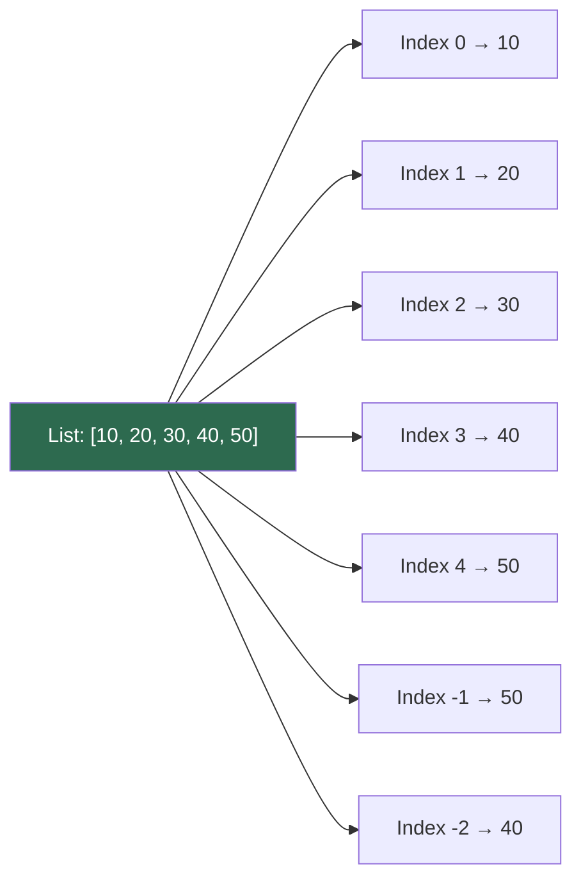

# Lists

!!! abstract "What You'll Learn"
    - ✅ What Python lists are and how they work in memory
    - ✅ Creating, accessing, slicing, and modifying lists
    - ✅ All essential list methods and when to use them
    - ✅ List comprehensions — the Pythonic way to build lists
    - ✅ Nested lists and 2D grids
    - ✅ Time complexity of common list operations

Python lists are **ordered, mutable, dynamic arrays** that can hold elements of any type. They are the most commonly used data structure in Python — understanding them deeply makes everything else easier.

!!! tip "New to Python?"
    Think of a list like a numbered shelf — each slot has an index starting at 0, and you can put anything on any shelf. You can add, remove, or rearrange items freely.

!!! info "Coming from another language?"
    Python lists are like `ArrayList` in Java or `vector` in C++. Unlike arrays in C, Python lists are **dynamic** (they resize automatically) and **heterogeneous** (can mix types, though it's rarely a good idea).

!!! warning "Keep in mind"
    Lists are **mutable** — when you assign a list to another variable or pass it to a function, you're sharing a reference, not making a copy. This is a very common source of bugs.

---



---

## 1️⃣ Creating Lists

=== "Basic Creation"

    ```python
    # Empty list
    empty = []
    also_empty = list()

    # List of integers
    numbers = [1, 2, 3, 4, 5]

    # Mixed types (valid, but uncommon in practice)
    mixed = [42, "hello", 3.14, True, None]

    # List from a range
    from_range = list(range(1, 6))

    # List from a string
    chars = list("hello")

    print(numbers)
    print(from_range)
    print(chars)
    ```
    **Output:**
    ```
    [1, 2, 3, 4, 5]
    [1, 2, 3, 4, 5]
    ['h', 'e', 'l', 'l', 'o']
    ```

=== "List Repetition"

    ```python
    # Repeat elements
    zeros = [0] * 5
    pattern = [1, 2] * 3

    print(zeros)
    print(pattern)
    ```
    **Output:**
    ```
    [0, 0, 0, 0, 0]
    [1, 2, 1, 2, 1, 2]
    ```

=== "Nested Lists"

    ```python
    # 2D grid (3x3 matrix)
    matrix = [
        [1, 2, 3],
        [4, 5, 6],
        [7, 8, 9]
    ]

    print(matrix[1][2])   # row 1, col 2
    ```
    **Output:** `6`

---

## 2️⃣ Indexing & Slicing

```
List:     [ 10,  20,  30,  40,  50 ]
Index:       0    1    2    3    4
Neg Index:  -5   -4   -3   -2   -1
```

=== "Indexing"

    ```python
    nums = [10, 20, 30, 40, 50]

    print(nums[0])    # First element
    print(nums[-1])   # Last element
    print(nums[-2])   # Second to last
    ```
    **Output:**
    ```
    10
    50
    40
    ```

=== "Slicing  [start:stop:step]"

    ```python
    nums = [10, 20, 30, 40, 50]

    print(nums[1:4])    # index 1 up to (not including) 4
    print(nums[:3])     # from start up to index 3
    print(nums[2:])     # from index 2 to end
    print(nums[::2])    # every 2nd element
    print(nums[::-1])   # reversed
    ```
    **Output:**
    ```
    [20, 30, 40]
    [10, 20, 30]
    [30, 40, 50]
    [10, 30, 50]
    [50, 40, 30, 20, 10]
    ```

!!! tip "Slice creates a copy"
    `nums[:]` is a common idiom to create a **shallow copy** of a list. Modifying the copy won't affect the original.

=== "Modifying via Slice"

    ```python
    nums = [10, 20, 30, 40, 50]
    nums[1:3] = [99, 88]   # Replace index 1 and 2
    print(nums)

    nums[1:3] = []         # Delete index 1 and 2
    print(nums)
    ```
    **Output:**
    ```
    [10, 99, 88, 40, 50]
    [10, 40, 50]
    ```

---

## 3️⃣ Core List Methods

=== "Adding Elements"

    ```python
    fruits = ["apple", "banana"]

    fruits.append("cherry")          # Add to end — O(1)
    print(fruits)

    fruits.insert(1, "blueberry")    # Insert at index — O(n)
    print(fruits)

    fruits.extend(["date", "elderberry"])  # Add multiple — O(k)
    print(fruits)
    ```
    **Output:**
    ```
    ['apple', 'banana', 'cherry']
    ['apple', 'blueberry', 'banana', 'cherry']
    ['apple', 'blueberry', 'banana', 'cherry', 'date', 'elderberry']
    ```

=== "Removing Elements"

    ```python
    nums = [3, 1, 4, 1, 5, 9, 2, 6]

    nums.remove(1)       # Removes FIRST occurrence of value — O(n)
    print(nums)

    popped = nums.pop()  # Remove & return last element — O(1)
    print(popped, nums)

    popped_i = nums.pop(2)  # Remove & return at index — O(n)
    print(popped_i, nums)

    del nums[0]          # Delete at index — O(n)
    print(nums)
    ```
    **Output:**
    ```
    [3, 4, 1, 5, 9, 2, 6]
    6 [3, 4, 1, 5, 9, 2]
    1 [3, 4, 5, 9, 2]
    [4, 5, 9, 2]
    ```

=== "Searching & Counting"

    ```python
    nums = [3, 1, 4, 1, 5, 9, 2, 6, 1]

    print(nums.index(1))     # Index of FIRST occurrence — O(n)
    print(nums.count(1))     # Count occurrences — O(n)
    print(5 in nums)         # Membership test — O(n)
    print(7 in nums)
    ```
    **Output:**
    ```
    1
    3
    True
    False
    ```

=== "Sorting & Reversing"

    ```python
    nums = [3, 1, 4, 1, 5, 9, 2, 6]

    nums.sort()                    # In-place sort — O(n log n)
    print(nums)

    nums.sort(reverse=True)        # Descending
    print(nums)

    words = ["banana", "apple", "cherry"]
    words.sort(key=len)            # Sort by string length
    print(words)

    nums.reverse()                 # In-place reverse — O(n)
    print(nums)

    original = [3, 1, 4]
    sorted_copy = sorted(original) # Returns NEW list — O(n log n)
    print(original, sorted_copy)
    ```
    **Output:**
    ```
    [1, 1, 2, 3, 4, 5, 6, 9]
    [9, 6, 5, 4, 3, 2, 1, 1]
    ['apple', 'banana', 'cherry']
    [1, 1, 2, 3, 4, 5, 6, 9]
    [3, 1, 4] [1, 3, 4]
    ```

=== "Other Useful Methods"

    ```python
    nums = [1, 2, 3, 4, 5]

    print(len(nums))       # Length
    print(sum(nums))       # Sum of elements
    print(min(nums))       # Minimum
    print(max(nums))       # Maximum

    nums.clear()           # Remove all elements
    print(nums)

    a = [1, 2, 3]
    b = a.copy()           # Shallow copy
    b.append(99)
    print(a, b)            # Original unchanged
    ```
    **Output:**
    ```
    5
    15
    1
    5
    []
    [1, 2, 3] [1, 2, 3, 99]
    ```

---

## 4️⃣ List Comprehensions

List comprehensions are the **Pythonic** way to build lists — concise, readable, and faster than equivalent `for` loops.

**Syntax:** `[expression for item in iterable if condition]`

=== "Basic Comprehensions"

    ```python
    # Squares of 0–9
    squares = [x ** 2 for x in range(10)]
    print(squares)

    # Even numbers only
    evens = [x for x in range(20) if x % 2 == 0]
    print(evens)

    # Uppercase all words
    words = ["hello", "world", "python"]
    upper = [w.upper() for w in words]
    print(upper)
    ```
    **Output:**
    ```
    [0, 1, 4, 9, 16, 25, 36, 49, 64, 81]
    [0, 2, 4, 6, 8, 10, 12, 14, 16, 18]
    ['HELLO', 'WORLD', 'PYTHON']
    ```

=== "With Conditions"

    ```python
    # FizzBuzz as a list
    result = [
        "FizzBuzz" if x % 15 == 0
        else "Fizz" if x % 3 == 0
        else "Buzz" if x % 5 == 0
        else x
        for x in range(1, 16)
    ]
    print(result)
    ```
    **Output:**
    ```
    [1, 2, 'Fizz', 4, 'Buzz', 'Fizz', 7, 8, 'Fizz', 'Buzz', 11, 'Fizz', 13, 14, 'FizzBuzz']
    ```

=== "Nested Comprehensions"

    ```python
    # Flatten a 2D matrix
    matrix = [[1, 2, 3], [4, 5, 6], [7, 8, 9]]
    flat = [x for row in matrix for x in row]
    print(flat)

    # Transpose a matrix
    transposed = [[row[i] for row in matrix] for i in range(3)]
    print(transposed)
    ```
    **Output:**
    ```
    [1, 2, 3, 4, 5, 6, 7, 8, 9]
    [[1, 4, 7], [2, 5, 8], [3, 6, 9]]
    ```

!!! warning "Don't over-compress"
    Comprehensions shine for simple transformations. If your comprehension spans 3+ lines of logic, a plain `for` loop is more readable — prioritize clarity.

---

## 5️⃣ Memory & Mutability — The Reference Trap

!!! warning "This is one of the most common Python bugs"

```python
# ❌ WRONG — all rows point to the SAME list object
grid = [[0] * 3] * 3
grid[0][0] = 9
print(grid)   # All rows changed!

# ✅ CORRECT — each row is a separate list
grid = [[0] * 3 for _ in range(3)]
grid[0][0] = 9
print(grid)   # Only first row changed
```
**Output:**
```
[[9, 0, 0], [9, 0, 0], [9, 0, 0]]   # ❌ Bug
[[9, 0, 0], [0, 0, 0], [0, 0, 0]]   # ✅ Correct
```

```
Memory view of the BUG:

grid[0] ──┐
grid[1] ──┼──→  [ 0, 0, 0 ]   (same object!)
grid[2] ──┘

Memory view of the FIX:

grid[0] ──→  [ 0, 0, 0 ]
grid[1] ──→  [ 0, 0, 0 ]   (different objects)
grid[2] ──→  [ 0, 0, 0 ]
```

---

## 6️⃣ Iterating Over Lists

=== "Basic Iteration"

    ```python
    fruits = ["apple", "banana", "cherry"]

    for fruit in fruits:
        print(fruit)
    ```
    **Output:**
    ```
    apple
    banana
    cherry
    ```

=== "With Index — enumerate()"

    ```python
    fruits = ["apple", "banana", "cherry"]

    for i, fruit in enumerate(fruits):
        print(f"{i}: {fruit}")

    # Start index from 1
    for i, fruit in enumerate(fruits, start=1):
        print(f"{i}. {fruit}")
    ```
    **Output:**
    ```
    0: apple
    1: banana
    2: cherry
    1. apple
    2. banana
    3. cherry
    ```

=== "Multiple Lists — zip()"

    ```python
    names  = ["Alice", "Bob", "Carol"]
    scores = [95, 87, 92]

    for name, score in zip(names, scores):
        print(f"{name}: {score}")
    ```
    **Output:**
    ```
    Alice: 95
    Bob: 87
    Carol: 92
    ```

---

## 7️⃣ Time Complexity Reference

```
Operation                   Time Complexity    Notes
─────────────────────────────────────────────────────────────────
Access by index  (list[i])       O(1)          Direct memory offset
Append to end    (.append())     O(1)*         Amortized — occasional resize
Pop from end     (.pop())        O(1)          Fast!
Insert at index  (.insert(i,v))  O(n)          Shifts all elements right
Delete at index  (.pop(i))       O(n)          Shifts all elements left
Search / in      (x in list)     O(n)          Linear scan
Sort             (.sort())       O(n log n)    Timsort — highly optimized
Slice            (list[a:b])     O(k)          k = slice length
Extend / +       (.extend())     O(k)          k = length of added iterable
```

!!! tip "Use `collections.deque` for fast front-insertions"
    If you frequently need to insert or remove from the **front** of a list, `list.insert(0, x)` is O(n). Use `collections.deque` instead for O(1) operations on both ends.

---

## ✅ Quick Reference Summary

| Operation | Syntax | Time |
|---|---|---|
| Create | `lst = [1, 2, 3]` | O(n) |
| Access | `lst[i]` | O(1) |
| Slice | `lst[a:b]` | O(k) |
| Append | `lst.append(x)` | O(1)* |
| Insert | `lst.insert(i, x)` | O(n) |
| Remove by value | `lst.remove(x)` | O(n) |
| Remove by index | `lst.pop(i)` | O(n) |
| Pop last | `lst.pop()` | O(1) |
| Search | `x in lst` | O(n) |
| Sort (in-place) | `lst.sort()` | O(n log n) |
| Sort (new list) | `sorted(lst)` | O(n log n) |
| Reverse | `lst.reverse()` | O(n) |
| Length | `len(lst)` | O(1) |
| Shallow copy | `lst.copy()` or `lst[:]` | O(n) |
| List comprehension | `[expr for x in lst if cond]` | O(n) |