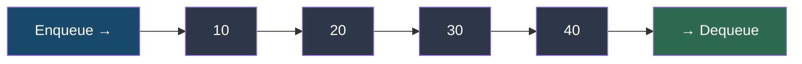

# Queues

!!! abstract "What You'll Learn"
    - ✅ What a queue is and how FIFO works
    - ✅ Implementing queues using `collections.deque`, `queue.Queue`, and `heapq`
    - ✅ All core queue operations — enqueue, dequeue, peek, isEmpty
    - ✅ Variants — Deque (double-ended), Priority Queue, Circular Queue
    - ✅ Classic queue problems — BFS, task scheduling, sliding window maximum
    - ✅ Time complexity of all queue operations

A queue is a **linear data structure that follows the First-In, First-Out (FIFO) principle** — the first element added is the first one removed. Think of a line at a ticket counter: the person who arrives first gets served first. Queues are fundamental to BFS traversal, task scheduling, rate limiting, and stream processing.

!!! tip "New to queues?"
    Imagine a queue of people waiting at a bank. New people join at the **back (enqueue)**, and the teller serves the person at the **front (dequeue)**. Nobody cuts the line — that's FIFO.

!!! info "Where queues appear in real life"
    - **BFS (Breadth-First Search)** — graph/tree traversal level by level
    - **Task schedulers** — OS process scheduling, print queues
    - **Message queues** — Kafka, RabbitMQ, async job systems
    - **Rate limiting** — sliding window request counters
    - **Keyboard input buffers** — keystrokes processed in order

!!! warning "Keep in mind"
    Never use a plain `list` as a queue. `list.pop(0)` (dequeue from front) is **O(n)** because it shifts every element. Always use `collections.deque` or `queue.Queue` for true O(1) queue operations.

---



---

## 1️⃣ Why Not a List?

```python
import timeit

# ❌ list as queue — O(n) dequeue
t_list = timeit.timeit(
    "q.append(1); q.pop(0)",
    setup="q = list(range(10_000))",
    number=10_000
)

# ✅ deque as queue — O(1) dequeue
t_deque = timeit.timeit(
    "q.append(1); q.popleft()",
    setup="from collections import deque; q = deque(range(10_000))",
    number=10_000
)

print(f"list  enqueue+dequeue: {t_list:.4f}s")
print(f"deque enqueue+dequeue: {t_deque:.4f}s")
```
**Output:**
```
list  enqueue+dequeue: 0.3842s
deque enqueue+dequeue: 0.0028s
```

```
Why list.pop(0) is O(n):

Before:  [ 10, 20, 30, 40, 50 ]
                ↑   ↑   ↑   ↑
          each element shifts left after pop(0)

After:   [ 20, 30, 40, 50 ]   ← every element moved!
```

---

## 2️⃣ Queue Using `collections.deque`

`deque` is the **go-to queue implementation** in Python — O(1) append to the right and O(1) popleft from the left.

```python
from collections import deque

queue = deque()

# Enqueue — add to the back (right)
queue.append(10)
queue.append(20)
queue.append(30)
queue.append(40)
print("Queue:", queue)

# Peek — view front without removing
front = queue[0]
print("Front:", front)

# Dequeue — remove from the front (left)
served = queue.popleft()
print("Dequeued:", served)
print("Queue:", queue)

# Size and empty check
print("Size:", len(queue))
print("Is empty:", len(queue) == 0)
```
**Output:**
```
Queue: deque([10, 20, 30, 40])
Front: 10
Dequeued: 10
Queue: deque([20, 30, 40])
Size: 3
Is empty: False
```

!!! tip "deque memory model"
    ```
    Back (append here)          Front (popleft here)
          ↓                           ↓
    [ ..., 30, 20, 10 ]  →  dequeue → 10 exits
    ```

---

## 3️⃣ Queue Using `queue.Queue` (Thread-Safe)

`queue.Queue` is the **thread-safe** queue — use it in multi-threaded programs where multiple threads produce and consume tasks concurrently.

=== "Basic Usage"

    ```python
    from queue import Queue

    q = Queue(maxsize=0)   # 0 = unlimited size

    # Enqueue — .put()
    q.put("task_1")
    q.put("task_2")
    q.put("task_3")

    print("Size:", q.qsize())
    print("Is empty:", q.empty())
    print("Is full:", q.full())

    # Dequeue — .get()
    print(q.get())
    print(q.get())
    print("Size:", q.qsize())
    ```
    **Output:**
    ```
    Size: 3
    Is empty: False
    Is full: False
    task_1
    task_2
    Size: 1
    ```

=== "Producer-Consumer Pattern"

    ```python
    import threading
    from queue import Queue
    import time

    task_queue = Queue()

    def producer():
        for i in range(1, 6):
            task = f"task_{i}"
            task_queue.put(task)
            print(f"  Produced: {task}")
            time.sleep(0.1)

    def consumer():
        while True:
            task = task_queue.get()   # Blocks until item available
            if task is None:          # Sentinel value to stop
                break
            print(f"    Consumed: {task}")
            task_queue.task_done()    # Signal task is complete

    t1 = threading.Thread(target=producer)
    t2 = threading.Thread(target=consumer)

    t1.start(); t2.start()
    t1.join()
    task_queue.put(None)   # Send sentinel to stop consumer
    t2.join()
    ```
    **Output:**
    ```
      Produced: task_1
        Consumed: task_1
      Produced: task_2
        Consumed: task_2
      Produced: task_3
        Consumed: task_3
      Produced: task_4
        Consumed: task_4
      Produced: task_5
        Consumed: task_5
    ```

---

## 4️⃣ Queue Class Implementation

```python
from collections import deque

class Queue:
    def __init__(self):
        self._data = deque()

    def enqueue(self, item):
        """Add item to the back — O(1)"""
        self._data.append(item)

    def dequeue(self):
        """Remove and return front item — O(1)"""
        if self.is_empty():
            raise IndexError("dequeue from empty queue")
        return self._data.popleft()

    def peek(self):
        """Return front item without removing — O(1)"""
        if self.is_empty():
            raise IndexError("peek from empty queue")
        return self._data[0]

    def is_empty(self):
        """Return True if queue has no elements — O(1)"""
        return len(self._data) == 0

    def size(self):
        """Return number of elements — O(1)"""
        return len(self._data)

    def __repr__(self):
        return f"Queue(front → {list(self._data)} ← back)"


# Usage
q = Queue()
q.enqueue("Alice")
q.enqueue("Bob")
q.enqueue("Carol")
print(q)
print("Peek:", q.peek())
print("Dequeue:", q.dequeue())
print(q)
print("Size:", q.size())
```
**Output:**
```
Queue(front → ['Alice', 'Bob', 'Carol'] ← back)
Peek: Alice
Dequeue: Alice
Queue(front → ['Bob', 'Carol'] ← back)
Size: 2
```

---

## 5️⃣ Deque — Double-Ended Queue

A **deque** (double-ended queue) allows O(1) insertions and deletions from **both ends** — it generalizes both stacks and queues.

```
appendleft()  →  [ front ... back ]  ←  append()
popleft()     ←  [ front ... back ]  →  pop()
```

=== "All deque Operations"

    ```python
    from collections import deque

    dq = deque([3, 4, 5])

    # Add to either end
    dq.append(6)          # Add to right (back)
    dq.appendleft(2)      # Add to left (front)
    print("After appends:", dq)

    # Remove from either end
    right = dq.pop()      # Remove from right
    left  = dq.popleft()  # Remove from left
    print(f"Popped right: {right}, left: {left}")
    print("After pops:", dq)

    # Rotate — shift elements right (+) or left (-)
    dq = deque([1, 2, 3, 4, 5])
    dq.rotate(2)          # Rotate right by 2
    print("Rotate right 2:", dq)

    dq.rotate(-2)         # Rotate left by 2 (back to original)
    print("Rotate left 2:", dq)
    ```
    **Output:**
    ```
    After appends: deque([2, 3, 4, 5, 6])
    Popped right: 6, left: 2
    After pops: deque([3, 4, 5])
    Rotate right 2: deque([4, 5, 1, 2, 3])
    Rotate left 2: deque([1, 2, 3, 4, 5])
    ```

=== "Bounded deque (maxlen)"

    ```python
    from collections import deque

    # Fixed-size sliding window — auto-discards oldest when full
    window = deque(maxlen=3)

    for val in [1, 2, 3, 4, 5, 6]:
        window.append(val)
        print(f"Added {val}: {list(window)}")
    ```
    **Output:**
    ```
    Added 1: [1]
    Added 2: [1, 2]
    Added 3: [1, 2, 3]
    Added 4: [2, 3, 4]   ← 1 auto-discarded
    Added 5: [3, 4, 5]   ← 2 auto-discarded
    Added 6: [4, 5, 6]   ← 3 auto-discarded
    ```

---

## 6️⃣ Priority Queue

A **priority queue** dequeues the element with the **highest priority** (lowest value by default) rather than the oldest element. Python's `heapq` module implements a min-heap.

=== "heapq — Min Priority Queue"

    ```python
    import heapq

    pq = []

    # Push — (priority, item)
    heapq.heappush(pq, (3, "low priority task"))
    heapq.heappush(pq, (1, "urgent task"))
    heapq.heappush(pq, (2, "medium priority task"))
    heapq.heappush(pq, (1, "also urgent task"))

    print("Heap:", pq)

    # Pop — always returns smallest priority first
    while pq:
        priority, task = heapq.heappop(pq)
        print(f"  Priority {priority}: {task}")
    ```
    **Output:**
    ```
    Heap: [(1, 'also urgent task'), (1, 'urgent task'), (2, 'medium priority task'), (3, 'low priority task')]
      Priority 1: also urgent task
      Priority 1: urgent task
      Priority 2: medium priority task
      Priority 3: low priority task
    ```

=== "Max Priority Queue"

    ```python
    import heapq

    # Python's heapq is a min-heap.
    # Negate priorities to simulate a max-heap.
    pq = []

    tasks = [(3, "low"), (1, "urgent"), (5, "critical"), (2, "medium")]

    for priority, task in tasks:
        heapq.heappush(pq, (-priority, task))   # Negate!

    while pq:
        neg_priority, task = heapq.heappop(pq)
        print(f"  Priority {-neg_priority}: {task}")
    ```
    **Output:**
    ```
      Priority 5: critical
      Priority 3: low
      Priority 2: medium
      Priority 1: urgent
    ```

=== "queue.PriorityQueue (Thread-Safe)"

    ```python
    from queue import PriorityQueue

    pq = PriorityQueue()

    pq.put((2, "medium"))
    pq.put((1, "urgent"))
    pq.put((3, "low"))

    while not pq.empty():
        priority, item = pq.get()
        print(f"  {priority}: {item}")
    ```
    **Output:**
    ```
      1: urgent
      2: medium
      3: low
    ```

---

## 7️⃣ Classic Queue Problems

### 🔵 Breadth-First Search (BFS)

The most important queue application — traverse a graph or tree **level by level**.

```python
from collections import deque

def bfs(graph, start):
    visited = set([start])
    queue   = deque([start])
    order   = []

    while queue:
        node = queue.popleft()         # Dequeue front
        order.append(node)

        for neighbour in graph[node]:
            if neighbour not in visited:
                visited.add(neighbour)
                queue.append(neighbour)  # Enqueue unvisited neighbours

    return order


graph = {
    "A": ["B", "C"],
    "B": ["A", "D", "E"],
    "C": ["A", "F"],
    "D": ["B"],
    "E": ["B", "F"],
    "F": ["C", "E"],
}

print("BFS order:", bfs(graph, "A"))
```
**Output:**
```
BFS order: ['A', 'B', 'C', 'D', 'E', 'F']
```

```
BFS traversal level by level:

Level 0:          A
                 / \
Level 1:        B   C
               /\    \
Level 2:      D  E    F

Queue trace:
Start:  [A]
Pop A → enqueue B, C  →  [B, C]
Pop B → enqueue D, E  →  [C, D, E]
Pop C → enqueue F     →  [D, E, F]
Pop D →               →  [E, F]
Pop E →               →  [F]
Pop F →               →  []
Done ✅
```

---

### 🔵 Shortest Path in a Grid (BFS)

**Problem:** Find the shortest path from top-left to bottom-right in a binary grid (0 = open, 1 = wall).

```python
from collections import deque

def shortest_path(grid):
    rows, cols = len(grid), len(grid[0])
    if grid[0][0] == 1 or grid[rows-1][cols-1] == 1:
        return -1

    directions = [(0,1),(0,-1),(1,0),(-1,0)]
    queue    = deque([(0, 0, 1)])          # (row, col, distance)
    visited  = {(0, 0)}

    while queue:
        r, c, dist = queue.popleft()

        if r == rows - 1 and c == cols - 1:
            return dist                    # Reached destination

        for dr, dc in directions:
            nr, nc = r + dr, c + dc
            if 0 <= nr < rows and 0 <= nc < cols \
               and grid[nr][nc] == 0 and (nr, nc) not in visited:
                visited.add((nr, nc))
                queue.append((nr, nc, dist + 1))

    return -1                              # No path found


grid = [
    [0, 0, 1, 0],
    [1, 0, 0, 1],
    [0, 0, 0, 0],
    [0, 1, 1, 0],
]
print("Shortest path length:", shortest_path(grid))
```
**Output:**
```
Shortest path length: 7
```

---

### 🔵 Sliding Window Maximum

**Problem:** Given a list and window size `k`, find the maximum value in every sliding window of size `k`.

Uses a **monotonic deque** — maintains a decreasing sequence of indices.

```python
from collections import deque

def sliding_window_max(nums, k):
    dq     = deque()    # Stores indices, front = max of current window
    result = []

    for i, num in enumerate(nums):
        # Remove indices outside the window
        while dq and dq[0] < i - k + 1:
            dq.popleft()

        # Remove indices whose values are smaller than current
        while dq and nums[dq[-1]] < num:
            dq.pop()

        dq.append(i)

        # Window is fully formed
        if i >= k - 1:
            result.append(nums[dq[0]])   # Front is always the max

    return result


print(sliding_window_max([1, 3, -1, -3, 5, 3, 6, 7], k=3))
print(sliding_window_max([4, 3, 2, 1], k=2))
print(sliding_window_max([1, 3, 5, 2, 4], k=3))
```
**Output:**
```
[3, 3, 5, 5, 6, 7]
[4, 3, 2]
[5, 5, 5]
```

```
Trace for [1, 3, -1, -3, 5, 3, 6, 7], k=3:

i=0  num=1   dq=[0]             window not full
i=1  num=3   pop 0 (1<3) dq=[1] window not full
i=2  num=-1  dq=[1,2]           window=[1,3,-1]   max=nums[1]=3  ✅
i=3  num=-3  dq=[1,2,3]         window=[3,-1,-3]  max=nums[1]=3  ✅
i=4  num=5   pop all, dq=[4]    window=[-1,-3,5]  max=nums[4]=5  ✅
i=5  num=3   dq=[4,5]           window=[-3,5,3]   max=nums[4]=5  ✅
i=6  num=6   pop 5,4, dq=[6]    window=[5,3,6]    max=nums[6]=6  ✅
i=7  num=7   pop 6, dq=[7]      window=[3,6,7]    max=nums[7]=7  ✅
```

---

### 🔵 Task Scheduler

**Problem:** Given tasks with cooldown `n` between same-task repeats, find the minimum time to finish all tasks.

```python
from collections import Counter
import heapq
from collections import deque

def least_interval(tasks, n):
    freq    = Counter(tasks)
    max_heap = [-f for f in freq.values()]   # Max-heap via negation
    heapq.heapify(max_heap)

    cooldown = deque()   # (frequency_remaining, available_at_time)
    time     = 0

    while max_heap or cooldown:
        time += 1

        if max_heap:
            freq_left = heapq.heappop(max_heap) + 1   # +1 because negated
            if freq_left < 0:
                cooldown.append((freq_left, time + n))

        # Release tasks whose cooldown has expired
        if cooldown and cooldown[0][1] == time:
            heapq.heappush(max_heap, cooldown.popleft()[0])

    return time


print(least_interval(["A","A","A","B","B","B"], n=2))   # 8
print(least_interval(["A","A","A","B","B","B"], n=0))   # 6
print(least_interval(["A","A","A","A","B","C"], n=3))   # 10
```
**Output:**
```
8
6
10
```

---

## 8️⃣ Queue vs Stack vs Deque

```
Feature          Queue (FIFO)      Stack (LIFO)      Deque (Both)
─────────────────────────────────────────────────────────────────
Order            First in, first   Last in, first    Both ends
Insert           Back only         Top only          Front or Back
Remove           Front only        Top only          Front or Back
Python type      deque / Queue     list / deque      deque
Use case         BFS, scheduling   DFS, undo, parse  Sliding window
Front access     O(1)              O(1)              O(1)
Back access      O(1)              O(1)              O(1)
```

---

## 9️⃣ Time Complexity Reference

```
Operation                 deque      queue.Queue    heapq (PQ)
──────────────────────────────────────────────────────────────
Enqueue  (back)           O(1)       O(1)           O(log n)
Dequeue  (front)          O(1)       O(1)           O(log n)
Peek front                O(1)       —              O(1)
Peek min/max              —          —              O(1)
Size                      O(1)       O(1)           O(1)
Is empty                  O(1)       O(1)           O(1)
Search                    O(n)       O(n)           O(n)
Build from iterable       O(n)       O(n)           O(n)
```

---

## ✅ Quick Reference Summary

| Operation | deque Syntax | queue.Queue Syntax | Time |
|---|---|---|---|
| Create | `q = deque()` | `q = Queue()` | O(1) |
| Enqueue | `q.append(x)` | `q.put(x)` | O(1) |
| Dequeue | `q.popleft()` | `q.get()` | O(1) |
| Peek front | `q[0]` | — | O(1) |
| Peek back | `q[-1]` | — | O(1) |
| Is empty | `len(q) == 0` | `q.empty()` | O(1) |
| Size | `len(q)` | `q.qsize()` | O(1) |
| Add to front | `q.appendleft(x)` | — | O(1) |
| Remove from back | `q.pop()` | — | O(1) |
| Bounded size | `deque(maxlen=k)` | `Queue(maxsize=k)` | — |
| Priority queue | `heapq.heappush(pq, (pri, item))` | `PriorityQueue()` | O(log n) |

!!! tip "When queues are the right tool"
    - You need **BFS** — graph/tree traversal level by level
    - You need **FIFO order** — process things in arrival order
    - You need a **sliding window** — use bounded deque with `maxlen`
    - You need **priority-based processing** — use `heapq` or `PriorityQueue`
    - You need **thread-safe** task distribution — use `queue.Queue`