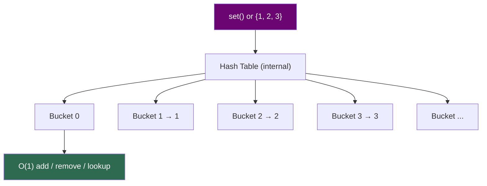

# Sets

!!! abstract "What You'll Learn"
    - ✅ What Python sets are and how they work internally (hash tables)
    - ✅ Creating, adding, and removing elements from sets
    - ✅ Set operations — union, intersection, difference, symmetric difference
    - ✅ Set comprehensions
    - ✅ Frozen sets — the immutable variant
    - ✅ When to use sets vs lists vs dicts
    - ✅ Time complexity of common set operations

A Python set is an **unordered, mutable collection of unique elements**. Sets are backed by a hash table — the same engine that powers dictionaries — giving them blazing-fast O(1) lookups, insertions, and deletions. If you need to eliminate duplicates, check membership quickly, or compute relationships between groups of data, sets are your tool.

!!! tip "New to Python?"
    Think of a set like a bag of unique marbles — you can add or remove marbles, but you can never have two of the same color. Order doesn't matter; only membership does.

!!! info "Coming from another language?"
    Python sets are equivalent to `HashSet` in Java or `unordered_set` in C++. They are backed by a hash table, so elements must be **hashable** (immutable types: int, float, str, tuple — not lists or dicts).

!!! warning "Keep in mind"
    Sets are **unordered** — you cannot index into a set with `set[0]`. If you need order, use a list. If you need fast membership testing AND order, use a `dict` (dicts preserve insertion order in Python 3.7+).

---



---

## 1️⃣ Creating Sets

=== "Basic Creation"

    ```python
    # Empty set — MUST use set(), not {}
    empty = set()

    # From literals
    fruits = {"apple", "banana", "cherry"}

    # From an iterable
    from_list  = set([1, 2, 3, 2, 1])   # Duplicates removed
    from_str   = set("mississippi")      # Unique characters
    from_range = set(range(5))

    print(fruits)
    print(from_list)
    print(from_str)
    print(from_range)
    ```
    **Output:**
    ```
    {'apple', 'banana', 'cherry'}
    {1, 2, 3}
    {'m', 'i', 's', 'p'}
    {0, 1, 2, 3, 4}
    ```

!!! warning "`{}` creates a dict, NOT a set"
    ```python
    a = {}          # ❌ This is an empty dict
    b = set()       # ✅ This is an empty set

    print(type(a))  # <class 'dict'>
    print(type(b))  # <class 'set'>
    ```

=== "Deduplication Pattern"

    ```python
    # The fastest way to remove duplicates from a list
    data = [3, 1, 4, 1, 5, 9, 2, 6, 5, 3, 5]

    unique = list(set(data))
    print(unique)   # Order not guaranteed

    # Preserve order while deduplicating (Python 3.7+)
    seen = set()
    ordered_unique = []
    for x in data:
        if x not in seen:
            seen.add(x)
            ordered_unique.append(x)

    print(ordered_unique)
    ```
    **Output:**
    ```
    [1, 2, 3, 4, 5, 6, 9]
    [3, 1, 4, 5, 9, 2, 6]
    ```

---

## 2️⃣ Adding & Removing Elements

=== "Adding"

    ```python
    s = {1, 2, 3}

    s.add(4)           # Add single element — O(1)
    print(s)

    s.add(2)           # Already exists — no error, no duplicate
    print(s)

    s.update([5, 6, 7])       # Add multiple elements — O(k)
    s.update({8}, (9, 10))    # Works with any iterables
    print(s)
    ```
    **Output:**
    ```
    {1, 2, 3, 4}
    {1, 2, 3, 4}
    {1, 2, 3, 4, 5, 6, 7, 8, 9, 10}
    ```

=== "Removing"

    ```python
    s = {1, 2, 3, 4, 5}

    s.remove(3)        # Remove element — KeyError if not found
    print(s)

    s.discard(99)      # Remove if present — NO error if missing ✅
    print(s)

    popped = s.pop()   # Remove & return ARBITRARY element — O(1)
    print(popped, s)

    s.clear()          # Remove all elements
    print(s)
    ```
    **Output:**
    ```
    {1, 2, 4, 5}
    {1, 2, 4, 5}
    1 {2, 4, 5}
    set()
    ```

!!! tip "`.discard()` over `.remove()`"
    Use `.discard(x)` when you're not sure if `x` is in the set. Use `.remove(x)` only when its absence should be treated as a bug.

---

## 3️⃣ Membership & Inspection

```python
primes = {2, 3, 5, 7, 11, 13}

print(7 in primes)       # O(1) — hash lookup
print(9 in primes)       # O(1)
print(9 not in primes)   # O(1)

print(len(primes))       # Number of elements
print(min(primes))       # Minimum value
print(max(primes))       # Maximum value
```
**Output:**
```
True
False
True
6
2
13
```

!!! info "Why sets beat lists for membership"
    ```python
    import timeit

    big_list = list(range(1_000_000))
    big_set  = set(range(1_000_000))

    t_list = timeit.timeit("999999 in big_list", globals=globals(), number=1000)
    t_set  = timeit.timeit("999999 in big_set",  globals=globals(), number=1000)

    print(f"List lookup: {t_list:.4f}s")
    print(f"Set  lookup: {t_set:.4f}s")
    ```
    **Output:**
    ```
    List lookup: 0.0204s
    Set  lookup: 0.0000s
    ```
    For large collections, set membership is **hundreds of times faster** than list membership.

---

## 4️⃣ Set Operations

This is where sets truly shine — expressing mathematical relationships between groups of data cleanly and efficiently.

```
Set A = {1, 2, 3, 4, 5}
Set B = {4, 5, 6, 7, 8}

Union         A | B  = {1, 2, 3, 4, 5, 6, 7, 8}   (everything)
Intersection  A & B  = {4, 5}                       (in both)
Difference    A - B  = {1, 2, 3}                    (in A, not B)
Sym Diff      A ^ B  = {1, 2, 3, 6, 7, 8}          (in one, not both)
```

=== "Union  ( | )"

    ```python
    a = {1, 2, 3, 4, 5}
    b = {4, 5, 6, 7, 8}

    # Method 1: operator
    print(a | b)

    # Method 2: method (accepts any iterable)
    print(a.union(b))
    print(a.union([6, 7, 8]))   # Works with lists too
    ```
    **Output:**
    ```
    {1, 2, 3, 4, 5, 6, 7, 8}
    {1, 2, 3, 4, 5, 6, 7, 8}
    {1, 2, 3, 4, 5, 6, 7, 8}
    ```

=== "Intersection  ( & )"

    ```python
    a = {1, 2, 3, 4, 5}
    b = {4, 5, 6, 7, 8}

    print(a & b)
    print(a.intersection(b))

    # Intersection of multiple sets
    c = {4, 5, 9}
    print(a & b & c)
    print(a.intersection(b, c))
    ```
    **Output:**
    ```
    {4, 5}
    {4, 5}
    {4, 5}
    {4, 5}
    ```

=== "Difference  ( - )"

    ```python
    a = {1, 2, 3, 4, 5}
    b = {4, 5, 6, 7, 8}

    print(a - b)    # In A but not in B
    print(b - a)    # In B but not in A

    print(a.difference(b))
    ```
    **Output:**
    ```
    {1, 2, 3}
    {6, 7, 8}
    {1, 2, 3}
    ```

=== "Symmetric Difference  ( ^ )"

    ```python
    a = {1, 2, 3, 4, 5}
    b = {4, 5, 6, 7, 8}

    # Elements in A or B, but NOT both
    print(a ^ b)
    print(a.symmetric_difference(b))
    ```
    **Output:**
    ```
    {1, 2, 3, 6, 7, 8}
    {1, 2, 3, 6, 7, 8}
    ```

=== "In-Place Operations"

    ```python
    a = {1, 2, 3, 4, 5}
    b = {4, 5, 6, 7, 8}

    a |= b             # a = a | b  (union update)
    print(a)

    a = {1, 2, 3, 4, 5}
    a &= b             # a = a & b  (intersection update)
    print(a)

    a = {1, 2, 3, 4, 5}
    a -= b             # a = a - b  (difference update)
    print(a)
    ```
    **Output:**
    ```
    {1, 2, 3, 4, 5, 6, 7, 8}
    {4, 5}
    {1, 2, 3}
    ```

---

## 5️⃣ Subset, Superset & Disjoint

```python
a = {1, 2, 3}
b = {1, 2, 3, 4, 5}
c = {6, 7, 8}

# Subset — is every element of a in b?
print(a <= b)              # True
print(a.issubset(b))       # True
print(a < b)               # True  (proper subset — a ≠ b)
print(b < b)               # False (a set is not a proper subset of itself)

# Superset — does b contain all elements of a?
print(b >= a)              # True
print(b.issuperset(a))     # True

# Disjoint — do they share NO elements?
print(a.isdisjoint(c))     # True
print(a.isdisjoint(b))     # False
```
**Output:**
```
True
True
True
False
True
True
True
False
```

```
Venn Diagram:

    a ⊆ b:              a and c disjoint:
  ┌─────────────┐       ┌───────┐   ┌───────┐
  │  b          │       │  a    │   │   c   │
  │  ┌───────┐  │       │1,2,3  │   │ 6,7,8 │
  │  │  a    │  │       └───────┘   └───────┘
  │  │1,2,3  │  │         no overlap!
  │  └───────┘  │
  │  4, 5       │
  └─────────────┘
```

---

## 6️⃣ Set Comprehensions

Just like list comprehensions, but produce a set — duplicates are automatically eliminated.

```python
# Squares of numbers 0–9
squares = {x ** 2 for x in range(10)}
print(squares)

# Unique first letters of words
words = ["apple", "banana", "avocado", "blueberry", "cherry"]
first_letters = {w[0] for w in words}
print(first_letters)

# Even numbers in a range
evens = {x for x in range(20) if x % 2 == 0}
print(evens)

# Unique lengths of words
lengths = {len(w) for w in words}
print(lengths)
```
**Output:**
```
{0, 1, 4, 9, 16, 25, 36, 49, 64, 81}
{'a', 'b', 'c'}
{0, 2, 4, 6, 8, 10, 12, 14, 16, 18}
{5, 6, 9}
```

---

## 7️⃣ Frozen Sets

`frozenset` is the **immutable** variant of `set`. It's hashable — so it can be used as a dictionary key or stored inside another set.

=== "Creating & Using frozenset"

    ```python
    fs = frozenset([1, 2, 3, 4, 5])

    print(fs)
    print(type(fs))
    print(3 in fs)        # Membership — O(1)

    # fs.add(6)           # ❌ AttributeError: 'frozenset' has no attribute 'add'

    # All read-only set operations still work
    other = frozenset([4, 5, 6])
    print(fs & other)     # Intersection
    print(fs | other)     # Union
    ```
    **Output:**
    ```
    frozenset({1, 2, 3, 4, 5})
    <class 'frozenset'>
    True
    frozenset({4, 5})
    frozenset({1, 2, 3, 4, 5, 6})
    ```

=== "frozenset as Dict Key"

    ```python
    # Graph edges as frozensets — order of nodes doesn't matter
    edge_data = {
        frozenset({"A", "B"}): 5,
        frozenset({"B", "C"}): 3,
        frozenset({"A", "C"}): 7,
    }

    print(edge_data[frozenset({"B", "A"})])   # Same as {"A", "B"}
    print(edge_data[frozenset({"C", "B"})])
    ```
    **Output:**
    ```
    5
    3
    ```

=== "Set of Sets"

    ```python
    # Regular sets can't be in a set — they're unhashable
    # s = {{1, 2}, {3, 4}}   # ❌ TypeError

    # frozensets can!
    s = {frozenset({1, 2}), frozenset({3, 4}), frozenset({1, 2})}
    print(s)   # Duplicate frozenset removed
    ```
    **Output:** `{frozenset({1, 2}), frozenset({3, 4})}`

---

## 8️⃣ Practical Patterns

=== "Find Common Elements"

    ```python
    team_a = {"Alice", "Bob", "Carol", "Dave"}
    team_b = {"Carol", "Dave", "Eve", "Frank"}

    both_teams  = team_a & team_b    # In both
    either_team = team_a | team_b    # In either
    only_a      = team_a - team_b    # Only in A
    only_b      = team_b - team_a    # Only in B

    print("Both teams:", both_teams)
    print("Either team:", either_team)
    print("Only in A:", only_a)
    print("Only in B:", only_b)
    ```
    **Output:**
    ```
    Both teams: {'Carol', 'Dave'}
    Either team: {'Alice', 'Bob', 'Carol', 'Dave', 'Eve', 'Frank'}
    Only in A: {'Alice', 'Bob'}
    Only in B: {'Eve', 'Frank'}
    ```

=== "Fast Duplicate Detection"

    ```python
    def has_duplicates(lst):
        return len(lst) != len(set(lst))

    print(has_duplicates([1, 2, 3, 4, 5]))    # False
    print(has_duplicates([1, 2, 3, 2, 5]))    # True
    ```
    **Output:**
    ```
    False
    True
    ```

=== "Two-Sum Problem (O(n) with set)"

    ```python
    def two_sum_exists(nums, target):
        seen = set()
        for n in nums:
            complement = target - n
            if complement in seen:   # O(1) lookup
                return True
            seen.add(n)
        return False

    print(two_sum_exists([2, 7, 11, 15], 9))   # 2 + 7
    print(two_sum_exists([1, 3, 5, 7], 10))    # 3 + 7
    print(two_sum_exists([1, 2, 3], 100))
    ```
    **Output:**
    ```
    True
    True
    False
    ```

---

## 9️⃣ Time Complexity Reference

```
Operation                       Time Complexity    Notes
───────────────────────────────────────────────────────────────────
Add element      (.add())            O(1)*         Amortized
Remove element   (.remove())         O(1)*         KeyError if missing
Discard element  (.discard())        O(1)*         Safe — no error
Membership test  (x in s)           O(1)*         Hash lookup
Pop              (.pop())            O(1)*         Arbitrary element
Union            (s | t)            O(len(s)+len(t))
Intersection     (s & t)            O(min(len(s), len(t)))
Difference       (s - t)            O(len(s))
Symmetric diff   (s ^ t)            O(len(s)+len(t))
Subset check     (s <= t)           O(len(s))
Iteration        (for x in s)       O(n)
Copy             (.copy())          O(n)

* Average case — O(n) worst case due to hash collisions (rare)
```

---

## ✅ Quick Reference Summary

| Operation | Syntax | Time |
|---|---|---|
| Create | `s = {1, 2, 3}` | O(n) |
| Create empty | `s = set()` | O(1) |
| Add element | `s.add(x)` | O(1) |
| Add multiple | `s.update([x, y])` | O(k) |
| Remove (strict) | `s.remove(x)` | O(1) |
| Remove (safe) | `s.discard(x)` | O(1) |
| Membership | `x in s` | O(1) |
| Union | `s \| t` or `s.union(t)` | O(n+m) |
| Intersection | `s & t` or `s.intersection(t)` | O(min) |
| Difference | `s - t` or `s.difference(t)` | O(n) |
| Symmetric diff | `s ^ t` | O(n+m) |
| Subset | `s <= t` or `s.issubset(t)` | O(n) |
| Superset | `s >= t` or `s.issuperset(t)` | O(n) |
| Disjoint | `s.isdisjoint(t)` | O(min) |
| Length | `len(s)` | O(1) |
| Clear | `s.clear()` | O(n) |
| Comprehension | `{expr for x in it if cond}` | O(n) |
| Immutable set | `frozenset(iterable)` | O(n) |
| Deduplicate list | `list(set(lst))` | O(n) |