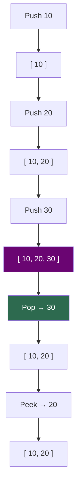

# Stacks

!!! abstract "What You'll Learn"
    - ✅ What a stack is and how LIFO works
    - ✅ Implementing stacks using Python lists and `collections.deque`
    - ✅ All core stack operations — push, pop, peek, isEmpty
    - ✅ Building a stack class from scratch
    - ✅ Classic stack problems — balanced brackets, undo/redo, expression evaluation
    - ✅ Time complexity of all stack operations

A stack is a **linear data structure that follows the Last-In, First-Out (LIFO) principle** — the last element pushed onto the stack is the first one to be popped off. Think of a stack of plates: you always add and remove from the top. Stacks are fundamental to recursion, expression parsing, undo systems, and backtracking algorithms.

!!! tip "New to stacks?"
    Picture a stack of books on a desk. You can only add a new book on top, and you can only take the top book off. You can't reach into the middle without removing everything above it first. That constraint is exactly what makes stacks powerful.

!!! info "Where stacks appear in real life"
    - **Browser history** — Back button pops the last visited page
    - **Undo/Redo** — Every text editor uses a stack internally
    - **Function call stack** — Python's own execution uses a stack for function calls
    - **Expression evaluation** — Compilers use stacks to parse and evaluate expressions

!!! warning "Keep in mind"
    Python does not have a built-in `Stack` class. You implement stacks using a **list** (simplest) or **`collections.deque`** (preferred for performance). Never use `list.insert(0, x)` or `list.pop(0)` for stack operations — those are O(n).

---



---

## 1️⃣ Stack Using a Python List

The simplest stack implementation — use `.append()` to push and `.pop()` to pop. Both are O(1) amortized.

```
Stack grows upward — top is the RIGHT end of the list:

Bottom                         Top
  ↓                              ↓
[ 10,  20,  30,  40,  50 ]
                          ← pop() removes from here
                          ← append() adds here
```

```python
stack = []

# Push — add to top
stack.append(10)
stack.append(20)
stack.append(30)
print("Stack:", stack)

# Peek — view top without removing
top = stack[-1]
print("Top:", top)

# Pop — remove from top
popped = stack.pop()
print("Popped:", popped)
print("Stack after pop:", stack)

# Check if empty
print("Is empty:", len(stack) == 0)
print("Size:", len(stack))
```
**Output:**
```
Stack: [10, 20, 30]
Top: 30
Popped: 30
Stack after pop: [10, 20]
Is empty: False
Size: 2
```

!!! warning "Never use `list.pop(0)` for stacks"
    `list.pop(0)` removes from the front — that's a queue operation and it's O(n). For a stack, always use `list.pop()` (no argument) to remove from the end in O(1).

---

## 2️⃣ Stack Using `collections.deque`

`deque` (double-ended queue) is the **preferred** stack implementation in Python for performance-critical code. It guarantees O(1) append and pop from both ends with no risk of memory reallocation.

=== "deque as Stack"

    ```python
    from collections import deque

    stack = deque()

    # Push
    stack.append(10)
    stack.append(20)
    stack.append(30)
    print("Stack:", stack)

    # Peek
    print("Top:", stack[-1])

    # Pop
    print("Popped:", stack.pop())
    print("Stack:", stack)

    # isEmpty
    print("Is empty:", len(stack) == 0)
    ```
    **Output:**
    ```
    Stack: deque([10, 20, 30])
    Top: 30
    Popped: 30
    Stack: deque([10, 20])
    Is empty: False
    ```

=== "list vs deque"

    ```python
    import timeit

    # list append/pop
    t_list = timeit.timeit(
        "s.append(1); s.pop()",
        setup="s = []",
        number=1_000_000
    )

    # deque append/pop
    t_deque = timeit.timeit(
        "s.append(1); s.pop()",
        setup="from collections import deque; s = deque()",
        number=1_000_000
    )

    print(f"list  push+pop: {t_list:.3f}s")
    print(f"deque push+pop: {t_deque:.3f}s")
    ```
    **Output:**
    ```
    list  push+pop: 0.089s
    deque push+pop: 0.064s
    ```

!!! info "Which one to use?"
    - Use **`list`** when simplicity matters and the stack is small
    - Use **`deque`** when performance matters or the stack could grow large

---

## 3️⃣ Stack Class Implementation

Building a clean `Stack` class that wraps the internals and provides a readable interface.

=== "Basic Stack Class"

    ```python
    class Stack:
        def __init__(self):
            self._data = []

        def push(self, item):
            """Add item to the top — O(1)"""
            self._data.append(item)

        def pop(self):
            """Remove and return top item — O(1)"""
            if self.is_empty():
                raise IndexError("pop from empty stack")
            return self._data.pop()

        def peek(self):
            """Return top item without removing — O(1)"""
            if self.is_empty():
                raise IndexError("peek from empty stack")
            return self._data[-1]

        def is_empty(self):
            """Return True if stack has no elements — O(1)"""
            return len(self._data) == 0

        def size(self):
            """Return number of elements — O(1)"""
            return len(self._data)

        def __repr__(self):
            return f"Stack({self._data}  ← top)"


    # Usage
    s = Stack()
    s.push(1)
    s.push(2)
    s.push(3)
    print(s)
    print("Peek:", s.peek())
    print("Pop:", s.pop())
    print(s)
    print("Size:", s.size())
    ```
    **Output:**
    ```
    Stack([1, 2, 3]  ← top)
    Peek: 3
    Pop: 3
    Stack([1, 2]  ← top)
    Size: 2
    ```

=== "Stack with Max Size"

    ```python
    class BoundedStack:
        def __init__(self, max_size):
            self._data = []
            self._max  = max_size

        def push(self, item):
            if len(self._data) >= self._max:
                raise OverflowError(f"Stack is full (max {self._max})")
            self._data.append(item)

        def pop(self):
            if not self._data:
                raise IndexError("pop from empty stack")
            return self._data.pop()

        def peek(self):
            if not self._data:
                raise IndexError("peek from empty stack")
            return self._data[-1]

        def is_full(self):
            return len(self._data) == self._max

        def is_empty(self):
            return len(self._data) == 0

        def __repr__(self):
            return f"BoundedStack({self._data}, max={self._max})"


    bs = BoundedStack(3)
    bs.push("a")
    bs.push("b")
    bs.push("c")
    print(bs)
    print("Full:", bs.is_full())
    # bs.push("d")   # ❌ OverflowError
    ```
    **Output:**
    ```
    BoundedStack(['a', 'b', 'c'], max=3)
    Full: True
    ```

---

## 4️⃣ Classic Stack Problems

### 🔵 Balanced Brackets

**Problem:** Given a string of brackets, determine if every opening bracket has a matching closing bracket in the correct order.

```python
def is_balanced(s):
    stack = []
    matching = {")": "(", "]": "[", "}": "{"}

    for char in s:
        if char in "([{":
            stack.append(char)             # Push opening bracket
        elif char in ")]}":
            if not stack or stack[-1] != matching[char]:
                return False               # No match — unbalanced
            stack.pop()                    # Matched — pop it

    return len(stack) == 0                 # Empty stack = balanced


tests = ["([]{})", "([)]", "((())", "{[()]}", ""]
for t in tests:
    print(f"'{t}' → {is_balanced(t)}")
```
**Output:**
```
'([]{})'  → True
'([)]'    → False
'((())'   → False
'{[()]}' → True
''        → True
```

```
Trace for "([]{})" :

char  stack
 (    [ ( ]
 [    [ (, [ ]
 ]    [ ( ]        ← ']' matches '[', pop
 {    [ (, { ]
 }    [ ( ]        ← '}' matches '{', pop
 )    [ ]          ← ')' matches '(', pop
END   []  ✅ empty = balanced
```

---

### 🔵 Undo / Redo System

```python
class TextEditor:
    def __init__(self):
        self.text      = ""
        self.undo_stack = []
        self.redo_stack = []

    def type(self, chars):
        self.undo_stack.append(self.text)   # Save current state
        self.redo_stack.clear()             # New action clears redo
        self.text += chars
        print(f"Text: '{self.text}'")

    def undo(self):
        if not self.undo_stack:
            print("Nothing to undo")
            return
        self.redo_stack.append(self.text)   # Save for redo
        self.text = self.undo_stack.pop()   # Restore previous state
        print(f"Undo → '{self.text}'")

    def redo(self):
        if not self.redo_stack:
            print("Nothing to redo")
            return
        self.undo_stack.append(self.text)   # Save for undo
        self.text = self.redo_stack.pop()   # Restore undone state
        print(f"Redo → '{self.text}'")


editor = TextEditor()
editor.type("Hello")
editor.type(", World")
editor.type("!")
editor.undo()
editor.undo()
editor.redo()
```
**Output:**
```
Text: 'Hello'
Text: 'Hello, World'
Text: 'Hello, World!'
Undo → 'Hello, World'
Undo → 'Hello'
Redo → 'Hello, World'
```

---

### 🔵 Evaluate Reverse Polish Notation (RPN)

**Problem:** Evaluate an expression in postfix notation (e.g., `["2", "3", "+", "4", "*"]` = `(2+3)*4 = 20`).

```python
def eval_rpn(tokens):
    stack = []
    ops = {
        "+": lambda a, b: a + b,
        "-": lambda a, b: a - b,
        "*": lambda a, b: a * b,
        "/": lambda a, b: int(a / b),   # Truncate toward zero
    }

    for token in tokens:
        if token in ops:
            b = stack.pop()             # Second operand
            a = stack.pop()             # First operand
            stack.append(ops[token](a, b))
        else:
            stack.append(int(token))    # Push number

    return stack[0]


print(eval_rpn(["2", "1", "+", "3", "*"]))     # (2+1)*3 = 9
print(eval_rpn(["4", "13", "5", "/", "+"]))    # 4+(13/5) = 6
print(eval_rpn(["2", "3", "+", "4", "*"]))     # (2+3)*4 = 20
```
**Output:**
```
9
6
20
```

```
Trace for ["2", "1", "+", "3", "*"]:

Token   Stack
  2     [2]
  1     [2, 1]
  +     [3]       ← pop 1 and 2, push 2+1=3
  3     [3, 3]
  *     [9]       ← pop 3 and 3, push 3*3=9

Result: 9 ✅
```

---

### 🔵 Next Greater Element

**Problem:** For each element in a list, find the next element to its right that is greater than it. Return -1 if none exists.

```python
def next_greater(nums):
    result = [-1] * len(nums)
    stack  = []                         # Stores indices

    for i, num in enumerate(nums):
        # While stack has elements AND current num is greater than top
        while stack and nums[stack[-1]] < num:
            idx = stack.pop()
            result[idx] = num           # Found next greater for idx
        stack.append(i)

    return result


print(next_greater([4, 5, 2, 10, 8]))
print(next_greater([3, 1, 2, 4]))
print(next_greater([5, 4, 3, 2, 1]))   # All -1 — decreasing
```
**Output:**
```
[5, 10, 10, -1, -1]
[4, 2, 4, -1]
[-1, -1, -1, -1, -1]
```

```
Trace for [4, 5, 2, 10, 8]:

i=0, num=4   stack=[0]
i=1, num=5   nums[0]=4 < 5 → result[0]=5, pop; stack=[1]
i=2, num=2   stack=[1, 2]
i=3, num=10  nums[2]=2 < 10 → result[2]=10, pop
             nums[1]=5 < 10 → result[1]=10, pop; stack=[3]
i=4, num=8   stack=[3, 4]
END          result[3]=-1, result[4]=-1

Result: [5, 10, 10, -1, -1] ✅
```

---

## 5️⃣ The Call Stack — Stacks Under the Hood

Python itself uses a stack to manage function calls. Every time a function is called, a **frame** is pushed onto the call stack. When it returns, the frame is popped.

```python
def c():
    print("  Inside c()")

def b():
    print(" Inside b(), calling c()")
    c()
    print(" Back in b()")

def a():
    print("Inside a(), calling b()")
    b()
    print("Back in a()")

a()
```
**Output:**
```
Inside a(), calling b()
 Inside b(), calling c()
  Inside c()
 Back in b()
Back in a()
```

```
Call Stack at deepest point:

┌─────────────┐  ← TOP (most recent)
│   c()       │
├─────────────┤
│   b()       │
├─────────────┤
│   a()       │
└─────────────┘  ← BOTTOM
```

!!! warning "Stack Overflow = Recursion too deep"
    Python's call stack has a default limit of 1000 frames. Infinite or very deep recursion raises `RecursionError`.
    ```python
    import sys
    print(sys.getrecursionlimit())   # 1000

    sys.setrecursionlimit(5000)      # Increase if needed (use with care)
    ```

---

## 6️⃣ Time Complexity Reference

```
Operation              Implementation    Time       Notes
──────────────────────────────────────────────────────────────
Push     (.append())   list / deque      O(1)*      Amortized for list
Pop      (.pop())      list / deque      O(1)       Always fast
Peek     ([-1])        list / deque      O(1)       No removal
Is empty (len == 0)    list / deque      O(1)
Size     (len())       list / deque      O(1)
Search                 list / deque      O(n)       Linear scan

* list occasionally resizes — amortized O(1)
  deque never resizes — always O(1)
```

---

## ✅ Quick Reference Summary

| Operation | List Syntax | deque Syntax | Time |
|---|---|---|---|
| Create | `s = []` | `s = deque()` | O(1) |
| Push | `s.append(x)` | `s.append(x)` | O(1) |
| Pop | `s.pop()` | `s.pop()` | O(1) |
| Peek | `s[-1]` | `s[-1]` | O(1) |
| Is empty | `len(s) == 0` | `len(s) == 0` | O(1) |
| Size | `len(s)` | `len(s)` | O(1) |
| Clear | `s.clear()` | `s.clear()` | O(n) |

!!! tip "When stacks are the right tool"
    - You need to **reverse** something (reverse a string, reverse a path)
    - You need to **match** pairs (brackets, tags, parentheses)
    - You need **undo/redo** or **backtracking** (DFS, maze solving)
    - You're evaluating **nested** or **postfix** expressions
    - You need to process things in **reverse order of arrival**