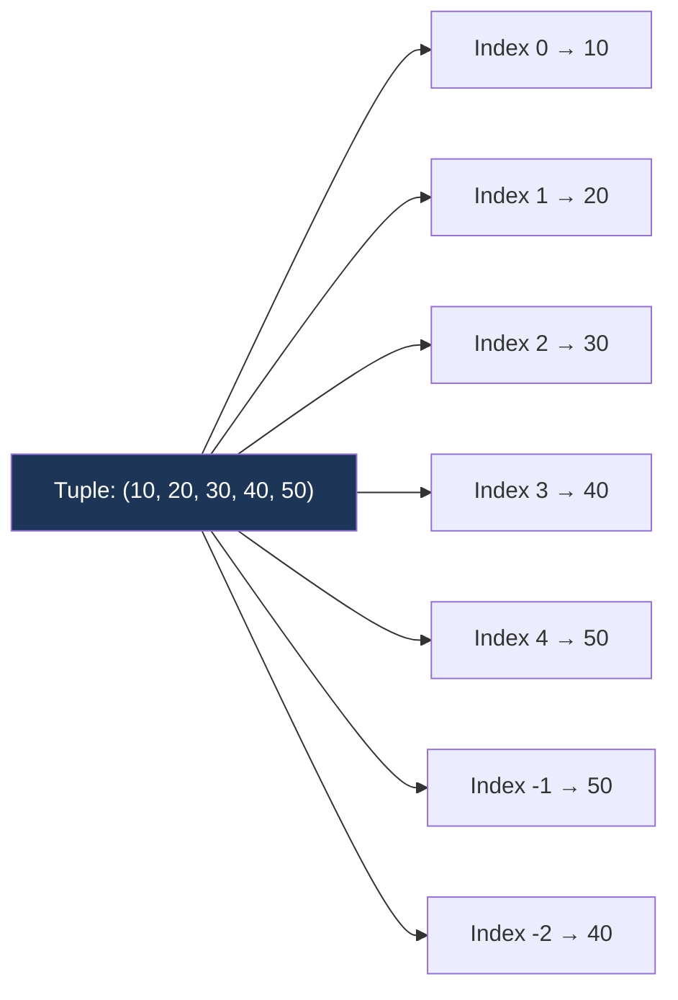

# Tuples

!!! abstract "What You'll Learn"
    - ✅ What Python tuples are and how they differ from lists
    - ✅ Creating, accessing, and slicing tuples
    - ✅ Tuple unpacking and the `*` operator
    - ✅ Named tuples for readable, structured data
    - ✅ When to use tuples vs lists
    - ✅ Time complexity of tuple operations

Tuples are **ordered, immutable sequences** — like lists, but frozen. Once created, their contents cannot be changed. This immutability makes them faster, safer as dictionary keys, and the right tool when data should never be modified.

!!! tip "New to Python?"
    Think of a tuple like a sealed envelope — you can read what's inside, but you can't change it. Use tuples when the data represents a fixed record: coordinates, RGB colors, database rows, function return values.

!!! info "Coming from another language?"
    Python tuples are similar to `const` arrays or `record` types in other languages. They're lightweight, memory-efficient, and hashable — meaning they can be used as dictionary keys or added to sets, unlike lists.

!!! warning "Keep in mind"
    Tuples are immutable, but if a tuple **contains** a mutable object (like a list), that inner object can still be changed. Immutability is shallow, not deep.

---



---

## 1️⃣ Creating Tuples

=== "Basic Creation"

    ```python
    # Empty tuple
    empty = ()
    also_empty = tuple()

    # Single-element tuple — the comma is REQUIRED
    single = (42,)         # ✅ This is a tuple
    not_tuple = (42)       # ❌ This is just an int in parentheses

    # Multi-element tuple
    coords = (10, 20, 30)

    # Parentheses are optional (tuple packing)
    point = 4, 5, 6

    # From an iterable
    from_list  = tuple([1, 2, 3])
    from_range = tuple(range(5))
    from_str   = tuple("hello")

    print(single)
    print(not_tuple)
    print(point)
    print(from_range)
    print(from_str)
    ```
    **Output:**
    ```
    (42,)
    42
    (4, 5, 6)
    (0, 1, 2, 3, 4)
    ('h', 'e', 'l', 'l', 'o')
    ```

!!! warning "The single-element comma trap"
    `(42)` is an integer. `(42,)` is a tuple. The trailing comma is what makes it a tuple — not the parentheses.

=== "Nested Tuples"

    ```python
    # Tuple of tuples — common for grids or records
    matrix = (
        (1, 2, 3),
        (4, 5, 6),
        (7, 8, 9)
    )

    print(matrix[1][2])   # row 1, col 2

    # Mixed nesting
    record = ("Alice", 30, ("Python", "SQL"))
    print(record[2][0])
    ```
    **Output:**
    ```
    6
    Python
    ```

---

## 2️⃣ Indexing & Slicing

```
Tuple:     ( 10,  20,  30,  40,  50 )
Index:        0    1    2    3    4
Neg Index:   -5   -4   -3   -2   -1
```

Tuples support the same indexing and slicing as lists — slicing always returns a **new tuple**.

=== "Indexing"

    ```python
    t = (10, 20, 30, 40, 50)

    print(t[0])     # First element
    print(t[-1])    # Last element
    print(t[2])     # Middle
    ```
    **Output:**
    ```
    10
    50
    30
    ```

=== "Slicing  [start:stop:step]"

    ```python
    t = (10, 20, 30, 40, 50)

    print(t[1:4])    # Elements at index 1, 2, 3
    print(t[:3])     # First three
    print(t[::2])    # Every second element
    print(t[::-1])   # Reversed
    ```
    **Output:**
    ```
    (20, 30, 40)
    (10, 20, 30)
    (10, 30, 50)
    (50, 40, 30, 20, 10)
    ```

=== "Immutability in Action"

    ```python
    t = (10, 20, 30)

    # t[0] = 99   # ❌ TypeError: 'tuple' object does not support item assignment

    # But inner mutables CAN change:
    t2 = ([1, 2], [3, 4])
    t2[0].append(99)        # ✅ The list inside changes
    print(t2)
    ```
    **Output:** `([1, 2, 99], [3, 4])`

---

## 3️⃣ Tuple Methods

Tuples have only **two** built-in methods (they're immutable, so no add/remove/sort).

```python
t = (3, 1, 4, 1, 5, 9, 2, 6, 1)

print(t.count(1))    # Count occurrences of a value
print(t.index(5))    # Index of first occurrence of a value
print(len(t))        # Length — not a method, but a built-in
print(9 in t)        # Membership test
print(min(t))        # Minimum
print(max(t))        # Maximum
print(sum(t))        # Sum
```
**Output:**
```
3
4
9
True
1
9
32
```

!!! info "Sorting a tuple"
    Tuples have no `.sort()` method. Use `sorted(t)` which returns a **new list**, or `tuple(sorted(t))` to get a sorted tuple.

    ```python
    t = (3, 1, 4, 1, 5)
    print(sorted(t))           # → list
    print(tuple(sorted(t)))    # → tuple
    ```
    **Output:**
    ```
    [1, 1, 3, 4, 5]
    (1, 1, 3, 4, 5)
    ```

---

## 4️⃣ Tuple Unpacking

Tuple unpacking is one of Python's most elegant features — assign multiple variables in a single line.

=== "Basic Unpacking"

    ```python
    point = (10, 20, 30)
    x, y, z = point

    print(x, y, z)

    # Swap two variables — no temp variable needed!
    a, b = 1, 2
    a, b = b, a
    print(a, b)
    ```
    **Output:**
    ```
    10 20 30
    2 1
    ```

=== "Extended Unpacking with *"

    ```python
    first, *rest = (1, 2, 3, 4, 5)
    print(first)   # 1
    print(rest)    # [2, 3, 4, 5]  ← note: rest is a list

    *init, last = (1, 2, 3, 4, 5)
    print(init)    # [1, 2, 3, 4]
    print(last)    # 5

    first, *middle, last = (1, 2, 3, 4, 5)
    print(first, middle, last)
    ```
    **Output:**
    ```
    1
    [2, 3, 4, 5]
    [1, 2, 3, 4]
    5
    1 [2, 3, 4] 5
    ```

=== "Unpacking in Loops"

    ```python
    employees = [
        ("Alice", "Engineer", 95000),
        ("Bob",   "Designer", 87000),
        ("Carol", "Manager",  105000),
    ]

    for name, role, salary in employees:
        print(f"{name} ({role}): ${salary:,}")
    ```
    **Output:**
    ```
    Alice (Engineer): $95,000
    Bob (Designer): $87,000
    Carol (Manager): $105,000
    ```

=== "Returning Multiple Values"

    ```python
    def min_max(numbers):
        return min(numbers), max(numbers)   # Returns a tuple

    lo, hi = min_max([3, 1, 4, 1, 5, 9, 2, 6])
    print(f"Min: {lo}, Max: {hi}")
    ```
    **Output:** `Min: 1, Max: 9`

!!! tip "Functions that return multiple values"
    When a Python function returns `a, b, c`, it's actually returning a single tuple `(a, b, c)`. Unpacking on the receiving end is what splits them into separate variables.

---

## 5️⃣ Named Tuples

Regular tuples use numeric indices — hard to read for structured data. `namedtuple` gives each field a name while staying immutable and memory-efficient.

=== "collections.namedtuple"

    ```python
    from collections import namedtuple

    # Define the structure
    Point   = namedtuple("Point", ["x", "y", "z"])
    Student = namedtuple("Student", ["name", "age", "grade"])

    # Create instances
    p = Point(1, 2, 3)
    s = Student("Alice", 20, "A")

    # Access by name OR index
    print(p.x, p.y, p.z)
    print(p[0], p[1], p[2])    # Works too

    print(s.name, s.grade)
    print(s)                   # Readable repr
    ```
    **Output:**
    ```
    1 2 3
    1 2 3
    Alice A
    Student(name='Alice', age=20, grade='A')
    ```

=== "typing.NamedTuple (modern style)"

    ```python
    from typing import NamedTuple

    class Point(NamedTuple):
        x: float
        y: float
        z: float = 0.0    # Default value supported

    p1 = Point(1.0, 2.0, 3.0)
    p2 = Point(4.0, 5.0)      # z defaults to 0.0

    print(p1)
    print(p2)
    print(p1.x + p2.x)
    ```
    **Output:**
    ```
    Point(x=1.0, y=2.0, z=3.0)
    Point(x=4.0, y=5.0, z=0.0)
    5.0
    ```

=== "Named Tuple as Dict Key"

    ```python
    from collections import namedtuple

    Cell = namedtuple("Cell", ["row", "col"])

    # Tuples are hashable — valid dict keys and set members
    grid_values = {
        Cell(0, 0): "A",
        Cell(0, 1): "B",
        Cell(1, 0): "C",
    }

    print(grid_values[Cell(0, 1)])
    ```
    **Output:** `B`

---

## 6️⃣ Tuples as Dictionary Keys

Because tuples are **hashable** (unlike lists), they can be used as dictionary keys — extremely useful for 2D grids, coordinates, and memoization.

```python
# Coordinate map
locations = {
    (0, 0): "Start",
    (3, 4): "Treasure",
    (9, 9): "End",
}

print(locations[(3, 4)])

# DP memoization with tuple key
memo = {}
memo[(5, 3)] = 42      # State (n=5, remaining=3) → result 42
print(memo[(5, 3)])
```
**Output:**
```
Treasure
42
```

!!! warning "Lists can't be dict keys"
    ```python
    d = {}
    d[[1, 2]] = "value"   # ❌ TypeError: unhashable type: 'list'
    d[(1, 2)] = "value"   # ✅ Works fine
    ```

---

## 7️⃣ Tuple vs List — When to Use Which

```
Feature              Tuple                    List
─────────────────────────────────────────────────────────────────
Mutability           ❌ Immutable              ✅ Mutable
Syntax               (1, 2, 3)                [1, 2, 3]
Hashable             ✅ Yes (dict key / set)   ❌ No
Memory               ✅ Lighter                More overhead
Speed                ✅ Faster iteration       Slightly slower
Methods              count, index only        Full method set
Use case             Fixed records, keys      Dynamic collections
Unpacking            ✅ Excellent              ✅ Also works
```

=== "Memory Comparison"

    ```python
    import sys

    lst   = [1, 2, 3, 4, 5]
    tup   = (1, 2, 3, 4, 5)

    print(f"List size:  {sys.getsizeof(lst)} bytes")
    print(f"Tuple size: {sys.getsizeof(tup)} bytes")
    ```
    **Output:**
    ```
    List size:  120 bytes
    Tuple size: 80 bytes
    ```

=== "Speed Comparison"

    ```python
    import timeit

    list_time  = timeit.timeit("[1, 2, 3, 4, 5]", number=10_000_000)
    tuple_time = timeit.timeit("(1, 2, 3, 4, 5)", number=10_000_000)

    print(f"List  creation: {list_time:.3f}s")
    print(f"Tuple creation: {tuple_time:.3f}s")
    ```
    **Output:**
    ```
    List  creation: 0.621s
    Tuple creation: 0.064s
    ```

!!! tip "Rule of thumb"
    - Data that **changes** → use a **list**
    - Data that's **fixed** (coordinates, config, DB rows, function returns) → use a **tuple**
    - Need it as a **dict key or in a set** → must use a **tuple**

---

## ✅ Quick Reference Summary

| Operation | Syntax | Time |
|---|---|---|
| Create | `t = (1, 2, 3)` | O(n) |
| Single element | `t = (42,)` | O(1) |
| Access | `t[i]` | O(1) |
| Slice | `t[a:b]` | O(k) |
| Count value | `t.count(x)` | O(n) |
| Find index | `t.index(x)` | O(n) |
| Membership | `x in t` | O(n) |
| Length | `len(t)` | O(1) |
| Unpack | `a, b, c = t` | O(n) |
| Extended unpack | `first, *rest = t` | O(n) |
| Sort (new tuple) | `tuple(sorted(t))` | O(n log n) |
| Convert to list | `list(t)` | O(n) |
| Named tuple | `from collections import namedtuple` | O(1) access |
| As dict key | `d[t] = val` | O(1) avg |